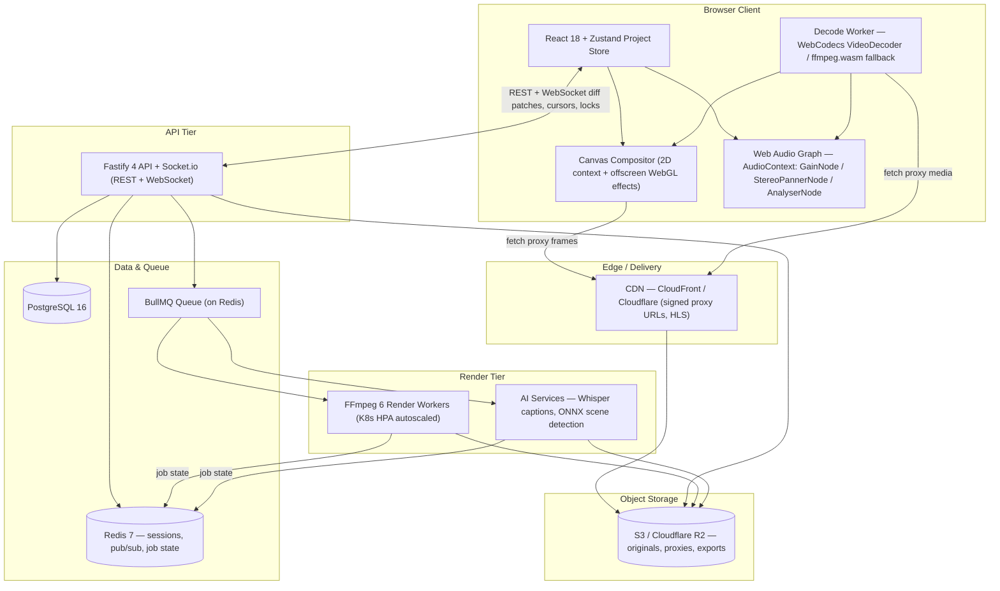

# 🎬 VideoForge — Product Requirements & Full-Stack Technical Specification

**Version 1.1** · _(corrected & expanded edition of the ClipForge v1.0 spec)_ · June 2026
**Scope:** Video Edit Module + Export Pipeline · **Audience:** Full-stack engineering teams

> **About this edition.** v1.1 is a faithful, corrected rewrite of the original v1.0 specification. A multi-agent audit raised 111 findings; **92 were confirmed** (after adversarial verification) and applied here, the product was renamed **ClipForge → VideoForge**, and **6 new sections** (18–23) were added to fill gaps the original lacked (data model/schema, accessibility, observability, billing, testing, non-goals/roadmap). Every corrected behaviour is flagged inline with a `> **v1.1 change:**` note. See [VideoForge_Spec_v1.1_CHANGELOG.md](VideoForge_Spec_v1.1_CHANGELOG.md) for the full list of corrections.

---

## Table of Contents

1. [Product Overview & Architecture](#1-product-overview--architecture)
2. [Editor Layout & Screen Space](#2-editor-layout--screen-space)
3. [Timeline Engine](#3-timeline-engine)
4. [Media Library & Import Pipeline](#4-media-library--import-pipeline)
5. [Playback Engine](#5-playback-engine)
6. [Video Effects & Filters](#6-video-effects--filters)
7. [Audio Engine](#7-audio-engine)
8. [Text, Overlays & Graphics](#8-text-overlays--graphics)
9. [Caption & Subtitle System](#9-caption--subtitle-system)
10. [Export Pipeline](#10-export-pipeline)
11. [Project Management](#11-project-management)
12. [Real-Time Collaboration](#12-real-time-collaboration)
13. [Keyboard Shortcuts Reference](#13-keyboard-shortcuts-reference)
14. [API Reference (Key Endpoints)](#14-api-reference-key-endpoints)
15. [Performance, Limits & Pricing Tiers](#15-performance-limits--pricing-tiers)
16. [Error Handling & Edge Cases](#16-error-handling--edge-cases)
17. [Security Model](#17-security-model)
18. [Data Model & Schema](#18-data-model--schema) _(new in v1.1)_
19. [Accessibility (a11y)](#19-accessibility-a11y) _(new in v1.1)_
20. [Observability, Analytics & Telemetry](#20-observability-analytics--telemetry) _(new in v1.1)_
21. [Billing & Monetization](#21-billing--monetization) _(new in v1.1)_
22. [Testing & QA Strategy](#22-testing--qa-strategy) _(new in v1.1)_
23. [Non-Goals & Phased Roadmap](#23-non-goals--phased-roadmap) _(new in v1.1)_
24. [Glossary & Index](#24-glossary--index)

---


---

## 1. Product Overview & Architecture

High-level vision, user personas, tech stack, and system design.

### 1.1 Product Vision

VideoForge (formerly ClipForge) is a browser-based, production-grade video editing SaaS. It gives creators, marketers, and enterprises the power to edit multi-track video projects entirely in the browser — no installs, no codec pain — with real-time preview, AI-assisted captions, and a professional export pipeline supporting up to 4K/60fps output.

The product is architecturally modelled after Canva's editing canvas but purpose-built for video: the canvas is a fixed-ratio preview viewport, the primary workspace is a multi-track timeline, and every media operation is non-destructive (all edits stored as a JSON project graph, never mutating source files).

> **v1.1 change:** Maximum export resolution is confirmed as 4K. The Enterprise plan's "Export resolution" in Section 15.2 is corrected from "8K" to "4K" to match this vision, the Section 10.1 resolution dropdown, and the 4096×4096 custom-canvas cap. (8K is not shipped; if pursued later, mark it explicitly as roadmap.)

### 1.2 User Personas

| Item | Detail |
| --- | --- |
| Content Creator | YouTubers, TikTokers, Reels editors — need fast cuts, captions, music sync, direct social export |
| Marketing Team | Brand video, ads, product demos — need branded templates, team collaboration, approval workflow |
| Educator / Trainer | Course content, tutorials — need screen recording import, chapter markers, caption accuracy |
| Enterprise Video Ops | Internal comms, events — need 4K export, custom watermark, SSO, bulk render queue |

### 1.3 System Architecture Overview

#### Frontend Stack

| Item | Detail |
| --- | --- |
| Framework | React 18 + TypeScript 5 — component tree driven by a single Zustand project store |
| Canvas Renderer | HTML5 Canvas (2D context) for preview frame compositing at 30/60fps via `requestAnimationFrame` (draws gated to a master clock) |
| Timeline Engine | Custom React virtualized list — only visible track segments are rendered to DOM |
| Media Decode | WebCodecs API `VideoDecoder` (Chrome/Edge, Safari 16.4+) with ffmpeg.wasm fallback for Firefox; decode runs in a dedicated Web Worker. Only the ffmpeg.wasm fallback uses `SharedArrayBuffer` (for multithreaded decode); WebCodecs decode does not require it. |
| Audio Engine | Web Audio API — `AudioContext` with per-track `GainNode`, `StereoPannerNode`, and `AnalyserNode` |
| State Management | Zustand (editor store) + React Query (server state) + Immer (immutable timeline mutations) |
| Drag & Drop | `@dnd-kit/core` — used for timeline clip dragging, track reorder, and media panel drop |
| Styling | Tailwind CSS 3 + CSS custom properties for theming; no CSS-in-JS runtime overhead |

> **v1.1 change:** The Media Decode path now matches Section 15.1: WebCodecs covers Chrome/Edge **and Safari 16.4+**, with ffmpeg.wasm as the **Firefox** fallback (previously this row read "ffmpeg.wasm fallback for Safari"). The pan node is corrected from `PannerNode` to `StereoPannerNode` (a `PannerNode` is a 3D spatialiser with no `.pan` AudioParam), aligning 1.3 with Sections 3.2 and 7.1. The decode-worker note is clarified: `SharedArrayBuffer` is a shared-memory buffer used by the worker, not a worker type, and is required only by the ffmpeg.wasm path (COOP/COEP headers per Section 15.1).

#### Backend Stack

| Item | Detail |
| --- | --- |
| API Server | Node.js 20 + Fastify 4 — REST + WebSocket (Socket.io) for real-time collaboration cursors |
| Job Queue | BullMQ on Redis 7 — render jobs, thumbnail generation, waveform extraction, AI caption jobs |
| Media Storage | S3-compatible object store (AWS S3 or Cloudflare R2) — original uploads, proxy files, export outputs |
| Database | PostgreSQL 16 (projects, users, assets, exports) + Redis 7 (sessions, pub/sub, job state) |
| Transcode Worker | Dockerized FFmpeg 6 workers, autoscaled via Kubernetes HPA on render queue depth |
| AI Services | OpenAI Whisper (captions) + internal ONNX model for scene detection; called async via job queue |
| CDN | CloudFront / Cloudflare — proxy video files served via signed URLs, HLS streaming for preview |
| Auth | JWT + Refresh tokens; OAuth2 (Google, GitHub); optional SAML/SSO for Enterprise tier |

#### System Architecture Diagram



#### Key Architectural Constraints

- All source media is immutable. Edits are stored as a Project JSON (operation log), never re-encoding until explicit export.
- Timeline state is serialisable at all times. Undo/redo is a stack of Immer patches (up to 200 steps).
- Preview rendering is client-side only. The server never streams decoded frames; the browser does all compositing during edit.
- Export is always server-side. A render job serialises the project JSON, dispatches to a worker pool, and FFmpeg executes the final encode.
- WebSocket room per project: each connected user receives diff patches, cursor positions, and lock events in real time.


---

## 2. Editor Layout & Screen Space

Full UI anatomy: every panel, zone, and pixel budget.

### 2.1 Global Layout Grid

The editor uses a fixed vertical band layout — top bar, canvas area, transport bar, timeline, and status bar stacked top to bottom — with a resizable horizontal split between the canvas and timeline zones. No scrollbars appear on the root layout — each zone manages its own scroll independently.

| Feature / Component | Behaviour / State | Technical Spec / Notes |
| --- | --- | --- |
| Top Bar | Fixed 56px height | Logo, project name (inline edit), undo/redo, collaboration avatars, settings, export CTA. `z-index: 100`. |
| Left Panel | Default 280px, resizable 180–420px | Left panel tabs: Videos, Audio, Images, Text overlays, Stickers, Captions, Transitions. Collapsible to icon-only rail (48px). |
| Canvas Area | Fills remaining width after left panel; `canvasAreaHeight = viewportHeight − topBar(56px) − transportBar(48px) − timelineHeight(default 260px, resizable) − statusBar(28px)` | Preview viewport centred inside; the surrounding editor area (letterbox/pillarbox surround) is neutral dark (#1A1A2E) and is editor chrome only — never exported. Accepts drag-drop from left panel. |
| Transport Bar | Fixed 48px height | Playback controls; centred below canvas, above timeline (see Section 5.3). |
| Right Panel | Default 300px, resizable 240–480px | Hosts two kinds of content: (1) the context-sensitive properties inspector (clip properties, text style, audio envelope) shown by selection, and (2) explicitly-invoked modes — Caption Editor (View > Caption Editor, Section 9.2) and Export Queue (Queue tab, Section 10.4). Default: when nothing is selected AND no explicit mode is active, the inspector auto-hides and the canvas expands. Invoking an explicit mode (or pressing Ctrl+Shift+P, Section 13.3) shows the panel regardless of selection and takes precedence over auto-hide; the panel stays open until that mode is dismissed. Making a selection while an explicit mode is open does not force the inspector — the user switches back via the panel's mode/tab control. (Export output settings are a top-bar modal per Section 10.1, not a right-panel mode.) |
| Timeline Zone | Default 260px height, resizable 180–600px via drag handle | Multi-track timeline with track headers on left (180px fixed) and scrollable track body. Horizontal scrollbar at bottom. Vertical scrollbar on track body. |
| Status Bar | Fixed 28px height | Current playhead time, total duration, zoom level, render progress indicator, auto-save status. |

> **v1.1 change:** The Canvas Area height formula now subtracts every stacked band, and an explicit **Transport Bar** row (fixed 48px) was added — previously the formula ignored the 28px status bar and the (undefined-height) transport bar, so the zones did not sum to the viewport. The intro is reworded from "fixed 3-zone vertical layout" to a "fixed vertical band layout" to match the five stacked bands. The Left Panel tab list adds **Transitions** (referenced by Section 6.4) to match downstream references. The Right Panel auto-hide rule is scoped to the inspector role only, so explicitly-invoked modes (Caption Editor, Export Queue) remain reachable with nothing selected. The "neutral dark (#1A1A2E)" surface is clarified as the non-exported editor surround, distinct from the configurable project canvas background in 2.2.

### 2.2 Canvas / Preview Viewport

#### Aspect Ratio & Resolution Modes

| Feature / Component | Behaviour / State | Technical Spec / Notes |
| --- | --- | --- |
| 16:9 Landscape | Default. Preview at 1920×1080 logical. | YouTube, LinkedIn, desktop. Keyboard shortcut: Alt+1 |
| 9:16 Portrait | Rotates canvas; timeline still horizontal. | TikTok, Reels, Shorts. Shortcut: Alt+2 |
| 1:1 Square | 1080×1080 logical. | Instagram feed. Shortcut: Alt+3 |
| 4:5 Portrait | 1080×1350 logical. | Instagram portrait. Shortcut: Alt+4 |
| Custom | Width × Height px input (min 360×360, max 4096×4096) | Validates aspect ratio; warns if non-standard for social. Note: clip positioning is percentage-based and resolution-independent, so the canvas logical size is decoupled from export output resolution — the percentage-positioned composition is scaled to the target output resolution at export (e.g. 4K export from a 1920-logical canvas). |

#### Canvas Viewport Behaviours

- Canvas is centred in the editor surround with equal letterbox/pillarbox padding. The canvas background colour (project `canvasConfig.backgroundColor` per Section 11.1) is configurable (default #111111) and is exported as a solid colour if not replaced by a clip.
- Zoom: Ctrl+scroll, or zoom controls in status bar. Range 10%–400%. "Fit to window" shortcut: Ctrl+Shift+0. Canvas never clips — always fully visible at any zoom.
- Rulers (optional, toggle via View menu): horizontal and vertical pixel rulers follow canvas edges. Gridlines snap at configurable intervals (default: 10px logical). Guides can be dragged out from rulers.
- Snapping: elements snap to canvas edges, centre axes, other element edges, and guide lines. Hold Alt to disable snap temporarily.
- Safe Zone Overlay: toggleable overlay showing title-safe (80%) and action-safe (90%) zones as dashed lines — visible in editor, never exported.

> **v1.1 change:** The configurable canvas background (default #111111) is now explicitly named as the project `canvasConfig.backgroundColor` field (Section 11.1) and distinguished from the non-exported #1A1A2E editor surround in 2.1 — previously two different "background" defaults read as the same surface.

#### Canvas Selection & Manipulation

| Feature / Component | Behaviour / State | Technical Spec / Notes |
| --- | --- | --- |
| Click to select | Selects the topmost clip/overlay at cursor. | Selection highlighted with blue 8-handle bounding box. |
| Drag to move | Moves element in X/Y within canvas bounds. | Position stored as % of canvas dimensions for resolution-independence. |
| Corner handle drag | Proportional resize (Shift = unconstrained). | Min size: 20×20px logical. Maintains pixel-snapping. |
| Edge handle drag | Single-axis (non-proportional) resize. | Dragging a top/bottom edge changes height only; dragging a left/right edge changes width only. Aspect ratio is not preserved. Min size 20×20px logical; maintains pixel-snapping (matching corner constraints). |
| Rotate handle | Handle appears 20px above top-centre handle. | Drag to rotate. Shift-drag snaps to 15° increments. Double-click resets to 0°. |
| Double-click text | Enters inline text edit mode. | Rich text cursor appears. ESC or click outside to commit. |
| Right-click | Context menu: Cut, Copy, Paste, Delete, Bring Forward/Back, Lock, Link audio. | Multi-select via Ctrl+Click; group transform applies. |

> **v1.1 change:** The Edge handle drag row is rewritten as a self-contained single-axis resize. The previous note ("Only active when Shift held on corner; otherwise same as corner") was self-contradictory and coupled edge behaviour to corner-Shift dragging; edge handles now always perform independent width-only/height-only resizes, complementary to the corner row's proportional/Shift-unconstrained behaviour.


---

## 3. Timeline Engine

Track model, clip operations, playhead, zoom, snapping, and all timeline interactions.

> This is the VideoForge Spec **v1.1** (formerly ClipForge) — a corrected edition.

### 3.1 Timeline Anatomy

The timeline is the primary edit surface. It is a scrollable 2D canvas where horizontal = time and vertical = track stacking order. All tracks share a common time axis.

| Feature / Component | Behaviour / State | Technical Spec / Notes |
| --- | --- | --- |
| Time Ruler | Sticky top row, full timeline width | Shows timecode (HH:MM:SS:FF) or seconds. Tick density adapts to zoom level. Click to jump playhead. Drag to scrub. |
| Track Header Column | Fixed 180px left column | Per-track: type icon, name (editable), mute/solo/lock toggles, height drag handle, track colour swatch, overflow menu. |
| Track Body | Scrollable right portion | Clip blocks rendered here. Background has subtle grid lines at every second (colour varies by track type). |
| Playhead | Vertical red line full timeline height | Current playback position. Draggable. Auto-scrolls timeline when approaching viewport edge during playback. |
| Work Area Bar | Draggable blue range bar on ruler | Defines in/out for partial export or loop-preview. Default = full project duration. |
| Zoom Control | Bottom-right corner of timeline zone | Slider (10%–2000%) + fit-to-window button. Ctrl+scroll on timeline body also zooms centred on cursor. |
| Scroll Sync | Horizontal scroll syncs ruler + all track bodies simultaneously | Virtual scrolling: only clips in ±200px buffer around viewport are mounted in DOM. |

### 3.2 Track Types

> **v1.1 change:** Track-count figures below are the Pro/Business defaults; per-plan limits (Free lower, Enterprise unlimited) are defined in Section 15.2.

#### Video Track

| Feature / Component | Behaviour / State | Technical Spec / Notes |
| --- | --- | --- |
| Track limit | Up to 20 video tracks per project on Pro/Business; Free is limited to 3, Enterprise is unlimited. See Section 15.2 for per-plan limits. | Track 1 = bottom layer; higher-numbered tracks render on top (Photoshop-style stacking). Track order is drag-reorderable. |
| Clip block display | Thumbnail strip (first frame of each second) + clip name label | Thumbnails generated server-side on upload, stored as WebP sprite sheet at 1 thumbnail/sec. |
| Clip colour coding | Default: teal. Colour-coded by source file — same source = same colour across all tracks. | User can override per-clip via right-click > Change Colour. |
| Track height | Default 64px, draggable from header edge. Range: 40px–200px. | Taller tracks show more thumbnail rows for easier scrubbing identification. |
| Blend Mode | Per-track or per-clip blend mode dropdown: Normal, Multiply, Screen, Overlay, Darken, Lighten, Add, Subtract. | Preview: Normal→`source-over`; Multiply/Screen/Overlay/Darken/Lighten→matching Canvas 2D `globalCompositeOperation` values. Add and Subtract have no native `globalCompositeOperation` equivalent — render them via the WebGL preview compositor (Add maps to `globalCompositeOperation='lighter'` as an acceptable approximation if the Canvas 2D path is used; Subtract requires a WebGL fragment shader, `dst-src` clamped to 0). Export: FFmpeg `blend` filter — Add→`all_mode=addition`, Subtract→`all_mode=subtract`, others to their corresponding `all_mode` values — for parity with preview. |
| Opacity | Per-clip opacity slider 0–100% in properties panel. | Animatable: keyframes can be set at any point on the clip timeline. |

> **v1.1 change:** Blend Mode preview is now specified per-mode. Add and Subtract are not native Canvas 2D `globalCompositeOperation` operations; they use the WebGL compositor (`lighter` approximation / subtract shader), with FFmpeg `blend=all_mode=addition`/`subtract` on export for parity.

#### Audio Track

| Feature / Component | Behaviour / State | Technical Spec / Notes |
| --- | --- | --- |
| Track limit | Up to 16 audio tracks on Pro/Business; Free 2, Enterprise unlimited. See Section 15.2. | Audio tracks can carry: extracted video audio, uploaded music, SFX, voiceover, or AI-generated audio. |
| Waveform display | Per-clip waveform rendered as SVG path inside clip block. | Waveform data extracted server-side (FFmpeg + audiowaveform binary), stored as JSON peaks array, rendered client-side. |
| Track height | Default 48px, range 32px–160px. | At >80px height, waveform switches to stereo dual-channel display. |
| Volume envelope | Click "E" button on track header to toggle envelope edit mode. | Envelope = draggable keyframe line over waveform. Default value = track volume (0–200%). Click on line to add keyframe; drag keyframe up/down. |
| Pan control | Slider in track header: -100 (left) to +100 (right). Default 0. | Mapped to Web Audio `StereoPannerNode.pan.value` during preview (slider -100..+100 normalised to the node's -1..+1 range), and to FFmpeg `pan` filter on export. |
| Mute / Solo | M = mute track (greyed out in timeline). S = solo (all other audio tracks muted). | Mute/solo state persists in project JSON (`track.muted`, `track.solo` per Section 11.1) and **IS** respected on export. A muted track is excluded from the export audio mix (dropped from the `amix` input graph, equivalent to gain 0). If any audio track is soloed, all non-soloed audio tracks are excluded from the export mix. To make a track inaudible permanently, mute it (state is non-destructive) or delete the track. |
| Audio Link | Video clips with embedded audio auto-create a linked audio clip on an audio track directly below the video track. | Linked clips move together when the video clip is dragged. Unlink via right-click > Unlink Audio. Linked state shown by a chain icon on both clips. |

> **v1.1 change:** Pan now uses `StereoPannerNode` (the node that actually exposes a `.pan` AudioParam), matching Sections 1.3 and 7.1.

> **v1.1 change:** Mute/solo is now respected on export — muted tracks (and, when any track is soloed, all non-soloed tracks) are excluded from the export mix, removing the previous preview-vs-export mismatch. Master volume remains preview-only (see Section 5.3 / 7.1).

#### Caption / Subtitle Track

| Feature / Component | Behaviour / State | Technical Spec / Notes |
| --- | --- | --- |
| Track limit | Up to 4 caption tracks (flat limit across all plans) (e.g., EN, ES, FR, AR). | Each track represents one language/style. Tracks are labelled by language code. |
| Caption block | Narrow pill-shaped blocks on a single-height track (36px default). | Block width = duration. Block text = first 30 chars of caption (truncated preview, distinct from the 42-chars/line content limit in Section 9.1/9.2). Click to select and edit in properties panel. |
| Caption editor panel | When caption track is selected, right panel switches to Caption Editor mode. | Shows full list of caption blocks as editable rows: start time \| end time \| text. Inline edit in table. |
| Auto-caption (AI) | Button on track header: "Auto-Caption". Calls Whisper via backend job. | Job streams word-level timestamps back via WebSocket. Captions appear progressively as job completes. Accuracy ~95% for clear speech in English. |
| Import / Export | Import: .srt, .vtt, .ass. Export: .srt, .vtt, or burned-in (hardcoded) on video export. | Burned-in captions are rendered by FFmpeg using the `subtitles` filter with selected font/size/position. |
| Style per track | Font family, size (px), colour, background fill, background opacity, outline, position (top/mid/bottom), horizontal alignment. | Styles apply to all captions on the track unless overridden per-block. |
| Per-block override | Select a block → properties panel shows override checkboxes for each style property. | Overrides stored as delta on the block object in project JSON. |

> **v1.1 change:** The auto-caption button is now consistently labelled "Auto-Caption" (matching Section 9.1).

#### Overlay / Graphics Track

| Feature / Component | Behaviour / State | Technical Spec / Notes |
| --- | --- | --- |
| Purpose | Text overlays, image overlays, shape elements, stickers, lower thirds. | Separate from video tracks; always renders on top of all video tracks. |
| Track limit | Up to 10 overlay tracks on Pro/Business; Free 2, Enterprise unlimited. See Section 15.2. | Stacking order = track order. Top overlay track = highest z-index. |
| Clip types | Text Block, Image, Shape (rect/ellipse/polygon), Lottie animation, Sticker. | Each type has its own properties sub-panel. |
| Canvas linkage | Overlay clips appear on canvas at their timeline position. Selecting on canvas selects the clip on timeline and vice versa. | Bi-directional selection binding via clip ID. |

#### Voice-Over Track (Dedicated)

| Feature / Component | Behaviour / State | Technical Spec / Notes |
| --- | --- | --- |
| Purpose | Single dedicated track for microphone voiceover recording. | Displayed with microphone icon and red accent colour. |
| Record button | Red record button on track header. Click to arm; playback starts automatically, recording begins. | Uses MediaRecorder API. Format: webm/opus. Uploaded to S3 on stop. |
| Waveform | Waveform renders in real-time during recording using AnalyserNode data. | Live waveform uses canvas animation loop, replaced by server-generated waveform after upload. |

### 3.3 Clip Operations

#### Core Clip Interactions

| Feature / Component | Behaviour / State | Technical Spec / Notes |
| --- | --- | --- |
| Select | Click clip block. | Blue highlight border. Properties panel updates. Multi-select: Ctrl+Click or rubber-band drag on empty timeline area. |
| Move (same track) | Drag left/right. | Magnetic snap to: other clip edges, playhead, second markers, work area edges. Snap threshold: 8px at current zoom. Hold Alt to disable snap. |
| Move (cross-track) | Drag up/down to different track. | Target track highlight on hover. If dropped on occupied time → insert mode pushes clips right, or swap mode (hold Shift). |
| Trim start (left edge drag) | Drag left edge of clip rightward (trim in) or leftward (extend in). | Cannot trim beyond source file start. Trim shown by darkened region outside clip. Min clip duration: 1 frame. |
| Trim end (right edge drag) | Drag right edge. | Cannot extend beyond source file end. A gap is left — not auto-closed. |
| Ripple trim | Hold Ctrl while trimming. | Ripple trim: all clips to the right of the trim point slide automatically to fill/create gap. |
| Split | Position playhead → S key, or right-click > Split at Playhead. | Creates two independent clips at split point. Linked audio splits simultaneously. See the S-key arbitration rule below (shared with Slip). |
| Delete | Delete/Backspace key. | Gap left (default). Ctrl+Delete = ripple delete (right clips slide left). |
| Duplicate | Ctrl+D. | Duplicate placed immediately after original on same track. |
| Copy / Paste | Ctrl+C / Ctrl+V. | Paste places clip at playhead position on same track. If track occupied, pastes to first available track of same type. |
| Slip | Hold S and drag clip body (not edges). | Slip: changes which portion of the source media is shown without changing clip duration or position on timeline. See the S-key arbitration rule below (shared with Split). |
| Slide | Hold W and drag clip. | Slide: moves clip and adjusts adjacent clip trim points to maintain total duration. |
| Speed change | Right-click > Change Speed. Or properties panel Speed field. | Range: 0.1× – 16×. Values < 1 = slow motion. Source frames interpolated using optical flow (server-side) or simple frame-drop (client-side preview). Pitch correction toggle. |
| Freeze frame | Right-click > Insert Freeze Frame. | Inserts a new 2-second still clip using the frame under the playhead, split from original clip. |

**S-key arbitration (Split vs Slip):** When a clip is under the cursor, pressing **S** enters a pending state:

1. If **S** is released without the pointer moving more than 4px while held, perform **Split** at the playhead on key-up.
2. If, while **S** is held, the pointer moves more than 4px starting on the clip body (not its edges), begin a **Slip** edit and suppress the Split; the Slip commits on pointer-up and the subsequent S key-up does not split.
3. If no clip is under the cursor, **S** always splits at the playhead on key-up.

> **v1.1 change:** The previously ambiguous overload of the **S** key (Split vs Slip) is now resolved by an explicit pending-state arbitration rule (4px movement threshold). This is cross-referenced from Section 13.2.

### 3.4 Timeline Zoom & Navigation

| Feature / Component | Behaviour / State | Technical Spec / Notes |
| --- | --- | --- |
| Zoom level | 10% (1px = ~10 seconds) to 2000% (1px = ~0.5 frames at 30fps). | Zoom centred on playhead position, not viewport left edge. |
| Zoom shortcuts | Ctrl+= (zoom in), Ctrl+- (zoom out), Ctrl+0 (fit all clips in view). | Also: pinch-to-zoom on trackpad. |
| Scroll navigation | Horizontal scroll: pan timeline. Middle-mouse drag: pan. Arrow keys: nudge playhead 1 frame. | J/K/L keys: reverse/pause/forward playback (industry standard). Repeated L presses: 2×, 4×, 8× fast forward. |
| Mini-map | Optional collapsed view above full timeline: shows all tracks condensed to 2px height. Click to jump. | Visible when project > 10 minutes or toggled via View menu. |

### 3.5 Snapping System

| Feature / Component | Behaviour / State | Technical Spec / Notes |
| --- | --- | --- |
| Snap to clip edges | ON by default. Clips snap to start/end of all other clips on all tracks. | Snap indicator: orange vertical line across full timeline height. |
| Snap to playhead | ON by default. Clips snap to current playhead position. | Useful for aligning cuts to music beats or speech. |
| Snap to markers | Clips snap to chapter/beat markers. | See Section 3.6 for markers. |
| Snap to grid | OFF by default. Snaps to fixed time intervals (configurable: 0.1s, 0.5s, 1s, 1 frame). | Toggle: View > Snap to Grid (keyboard: Ctrl+; — see Section 13.3). |
| Disable snapping | Hold Alt key while dragging. | Allows frame-accurate free positioning. |

> **v1.1 change:** The grid/snapping toggle shortcut is now **Ctrl+;** (was Ctrl+Shift+G, which collided with Ungroup); see Section 13.3.

### 3.6 Markers & Chapters

| Feature / Component | Behaviour / State | Technical Spec / Notes |
| --- | --- | --- |
| Add marker | M key at playhead, or right-click ruler > Add Marker. | Marker appears as coloured triangle on ruler. Default colour: yellow. |
| Marker types | Chapter, Beat, Comment, Export Point. | Type selectable in marker properties. Chapter markers exported to video metadata (MP4 chapters). |
| Marker properties | Double-click marker: name, time, colour, type, note. | Stored in project JSON. Displayed in a Markers panel (View > Markers). |
| Beat detection | Audio track right-click > Detect Beats → creates Beat markers at detected transients. | Uses client-side offline onset detection (decode the clip to an AudioBuffer and run spectral-flux/transient analysis, optionally via OfflineAudioContext or a WASM beat-tracking library) or server-side Essentia.js WASM. Accuracy ±1 frame at 30fps. |

> **v1.1 change:** Client-side beat detection now uses offline onset analysis (AudioBuffer + spectral-flux, optionally via OfflineAudioContext or a WASM beat-tracking library) instead of a real-time AnalyserNode FFT, which cannot scan a non-playing clip. The live recording meter (Section 3.2) still uses AnalyserNode.


---

## 4. Media Library & Import Pipeline

Upload, proxy generation, asset management, and search.

> This is the VideoForge (formerly ClipForge) specification, v1.1 — a corrected edition.

### 4.1 Supported Input Formats

| Item | Detail |
| --- | --- |
| Video | MP4 (H.264, H.265, AV1), MOV (ProRes, H.264), MKV, WEBM, AVI, FLV, WMV, TS. Max file size: 20 GB. |
| Audio | MP3, WAV, FLAC, AAC, OGG, M4A, AIFF. Max: 2 GB. |
| Image | JPG, PNG, WEBP, GIF (treated as animated clip), SVG, HEIC (auto-converted). Max: 100 MB. |
| Captions | `.SRT`, `.VTT`, `.ASS` — dragged directly onto caption track or imported via **File > Import Captions**. |
| Project | `.vfg` (VideoForge JSON) — opens in editor. Also importable as nested clip on a track. |

### 4.2 Upload & Proxy Generation Pipeline

- User selects files via drag-drop to canvas/timeline/left panel, or **File > Import**, or paste from clipboard (Ctrl+V supports pasting video URL or file).
- Frontend computes the MD5 hash of the file. The hash is carried on the presign call (below) — there is no separate `check-duplicate` request.
- **`POST /api/v1/assets/presign`** — request body includes `filename`, `contentType`, `fileSize`, and `md5Hash`. If a matching asset already exists in the workspace (workspace-scoped MD5 match), the response returns the existing `assetId` via the `existingAssetId` field (and no `uploadUrl`), in which case the client skips the S3 upload entirely (dedup by hash per workspace). Otherwise the response returns `uploadUrl`, `assetId`, and `expiresAt`.

  > **v1.1 change:** The previously-referenced `POST /api/v1/assets/check-duplicate` endpoint did not exist in the API reference (Section 14.2). Deduplication is now folded into the presign call: presign accepts `md5Hash` and returns `existingAssetId` on a workspace hash match. See Section 14.2.

- **If new:** multipart upload to S3 via presigned URLs (chunked, 10 MB chunks, parallel). Progress tracked per-file. Resumable on network failure.
- **On upload complete:** the client calls **`POST /api/v1/assets/:id/confirm`**, which triggers the async job-queue tasks:
  - **(a) Proxy transcode.** Transcode to H.264/AAC proxy MP4 renditions for browser preview — a base 720p/2 Mbps rendition plus higher- and lower-resolution renditions used by the playback engine (see Sections 5.2 and 5.3). The rendition set is source-resolution-dependent: 4K sources additionally get a 4K-capped proxy; all sources get a quarter-resolution rendition used for **Low** / performance mode. Section 4.2 is the single source of truth for the proxy rendition set; Sections 5.2, 5.3, and 16.2 reference only renditions produced here.

    > **v1.1 change:** A single fixed "720p/2 Mbps" proxy contradicted the playback targets in Sections 5.2 ("4K proxy", "1080p proxy") and 5.3 ("Low = quarter-resolution proxy"). The proxy is now a rendition set: the base 720p rendition, a 4K-capped rendition for 4K sources, and a quarter-resolution rendition for Low mode. The proxy SLA below applies to the base 720p rendition; the `asset:ready` payload and `GET /api/v1/assets/:id` expose the renditions as a map/array keyed by resolution rather than a single `proxyUrl`.

  - **(b) Thumbnails.** Generate thumbnail sprite sheet (1 thumb/sec, 160×90 WebP).
  - **(c) Waveform.** Extract waveform peaks JSON for audio.
  - **(d) Scene detection.** Extract scene/cut points for AI-assisted auto-edit.
  - **(e) HEIC decode.** For HEIC uploads, decode the original server-side to a stored JPG derivative (PNG if alpha is present) on upload. This derivative — not the original HEIC — is what the editor canvas previews and what export ingests. The original HEIC is preserved untouched in S3 per the immutability rule below.

    > **v1.1 change:** Section 4.1 listed "HEIC (auto-converted)" with no defined conversion path. HEIC is now decoded server-side to a stored JPG/PNG derivative on upload.

  - **(f) Animated GIF transcode.** Transcode the GIF to a looping H.264 MP4 proxy (consistent with the base proxy in task **(a)**) and record the GIF's intrinsic frame rate and total single-loop duration from its frame-delay metadata. On drop, the clip's default timeline duration equals the GIF's intrinsic single-loop duration; the proxy loops for preview, and on export the clip loops to fill its timeline length (`endOnTimeline − startOnTimeline`). A static (single-frame) GIF is treated as a normal image, not an animated clip.

    > **v1.1 change:** Section 4.1 listed "GIF (treated as animated clip)" with no defined fps/duration/looping model. Animated GIF now transcodes to a looping H.264 proxy with recorded intrinsic fps and duration; static GIFs are treated as images.

- Proxy and derivative URLs are returned via the `asset:ready` WebSocket event to the client. The client swaps the source from its local **uploading** state to its **ready** state, and the clip becomes usable in the timeline. The client maps the server asset status (`PROCESSING → READY`, per Sections 14.2 and 16) to its local `uploading`/`ready` clip states.

  > **v1.1 change:** The upload flow now uses the API-reference endpoints `presign` → `confirm` (Section 14.2), with `confirm` triggering the proxy/waveform jobs. The lowercase `uploading`/`ready` labels are client UI states mapped from the server `PROCESSING`/`READY` enum.

- The original high-res file is preserved untouched in S3. Proxies are used for all editor preview. The original is used for export encoding by default (see Section 10.1 "Proxy to source").

> 📌 **Proxy generation SLA:** the base 720p proxy rendition is ready within 2× realtime of source duration (e.g., a 60-second clip proxied within 2 minutes).

### 4.3 Media Library Panel

| Feature / Component | Behaviour / State | Technical Spec / Notes |
| --- | --- | --- |
| Grid / List view | Toggle between thumbnail grid (4 columns) and list view with metadata. | User preference persisted in localStorage. |
| Search | Full-text search by filename, tag, or transcript keyword (if AI-transcribed). | Debounced 300 ms. Results from PostgreSQL full-text index. |
| Filters | Type (Video/Audio/Image/Caption), Date added, Duration range, Tag. | Multi-filter with AND logic. |
| Tags | Click asset thumbnail > tag icon. Add free-text tags. Up to 20 per asset. | Tags stored per workspace, shared across projects. |
| Usage indicator | Badge on thumbnail shows count of projects using this asset. | Click badge to see project list. |
| Preview on hover | Hovering a video asset after 300 ms shows an animated thumbnail strip preview. | Uses CSS animation on sprite sheet — no video decode. |
| Drag to timeline | Drag asset from panel to any compatible track or empty canvas area. | Snap to playhead time on drop. If dropped on canvas: placed on Video Track 1 at playhead. |
| Right-click menu | Preview in full, Rename, Add to Project, Download Original, Delete. | Delete checks for usage across all projects; warns if in use. |
| Stock library | Built-in tab: browse Pexels / Unsplash / Pixabay via API. Search, preview, import to library. | Licensed for commercial use. Attribution tracked per project for export metadata (see below). |

**Stock ingestion path.** "Import to library" for a stock asset bypasses the client MD5 + presign flow: the server fetches the asset from the provider API, stores it to S3, and populates the asset record's optional `source` object — `{ provider: "pexels" | "unsplash" | "pixabay", sourceId, mediaType (video | image | audio), licenseType, attributionText, sourceUrl }`. Stock assets are deduped by `(provider, sourceId)` instead of by MD5 (they have no local file to hash). Stock imports go through the standard proxy/thumbnail/waveform jobs and `asset:ready` WebSocket event unchanged, and a high-res original is retained in S3; export uses that retained asset at its available stored resolution. For non-stock uploads the `source` object is `null`.

"Tracked per project" is satisfied by enumerating the distinct `sourceAssetId`s referenced by the project's clips/overlays — attribution travels with the asset, so no per-clip license field is required (Section 11.1 is unchanged). The export's attribution metadata is composed from each distinct used asset's `attributionText` (see Section 10.1 Metadata tab).

> **v1.1 change:** The stock-library promise ("Attribution tracked per project for export metadata") previously had no backing data model or ingestion path. v1.1 adds an optional `source` object to the asset record (for stock assets only), defines server-side stock ingestion that bypasses the MD5/presign flow and dedups by `(provider, sourceId)`, and specifies where attribution is written on export. Scope is limited to the stock library; ordinary user uploads gain no license fields.


---

## 5. Playback Engine

Preview rendering, seek, sync, frame stepping, and performance.

### 5.1 Playback Architecture

Preview playback is entirely client-side. The browser decodes proxy video frames via the WebCodecs API (`VideoDecoder`), composites them on the HTML5 Canvas inside a `requestAnimationFrame` loop, presenting frames timed to the audio master clock at the project's target frame rate (rAF runs at the display refresh rate; draws are gated against the clock), and plays audio via Web Audio API nodes.

> **v1.1 change:** `requestAnimationFrame` runs at the display refresh rate, not "at the project's target frame rate" — frame draws are now described as gated against the audio master clock so presentation matches the project frame rate without implying rAF itself can be retimed. (A-7)

The main preview canvas uses a **2D context** for final compositing (clear → draw video tracks bottom-up → draw overlay elements → draw caption text, with blend modes applied via `globalCompositeOperation` per Section 3.2). Per-clip GPU effects — colour grading (6.1), transition simulation (6.4), and chroma key (6.6) — are rendered in a separate **offscreen WebGL context** (`OffscreenCanvas`/framebuffer); each effect's output frame is transferred into the 2D composite via `drawImage` / `transferToImageBitmap` before blend-mode compositing.

> **v1.1 change:** Added the architectural sentence reconciling the compositing surface — the single visible preview canvas is Canvas 2D, while GPU effects from Sections 6.1/6.4/6.6 run in a separate offscreen WebGL pass and are composited into the 2D canvas. This removes the single-canvas dual-context contradiction. (A-6)

| Feature / Component | Behaviour / State | Technical Spec / Notes |
| --- | --- | --- |
| Master clock | `AudioContext.currentTime` — sample-accurate, drift-free. | Video frames sync to audio clock, not wall clock. Prevents A/V drift over long playback. |
| Frame compositing | Per-frame: clear canvas → draw video tracks bottom-up → draw overlay elements → draw caption text. | Compositing runs off the main thread via `OffscreenCanvas` in a worker when available, with rendered frames presented to the visible canvas through `transferControlToOffscreen` / `transferToImageBitmap`. GPU acceleration of the actual composite depends on the canvas context used (Canvas 2D acceleration is browser-dependent; the WebGL path in Section 6.1 is GPU-accelerated). |
| Playback rate | Normal (1×), 0.25×, 0.5× via controls; J/K/L shuttle: 2×, 4×, 8× forward (L) and 2×, 4×, 8× reverse (J). | At rates > 1×: frames skipped; preview audio is resampled via `AudioBufferSourceNode.playbackRate` and therefore shifts pitch with speed (no pitch preservation in preview). Final export preserves pitch via FFmpeg `atempo`. |
| Seek (click on ruler) | Immediate: pause → decode nearest keyframe → render single frame → ready for play. | Keyframe index built from proxy file manifest. Seek latency targets vary by project complexity — see the per-scenario figures in Section 5.2 Playback Performance Targets. |
| Frame step | Arrow keys (when paused): left = -1 frame, right = +1 frame. | Decodes exact frame using `VideoDecoder` timestamp. Sub-second scrubbing. |
| Loop | Loop toggle button. Loops work area or full duration. | Loop point is work area out-point. Seamless loop: re-queues decode from in-point. |
| Fullscreen preview | Ctrl+Shift+F. Canvas expands to full browser window. | Keyboard shortcuts still active. ESC to exit. |

> **v1.1 change (Frame compositing row):** Replaced the loose "Hardware-accelerated via GPU compositing if OffscreenCanvas + transferToImageBitmap available" claim with an accurate description: `OffscreenCanvas` moves compositing off the main thread, but GPU acceleration of the actual composite is context-dependent (the WebGL path in Section 6.1 is the GPU-accelerated one). (A-7)

> **v1.1 change (Playback rate row):** The J/K/L shuttle ceiling is now 8× (forward and reverse), matching Sections 3.4 and 13.1. Discrete preview rates 0.25× / 0.5× are set via the playback-rate control only; J/K/L are shuttle keys (K = pause/1×, L = forward cycling 2× → 4× → 8×, J = reverse cycling 2× → 4× → 8×). The earlier "0.25×, 0.5×, 2×, 4× via controls or J/K/L keys" list incorrectly attributed slow rates to J/K/L and capped the shuttle at 4×. (X-2, A-8)

> **v1.1 change (Playback rate row, Technical Spec):** Removed the technically incorrect "audio pitch-corrected via Web Audio playbackRate + detune" claim. `playbackRate` and `detune` combine into a single resampling rate (`computedPlaybackRate = playbackRate * 2^(detune/1200)`) and cannot decouple pitch from speed; preview audio shifts pitch with speed, and pitch is preserved only on export via FFmpeg `atempo`. (A-5)

> **v1.1 change (Seek row):** Replaced the conflicting blanket "Seek latency target: <200ms for proxy files" with a deferral to the per-scenario targets in Section 5.2, which is now the single source of truth for seek latency. (A-16)

### 5.2 Playback Performance Targets

| Item | Detail |
| --- | --- |
| 1080p source project, single video track | 60fps preview, <50ms seek latency |
| 1080p source project, up to 4 video tracks | 30fps preview, <100ms seek latency |
| 4K source project, single track (720p proxy preview) | 24fps preview, <300ms seek latency |
| Complex project (10+ tracks, effects) | 24fps preview, <500ms seek latency — degraded preview quality mode auto-activates |
| Audio latency (live edit) | `AudioContext` output latency typically <30ms with `latencyHint: 'interactive'`; platform-dependent, measured at runtime via `AudioContext.outputLatency`. |

> **v1.1 change:** The performance rows now name the **source/project** resolution, while preview always decodes the 720p proxy defined in Section 4.2. The former "4K proxy" / "1080p proxy" labels implied proxy resolutions that the proxy pipeline does not produce (proxies are 720p per 4.2). The 4K row is annotated to make explicit that its preview still runs on the 720p proxy. (A-4, D-3)

> **v1.1 change:** The audio-latency row no longer guarantees a hard "<10ms via AudioContext." Real-world `AudioContext` output latency is platform-dependent; it is requested via `latencyHint: 'interactive'` (typically <30ms) and measured at runtime through `AudioContext.outputLatency`. (A-10)

### 5.3 Playback Controls UI

| Feature / Component | Behaviour / State | Technical Spec / Notes |
| --- | --- | --- |
| Transport bar | Centred below canvas, above timeline. | Buttons: Skip to start \| Step back 1 frame \| Play/Pause \| Step forward 1 frame \| Skip to end. |
| Timecode display | Left of transport: current time HH:MM:SS:FF. | Click to type exact timecode and jump. Tab moves to duration display. |
| Duration display | Right of timecode: total project duration. | Click to set work area out-point. |
| Volume master | Right side of transport: master volume knob 0–200%. | Does NOT affect export — export uses track-level mix. This is the preview-only monitor volume (Master `GainNode`, per Sections 7.1/C-2). Mute/solo, by contrast, IS respected on export per Section 3.2. |
| Playback quality | Dropdown: Auto / High / Low. | Low = quarter-resolution proxy rendition (the same quarter-resolution rendition defined in Section 4.2, used by performance/Low mode in 16.2). Auto = degrades if frame budget exceeded. |
| Preload indicator | Buffer bar below timecode: shows decoded frame cache range. | Green = cached. Grey = not yet decoded. Proxy files pre-cache ±5 seconds around playhead. |

> **v1.1 change (Volume master row):** Clarified that the master volume knob maps to the preview-only Master `GainNode` (consistent with Sections 7.1 and the audio-routing model in C-2), and that this preview-only behaviour is distinct from mute/solo, which is now part of the exported mix (Section 3.2, B-8/X-6). (C-2, X-6)

> **v1.1 change (Playback quality row):** "Low" now references the specific quarter-resolution proxy rendition defined in Section 4.2, so the same term maps to one rendition across Sections 4.2, 5.3, and 16.2. (D-3)


---

## 6. Video Effects & Filters

Colour grading, filters, motion effects, masks, and keyframes.

### 6.1 Colour Grading Panel

Select a video clip → Properties panel → "Colour" tab. All adjustments are non-destructive and stored as parameters in project JSON. Preview applied via WebGL fragment shader on canvas. Export applied via FFmpeg `eq`/`colorchannelmixer`/`lut3d` filters.

| Feature / Component | Behaviour / State | Technical Spec / Notes |
| --- | --- | --- |
| Brightness | -100 to +100. Default 0. | FFmpeg: `eq=brightness=value/100` |
| Contrast | -100 to +100. Default 0. | FFmpeg: `eq=contrast=1+(value/100)` — UI -100..+100 maps to FFmpeg 0..2; UI default 0 → 1.0 (unchanged). Neutral FFmpeg value is 1.0. |
| Saturation | -100 to +100. Default 0. | FFmpeg: `eq=saturation=1+(value/100)` — UI -100..+100 maps to FFmpeg 0..2 (within eq's valid 0.0–3.0 range); UI default 0 → 1.0 (unchanged). Neutral FFmpeg value is 1.0. |
| Hue Rotation | 0°–360°. Default 0°. | FFmpeg: `hue=h=degrees` |
| Sharpness | -2 to +2. Default 0. | FFmpeg: `unsharp` filter |
| Blur | 0–100 (Gaussian radius 0–50px). | FFmpeg: `boxblur` or `gblur` |
| Shadows | -100 to +100. | Tone mapping via `curves` filter. |
| Highlights | -100 to +100. | Tone mapping via `curves` filter. |
| Temperature | -100 (cool/blue) to +100 (warm/orange). | Via `colorbalance` filter. |
| Tint | -100 (green) to +100 (magenta). | Via `colorbalance` filter. |
| Vignette | Strength 0–100, feather 0–100. | Via `vignette` filter. |
| LUT (3D LUT) | Upload .cube file. Preview + export. | Via `lut3d` filter. Up to 33³ LUT size supported. |

> **v1.1 change:** Contrast and Saturation now use explicit offset mappings (`1+(value/100)`) so the UI default of 0 maps to FFmpeg's neutral 1.0. Previously the raw `eq=contrast=value` / `eq=saturation` mapping would have rendered a gray, fully desaturated frame at the default setting. Brightness is unchanged (`eq=brightness=value/100` is correct because `eq.brightness` is 0-centered).

### 6.2 Preset Filters

Built-in filter library with preview thumbnails. Filters are LUT presets + parameter combinations. Applied in one click. Intensity slider (0–100%) blends filter with original.

| Item | Detail |
| --- | --- |
| Cinematic | Film Noir, Golden Hour, Teal & Orange, Fade, Day-for-Night, Bleach Bypass |
| Social | Vivid, Matte, Cool Breeze, Warm Sunset, Faded Film, Retro VHS |
| B&W | Classic B&W, High Contrast B&W, Sepia, Cyanotype |
| Technical | Log to Rec.709, ACES, S-Log2 Normalise, HLG to SDR |

### 6.3 Motion Effects (Ken Burns, Zoom, Pan)

| Feature / Component | Behaviour / State | Technical Spec / Notes |
| --- | --- | --- |
| Pan & Zoom (Ken Burns) | Animate scale + position over clip duration. | Set "Start" frame (scale + position) and "End" frame in properties panel. Linear or ease-in/out interpolation. |
| Zoom In / Out presets | One-click presets: Zoom In 110%, Zoom Out 90%, Slow Pan Left/Right. | Implemented as Ken Burns with preset start/end values. |
| Rotation animation | Animate rotation from start to end angle over clip. | Stored as two keyframes on rotation property. |
| Shake / Handheld | Procedural shake effect: frequency and amplitude sliders. | Applied via randomised translate keyframes. Seed value for reproducibility. |

### 6.4 Transitions

Transitions are applied between two adjacent clips on the same video track. They are stored as a separate object in project JSON with references to both clips.

| Feature / Component | Behaviour / State | Technical Spec / Notes |
| --- | --- | --- |
| Add transition | Drag transition from left panel > Transitions tab onto the cut point between two clips. Or right-click cut > Add Transition. | Transition block appears overlapping both clips by the transition duration. |
| Duration | Default 0.5s. Draggable handles to adjust (min: 2 frames, max: half of shorter clip duration). | Duration shown in status bar on hover. |
| Transition types | Cut (no transition), Dissolve/Crossfade, Fade to Black, Fade from Black, Wipe (8 directions), Slide (8 directions), Zoom In/Out, Spin, Glitch, Film Burn, Luma Fade, Whip Pan. | Each has configurable parameters (direction, easing, colour). |
| Preview | Hovering transition block in left panel shows looping preview on canvas. | Preview uses proxy thumbnails + WebGL shader simulation. |
| Copy transitions | Right-click transition > Copy. Paste onto another cut point. | Ctrl+Alt+V pastes to all cut points on selected track. |
| Remove | Click transition block → Delete key. Or right-click > Remove. | Cut point reverts to hard cut. |
| Export rendering | FFmpeg `xfade` filter for dissolve/wipe/slide. Custom `filter_complex` chains for complex effects. | All transitions rendered server-side for export. Client-side preview is approximation. |

### 6.5 Keyframe Animation

Any animatable property (opacity, position X/Y, scale, rotation, volume, colour values) can be keyframed over time. Keyframes are set per-clip relative to the clip's own timeline (not project timeline).

| Feature / Component | Behaviour / State | Technical Spec / Notes |
| --- | --- | --- |
| Enable keyframes | Click the diamond/stopwatch icon next to any property in the panel. | Property row expands to show mini keyframe timeline within the clip's bounds. |
| Add keyframe | With keyframe mode enabled: move playhead to desired time within clip → modify property value → keyframe auto-created. | Or click "+" button on the mini timeline at current clip-relative time. |
| Edit keyframe | Click keyframe diamond on mini timeline. Property shows value. Modify to update. | Selected keyframe highlighted blue. |
| Delete keyframe | Right-click keyframe > Delete. Or select + Delete key. | A property in keyframe mode may hold one or more keyframes. With exactly one keyframe, the property is animated with that value held constant for the clip's full duration, and keyframe mode stays enabled (stopwatch lit). Deleting keyframes one at a time down to a single remaining keyframe keeps this held-constant behaviour. Reverting to a static, non-keyframed value occurs only when the last remaining keyframe is deleted OR the user clicks the stopwatch to disable keyframe mode; in either case the property takes its current evaluated value as its new static value and `keyframes{}` is cleared for that property. |
| Interpolation | Right-click keyframe > Interpolation: Linear, Ease In, Ease Out, Ease In/Out, Constant, Bezier. | Bezier: drag tangent handles on curve editor that appears below mini timeline. |
| Copy keyframes | Select multiple keyframes (rubber-band or Ctrl+Click) → Ctrl+C → paste at new time on same or different property. | Relative timing preserved. |

> **v1.1 change:** The keyframe-deletion lifecycle is now fully specified. The single-keyframe state is explicit and legal (value held constant, keyframe mode stays on), and reverting to a static value has a single deterministic trigger — deleting the last keyframe or toggling off the stopwatch — replacing the previous "only 2 keyframes remain and both deleted" rule, which left the one-keyframe case undefined.

### 6.6 Masks & Clipping

| Feature / Component | Behaviour / State | Technical Spec / Notes |
| --- | --- | --- |
| Rectangular mask | Drag corner handles of mask rectangle on canvas. | Feather slider: 0–200px. |
| Elliptical mask | Same as rect but ellipse shape. | Feather slider. |
| Freeform mask | Pen tool: click to add points, drag for bezier curves. Close path to activate. | Up to 200 points. Feather: 0–200px. |
| Invert mask | Toggle: show inside mask (default) or show outside mask. | Button in mask properties. |
| Mask rendering (rectangular / elliptical / freeform) | Preview rendered via a WebGL alpha/stencil shader on the canvas. | Export generates a per-clip alpha matte composited via FFmpeg (e.g., a luma/alpha matte fed through `alphamerge` or `maskedmerge`, with feather applied as a gaussian blur (`gblur`) on the matte). FFmpeg filter names are illustrative. |
| Mask animation | Mask path vertices are keyframeable. | Allows animated rotoscoping. Keyframed vertices are emitted as time-driven FFmpeg expressions (e.g., via `sendcmd` / per-frame expressions) so animated paths render correctly on the server. |
| Chroma key (greenscreen) | Select clip → Effects → Chroma Key. Pick colour (eyedropper on canvas). Similarity + Smoothness sliders. | Preview via WebGL shader. Export via FFmpeg `chromakey` or `colorkey` filter. |

> **v1.1 change:** Rectangular, elliptical, and freeform masks now have explicit preview and export paths (WebGL alpha/stencil shader for preview; per-clip alpha matte via `alphamerge`/`maskedmerge` with `gblur` feather for export, and `sendcmd`/per-frame expressions for animated vertices). Previously only Chroma Key had an export path. The corresponding mask filter is added to the Section 10.3 filter list.


---

## 7. Audio Engine

Audio editing, mixing, effects, and synchronisation.

### 7.1 Audio Signal Chain

Audio routing has two levels. Per **CLIP**: a Gain Node only — used for clip gain, fade in/out, and the keyframe volume envelope (Section 3.2). All per-clip gain nodes on a track feed into that track's chain. Per **TRACK**: Track Gain (track volume 0–200%, also the target of mute/solo) → StereoPannerNode (track pan) → EQ (BiquadFilterNode chain) → Compressor (DynamicsCompressorNode + makeup GainNode) → Effects Chain → track AnalyserNode (level meter) → Master Bus Gain. The master bus is a single Master GainNode (preview-only monitor volume) → master AnalyserNode → `AudioContext.destination` (speakers). On export the same per-track chain is replicated via FFmpeg audio filters.

> **v1.1 change:** The signal chain is now explicitly split into per-clip and per-track levels (was an ambiguous "each audio clip has its own Gain → Pan → EQ → Compressor → … → Master Bus" chain that could not coexist with the per-track volume/pan/mute/solo controls in Section 3.2). The Pan stage is standardised on `StereoPannerNode` (the `PannerNode` reference elsewhere in the spec was incorrect — `PannerNode` is a 3D spatialiser with no `pan` property).

| Feature / Component | Behaviour / State | Technical Spec / Notes |
| --- | --- | --- |
| Track Volume | 0%–200% gain (0 = -∞ dB, 100% = 0 dB, 200% = +6 dB). | Web Audio GainNode (per-track Track Gain). FFmpeg: `volume` filter. |
| Track Pan | -100 (full left) to +100 (full right). | `StereoPannerNode` (per-track). UI value -100..+100 normalised to the node's -1..+1 range (`uiValue/100`). FFmpeg: `pan` filter. |
| Master Volume | Preview-only monitor volume. Does not affect export. | Separate Master GainNode before `AudioContext.destination`. |
| Fade In / Out | Drag handles on left/right ends of audio clip block. | Per-clip Gain Node. Linear ramp via `AudioParam.linearRampToValueAtTime`. FFmpeg: `afade` filter. |
| Volume Envelope | See Section 3.2 Audio Track — keyframe-based volume automation. | Applied on the per-clip Gain Node. Exported as multiple `volume` filter keyframes in FFmpeg. |
| Audio Ducking | Select music clip → right-click → "Duck when voice active". Threshold and depth sliders. | **Trigger track:** the dedicated Voice-Over track by default, with a dropdown to select any other audio track as the ducking trigger. **Voice-active detection:** the trigger track's RMS level crossing the Threshold slider, with a fixed hold window (e.g. 200 ms) to avoid chatter on gaps between words. **Depth slider:** maximum gain reduction applied to the music clip when voice is active (e.g. 0 to -24 dB). **Preview:** a Web Audio sidechain feeds the music clip's GainNode (or a `DynamicsCompressorNode` driven by the trigger track), producing the smooth-ramp volume envelope. **Export:** FFmpeg `sidechaincompress` filter — music as main input, trigger track as the sidechain; threshold/ratio mapped from the Threshold and Depth sliders, with default attack/release (e.g. 20 ms / 250 ms). |

> **v1.1 change:** Audio Ducking now specifies the trigger-track selection (default = Voice-Over track), the RMS-vs-Threshold voice-activity detection with a hold window, the Depth slider semantics, and both the preview (Web Audio sidechain) and export (FFmpeg `sidechaincompress`) paths — previously it only said "auto-detects voiceover/dialogue track presence" with no implementable mechanism.

### 7.2 Audio Effects

| Feature / Component | Behaviour / State | Technical Spec / Notes |
| --- | --- | --- |
| Equaliser (EQ) | 10-band parametric EQ. Each band: freq, gain (-24 to +24 dB), Q. | Web Audio `BiquadFilterNode` chain. FFmpeg: `anequalizer` filter. |
| Compressor | Threshold, ratio (1:1–20:1), attack (ms), release (ms), knee, makeup gain. | `DynamicsCompressorNode` for threshold/knee/ratio/attack/release; makeup gain implemented as a trailing GainNode immediately after the `DynamicsCompressorNode` (`DynamicsCompressorNode` has no makeup AudioParam). FFmpeg: `acompressor` (makeup gain → acompressor `makeup` option). |
| De-noise | Strength slider 0–100. Targets background hiss/hum. | Server-side processing via RNNoise model (WASM) or FFmpeg `arnndn` filter. Async job — not real-time. |
| Reverb | Room size, damping, wet/dry mix. Preset rooms: Small Room, Studio, Hall, Cathedral. | **Preview:** per-clip dry/wet topology — input fans out to a dry GainNode and to a `ConvolverNode` (loaded with the preset room's impulse response) feeding a wet GainNode; both GainNodes sum into the clip output. The wet/dry slider crossfades the two GainNodes (the `ConvolverNode` alone is 100% wet). **Export:** FFmpeg `afir` (impulse-response convolution) with the room IR as a second input, using afir's `dry`/`wet` gain parameters to match the slider. Do **not** use `aecho` (echo only) or `convolver` (no such FFmpeg filter). |
| Pitch Shift | -12 to +12 semitones. | Rubberband library (WASM) in real-time. FFmpeg: `asetrate` + `atempo` on export. |
| Bass Boost | Preset EQ: +6dB below 200Hz. | Implemented as EQ preset. |
| Voice Enhance | Preset chain: high-pass 80Hz + light compression + gentle presence boost. | Improves clarity of recorded voiceover. |
| Stereo Width | 0 (mono) – 200% (super-wide). | Mid-side matrix processing via two GainNodes. |

> **v1.1 change:** Compressor makeup gain is now a trailing GainNode after the `DynamicsCompressorNode` (the node has no makeup AudioParam). Reverb export now uses FFmpeg `afir` (impulse-response convolution) instead of the non-existent `convolver` filter, and the preview dry/wet topology is specified so the wet/dry slider is realisable.

### 7.3 Audio Meters & Monitoring

| Feature / Component | Behaviour / State | Technical Spec / Notes |
| --- | --- | --- |
| Per-track level meter | Vertical bar meter on track header. Peak + RMS display. | Fed by `AnalyserNode` FFT data. Updates at 30fps. Clip indicator (red) if exceeds -3dBFS. |
| Master meter | Stereo peak + RMS meters in transport bar. | Same architecture. LUFS integrated meter shown after playback. |
| Waveform scrub | Clicking waveform in timeline scrubs audio (plays short segment around click point). | Decoded via `AudioBuffer` at click timestamp. |


---

## 8. Text, Overlays & Graphics

Text blocks, lower thirds, shapes, and animated overlays.

### 8.1 Text Block Properties

| Feature / Component | Behaviour / State | Technical Spec / Notes |
| --- | --- | --- |
| Font family | Google Fonts library (1,400+ fonts) + custom font upload (OTF/TTF/WOFF2). | Fonts loaded on-demand. Custom fonts stored per workspace in S3, served via CDN. |
| Font size | 8–400px (logical canvas units). | Scales with canvas resolution on export. |
| Font weight | Thin/ExtraLight/Light/Regular/Medium/SemiBold/Bold/ExtraBold/Black (availability depends on font family). | |
| Style | Italic, Underline, Strikethrough. | |
| Colour | Solid colour (hex/RGB/HSL picker) or gradient (linear/radial with colour stops). | Gradient applied via Canvas `fillStyle` gradient. **Export:** gradient fills are not supported by FFmpeg `drawtext` (single `fontcolor` only). Text with a gradient fill is rasterised on the server from the canvas renderer to a transparent RGBA PNG and composited via the FFmpeg `overlay` filter instead of `drawtext`; solid-colour text continues to use `drawtext`. |
| Alignment | Left / Centre / Right / Justify. | Also: horizontal alignment within bounding box. |
| Letter spacing | -20 to +200 (em-based unit). | |
| Line height | 0.5× – 3× of font size. | |
| Text transform | None / Uppercase / Lowercase / Capitalise. | |
| Background fill | Colour fill behind text box. Border radius for pill/rounded shapes. | |
| Outline / Stroke | Colour, width (0–20px), position (inside/outside/centre). | **Export:** `drawtext` supports only a single outside-style border (`borderw`/`bordercolor`). "outside" maps directly to `borderw`/`bordercolor`; "inside" and "centre" stroke positions are not reproducible by `drawtext`, so text using them is rasterised to a transparent RGBA PNG and composited via the `overlay` filter. |
| Shadow | Colour, opacity, X/Y offset, blur radius. | Canvas `shadowBlur`; export via pre-rendered RGBA PNG composited with the `overlay` filter (not `drawtext`). `drawtext` supports only `shadowcolor`/`shadowx`/`shadowy` and has **no** blur parameter, so a non-zero blur radius is rasterised server-side from the canvas renderer to match preview exactly. |
| Opacity | 0–100% (affects entire text block including background). | Animatable via keyframes. |
| Position lock | Lock position (prevents accidental move). Lock to safe zone. | |

> **v1.1 change:** Text shadow **blur radius**, **gradient fills**, and **inside/centre stroke positions** cannot be reproduced by FFmpeg `drawtext`. On export, any text using these features is pre-rendered server-side from the canvas renderer to a transparent RGBA PNG and composited via the `overlay` filter (the canvas renderer is the single source of truth for those cases); solid-colour text with no blur and outside-only stroke continues to use `drawtext` directly. See Section 10.3.

### 8.2 Text Animation Presets

Text blocks support entry and exit animations. Select text clip → Properties → Animate tab.

| Item | Detail |
| --- | --- |
| Fade In / Out | Opacity 0→100 / 100→0. Duration: 0.1s–2s. |
| Slide In/Out | 8 directions. Overshoots with elastic easing optional. |
| Zoom In / Out | Scale from 0% or 200% with easing. |
| Typewriter | Characters appear one by one. Speed: chars/sec. |
| Wave | Each character animates individually with staggered wave motion. |
| Glitch | RGB channel offset + noise. Intensity slider. |
| Bounce | Drops in from above with bounce easing. |
| Lower Third Wipe | Background bar wipes in from left, text fades in after. |

### 8.3 Shapes & Graphics

| Feature / Component | Behaviour / State | Technical Spec / Notes |
| --- | --- | --- |
| Primitive shapes | Rectangle, Rounded Rectangle (radius control), Ellipse, Line, Arrow, Triangle, Polygon (3–12 sides), Star (3–12 points). | All created via shape tools in toolbar. |
| Fill | Solid colour or gradient. Opacity 0–100%. | |
| Border / Stroke | Colour, width, dash pattern (solid/dashed/dotted), line join (miter/round/bevel). | |
| Lottie animations | Upload .json Lottie files. Plays animated illustration on timeline. | Rendered via lottie-web library. Duration matches clip length (loops if shorter). On export, rasterised server-side to an RGBA PNG frame sequence — see Section 10.3. |
| Sticker library | Built-in animated sticker collection (categorised). Add to overlay track. | Pre-rendered Lottie animations. Resizable on canvas. On export, rasterised server-side to an RGBA PNG frame sequence — see Section 10.3. |
| SVG import | Upload SVG → placed as vector overlay. Editable fill/stroke colours. | Parsed client-side; fill/stroke colour changes applied to SVG XML. The recoloured SVG XML is persisted in the project JSON's overlay `style{}` object so the server has the final vector state. On export, rasterised server-side via a vector rasterizer (e.g. resvg) — see Section 10.3. |

> **v1.1 change:** Lottie animations, animated stickers, and SVG vector overlays now have a defined export path. The render worker rasterises each such overlay to a transparent RGBA PNG frame sequence at the project frame rate (Lottie/stickers via a headless renderer such as rlottie/lottie-web; recoloured SVG via a vector rasterizer such as resvg), then composites it via the FFmpeg `overlay` filter (positioned/scaled per the overlay's canvas %-coordinates and keyframes). The recoloured SVG XML is persisted in the project JSON so the server can reproduce it. This rasterisation step adds render time proportional to overlay count, duration, and resolution. See Section 10.3.


---

## 9. Caption & Subtitle System

Auto-generation, editing, styling, and multi-language support.

### 9.1 Auto-Caption Generation Pipeline

- User clicks **"Auto-Caption"** on the caption track header (or **Captions > Generate Captions** from the menu).

> **v1.1 change:** The track-header button label is canonically **"Auto-Caption"** across the entire spec (reconciling the Section 3.2 reference, which previously read "Auto-generate").

- Modal: select language (40+ supported), select the **source clip** (the video or audio clip whose audio is transcribed), select model accuracy (Fast / Accurate / Verbatim).

> **v1.1 change:** The modal now selects a **source clip** (listing clips/assets present on the timeline), not a "source audio track." This matches the single-`assetId` API shape: the backend transcribes the selected clip's underlying asset.

- `POST /api/v1/captions/generate` — creates an async job in BullMQ. Returns `jobId`.
  - Body: `projectId`, `trackId` (DESTINATION caption track to populate), `assetId` (SOURCE asset to transcribe — the `sourceAssetId` of the selected clip), `language`, `model`.
- Backend: extracts audio from the selected source clip's asset (its `sourceAssetId`): FFmpeg audio extract → WAV / 16 kHz / mono. For video clips this is the embedded audio track; for audio clips it is the clip's media. Sends to Whisper API (or self-hosted Faster-Whisper). Returns word-level timestamps.

> **v1.1 change:** Backend audio extraction is sourced from the selected clip's asset (`sourceAssetId`), with explicit per-format handling (video clips → embedded audio; audio clips → clip media), rather than an unqualified "source video clip."

- **Timestamp mapping:** Whisper word-level timestamps are relative to the extracted clip audio; the backend offsets every caption block by the clip's `startOnTimeline` (and accounts for `trimIn` and `speed`) so block `startMs` / `endMs` are absolute project-timeline values.

> **v1.1 change:** Added an explicit timeline-offset rule so caption block times are absolute project-timeline values, not clip-relative.

- Captions segmented into blocks: max 42 characters per line, max 2 lines, max 7 seconds per block (IAB / Netflix guidelines).

> **v1.1 change:** Removed the unsupported sentence *"Speaker change detection creates new block."* Whisper / Faster-Whisper (the only defined transcription engine) cannot produce speaker boundaries, and no other part of the spec supports diarization. The remaining block-segmentation rules (42 chars/line, max 2 lines, max 7s/block) are fully implementable on their own.

- Blocks streamed back to the client via WebSocket as they complete. Caption track populates progressively. Each `caption:block` event carries the full block object (including `words[]` per-word timings — see Section 9.3 and the data model in Section 11.1).
- Job completion: all blocks added. User can now edit, restyle, or export.

### 9.2 Caption Editor Panel

When any caption block is selected, or via **View > Caption Editor**, the right panel shows the full caption editor list view:

| Feature / Component | Behaviour / State | Technical Spec / Notes |
| --- | --- | --- |
| Caption list | Scrollable table: #, Start Time, End Time, Text (editable inline), Character count indicator. | Row highlights when the playhead is within that block's time range. |
| Inline text edit | Click any text cell → inline edit. Newline = second caption line. Enter = commit. Tab = move to next block. | Max 2 lines, 42 chars/line enforced with visual indicator. |
| Time edit | Click time cell → type timecode. Tab to move. Enter to commit. | Validates no overlap with adjacent blocks. Warns but allows overlap. |
| Add block | "+" button between rows inserts a new empty block with 2-second default duration at that time position. | |
| Delete block | Select row → Delete key, or row right-click > Delete. | Gap remains in timeline — no other blocks shift. |
| Merge blocks | Select 2+ contiguous rows → right-click > Merge. | Text joined with space. Start = first block start, End = last block end. |
| Split block | Place text cursor at split point in text → right-click > Split Here. | Two new blocks created at proportional time split point. |
| Find & Replace | Ctrl+H in caption editor panel. Regex support. | Replaces across all caption blocks on track. |
| Translate | Captions tab menu > Translate Track. Target language selector. Creates new caption track with AI translation. | Uses OpenAI GPT-4 or DeepL API. **Preserves block start/end times exactly** (1:1 mapping of source blocks to translated blocks — see overflow policy below). |

> **v1.1 change (Translate timing & overflow):** "Preserves timing exactly" is now defined precisely. The translation preserves **block start/end times exactly**: a 1:1 mapping of source blocks to translated blocks, with no blocks added, removed, split, or merged, so timing is identical to the source track. Translated text is **re-wrapped by word boundary** to honour the 42 chars/line, max 2 lines limit from Section 9.1. When the translated text cannot fit within 2 lines × 42 chars in the original block duration, the block is flagged **"overflow"** in the Caption Editor (the existing character-count indicator turns red) and the configured overflow policy is applied. **Default overflow policy:** auto-shrink the font for that block down to a track-configurable minimum, then allow text to wrap to a 3rd line if still overflowing, and mark the block for manual review. The 2-line cap enforced for inline hand-editing is relaxed to **"soft"** for AI-translated blocks in the overflow state until the user resolves the flag.

> **v1.1 change (Caption track limit on Translate):** Any action that would create a 5th caption track — **Translate Track**, auto-caption, or caption import — is blocked, since the caption-track cap is 4 (Section 3.2). `POST /api/v1/captions/translate` returns **409 Conflict** with `errorMessage` "Caption track limit reached" when the project already has 4 caption tracks, so the frontend pre-checks and surfaces a toast — "Caption track limit reached (max 4). Delete an existing caption track to add another." — before enqueuing a job. (See Section 16 Error Handling.)

> **v1.1 change (Translated tracks & karaoke):** Because AI translation changes word order and count, translated tracks do **not** carry per-word timing (`block.words[]`). Karaoke mode on a translated track therefore uses the synthesized even-distribution timing fallback described in Section 9.3.

### 9.3 Caption Style System

Styles apply globally to the track. Per-block overrides are available via block selection + override checkboxes.

| Feature / Component | Behaviour / State | Technical Spec / Notes |
| --- | --- | --- |
| Position | Bottom (default), Middle, Top. Custom Y% position. | Exported as ASS style header. |
| Font | Same Google Fonts library as text overlays. | Embedded in export for burned-in captions. |
| Size | 12px–120px (logical canvas units). Default 40px. | |
| Colour | Text colour, outline colour (width 0–8px), background box colour + opacity. | |
| Word highlight | Karaoke mode: active word highlighted (colour) as audio plays. | Uses per-word timing from `block.words[]`. Export requires a complex ASS style with timing tags. See word-timing requirements below. |
| Background box | Pill / Rectangle / None. Corner radius. Padding. | |
| Alignment | Left / Centre / Right within safe zone. | |
| Line wrapping | Manual (max chars) or auto (by word boundary). | |

> **v1.1 change (Karaoke word-timing requirement & fallback):** Karaoke highlight requires per-word timing (`block.words[]`), which is produced and persisted **only by AI auto-caption (Section 9.1, all accuracy tiers)** — the Fast model also returns word-level timestamps, so all tiers qualify. When a block has **no** `words[]` — manually added / merged / split blocks (Section 9.2), imported `.srt` / `.vtt` (Section 4.1), or AI-translated tracks (Section 9.2, where word order/count changes) — apply this fallback: synthesize even word timing by distributing the block's `[startMs, endMs]` duration across its words **proportionally to each word's character count**. The UI indicates synthesized timing (e.g., a "word timing estimated" note in the Caption Editor); the user may toggle karaoke off per track. (The `words[]` field — `{ text, startMs, endMs }` per entry — is defined in the caption block data model in Section 11.1 and rides inside the `caption:block` WebSocket payload in Section 14.5.)


---

## 10. Export Pipeline

Full export system: settings, quality presets, render queue, and delivery.

### 10.1 Export Modal — Settings

Accessed via: Export button (top bar) → Export Video. Modal has three tabs: **Format & Quality**, **Advanced**, **Metadata**.

#### Format & Quality Tab

| Feature / Component | Behaviour / State | Technical Spec / Notes |
| --- | --- | --- |
| Output Format | MP4 (H.264), MP4 (H.265/HEVC), WEBM (VP9), MOV (ProRes 422/4444), GIF, MP3 (audio only), WAV (audio only). | Default: MP4 H.264 for maximum compatibility. |
| Resolution | 360p / 480p / 720p / 1080p / 2K / 4K / Source / Custom. | Custom: width × height input. Maintains project aspect ratio by default. **Resolution options above the user's plan export cap (Section 15.2) are disabled in the dropdown. If the project canvas exceeds the cap, the 'Source' option resolves to the cap and the output is downscaled to fit (preserving aspect ratio).** |
| Frame Rate | 24fps / 25fps / 29.97fps / 30fps / 50fps / 59.94fps / 60fps / Source. | Default: matches project setting. |
| Video Bitrate | Auto (CRF-based) / Manual (100 Kbps – 100 Mbps). | Auto recommended. **Auto maps to a codec-specific quality target: x264/x265 CRF 0–51, default 18 (visually lossless); VP9 CRF 0–63, default 31; ProRes uses a fixed profile (no CRF) — Auto selects ProRes 422 HQ. Manual bitrate (100 Kbps–100 Mbps) overrides Auto for all codecs.** Manual for social platform limits. |
| Audio Codec | AAC (default) / MP3 / Opus / PCM (WAV only). | Compatibility constraints: PCM ⇒ WAV only; AAC ⇒ MP4/MOV; MP3 ⇒ MP4/MP3; Opus ⇒ WEBM. WAV forces Audio Codec = PCM; MP3 forces Audio Codec = MP3. |
| Audio Bitrate | 64 / 128 / 192 / 256 / 320 Kbps / Lossless. | Default 192 Kbps AAC. **'Lossless' is selectable only when Output Format = WAV (codec PCM); it is greyed out (and forced to a bitrate value) for all lossy-codec containers (MP4/WEBM/MOV/GIF audio, and MP3).** |
| Audio Sample Rate | 44.1 kHz / 48 kHz (default) / 96 kHz. | |
| Audio Channels | Stereo (default) / Mono. | |
| Export Range | Full Project / Work Area / Custom (in/out timecode input). | |
| Color Space | Rec.709 (default) / Rec.2020 / P3-D65. | HDR output requires HEVC or VP9. Tone-mapping applied if source is HDR + output is SDR. |

> **v1.1 change:** Video Bitrate "Auto" now defines per-codec CRF/quality targets (x264/x265 CRF 18, VP9 CRF 31, ProRes 422 HQ) instead of a single H.264-only "CRF 18" figure. (F-17)

> **v1.1 change:** "Lossless" audio bitrate is now scoped to the PCM/WAV path only and greyed out for all lossy-codec containers; Audio Codec ↔ container compatibility constraints are stated explicitly. (D-14)

> **v1.1 change:** Audio Channels no longer offers "5.1 Surround." The documented audio engine (Section 7), playback (Section 5), and track data model (Sections 3.2 / 11.1) are stereo-only, and there is no "surround tracks" concept anywhere in the spec; the option is removed to match. (D-5, X-15)

> **v1.1 change:** The Resolution dropdown remains capped at 4K — there is no 8K option. The maximum export resolution is 4K across the spec (vision §1.1, canvas cap §2.2, YouTube 4K preset, and the Enterprise plan cell in §15.2, now corrected to 4K). (A-3 Option B, F-6, X-5)

> **v1.1 change:** Resolution options above the user's plan export cap (Section 15.2) are disabled in the dropdown; 'Source' on an over-cap canvas resolves to the cap and the output is downscaled, with a toast and an error case in Section 16.3. (F-7)

#### Per-Format Setting Applicability

Because GIF and audio-only outputs do not use the full video/audio control set, the export modal shows, hides, or forces each control per Output Format as follows. Settings not listed for a format behave normally.

| Output Format | Resolution | Frame Rate | Video Bitrate | Color Space | Audio Codec/Bitrate/Sample Rate/Channels | Chapters | Watermark | Thumbnail | Captions |
| --- | --- | --- | --- | --- | --- | --- | --- | --- | --- |
| MP4 / MOV / WEBM (video) | Shown | Shown | Shown | Shown | Shown | Shown | Shown | Shown | Shown |
| MP3 / WAV (audio only) | Hidden | Hidden | Hidden | Hidden | Shown (WAV forces PCM/Lossless; MP3 forces MP3) | Hidden | Hidden | Hidden | Sidecar .SRT/.VTT allowed; Burned-in hidden (no video stream) |
| GIF | Shown (clamped to ≤ 480p) | Shown (clamped to ≤ 15fps) | Hidden (forced palettegen/paletteuse) | Hidden | Hidden (no audio stream) | Hidden | Shown | Hidden | Burned-in only (no soft-subtitle container) |

> **v1.1 change:** Added a "Per-Format Setting Applicability" matrix so GIF and audio-only outputs have defined behaviour for every dependent control. For GIF, Output Format itself enforces the preset caps (max 15s, ≤ 480p, ≤ 15fps) by clamping/validating Resolution and Frame Rate. WAV forces Audio Codec = PCM and MP3 forces Audio Codec = MP3. (D-11)

#### Social Platform Presets

| Feature / Component | Behaviour / State | Technical Spec / Notes |
| --- | --- | --- |
| YouTube 1080p | 1920×1080, H.264, 30fps, 8 Mbps video, 192 Kbps AAC, Rec.709. | |
| YouTube 4K | 3840×2160, H.265, 60fps, 40 Mbps video, 320 Kbps AAC. | |
| TikTok / Reels | 1080×1920 (9:16), H.264, 30fps, 5 Mbps, 128 Kbps AAC. Max 4GB. | |
| Instagram Post | 1080×1080 or 1080×1350, H.264, 30fps, 3.5 Mbps. | |
| Twitter / X | 1280×720, H.264, 30fps, 5 Mbps. Max 512 MB, 2:20 duration. | |
| LinkedIn | 1920×1080, H.264, 30fps, 5 Mbps. | |
| Podcast (Audio only) | MP3, 192 Kbps, 44.1 kHz Stereo. | |
| GIF (short clip) | Max 15s, 480p, 15fps, optimised palette. | FFmpeg palettegen + paletteuse filters for quality GIF. |

#### Advanced Tab

| Feature / Component | Behaviour / State | Technical Spec / Notes |
| --- | --- | --- |
| Captions | Separate .SRT / Separate .VTT / Burned-in / None. | Burned-in: FFmpeg subtitles filter with project caption styles. |
| Chapters | Embed chapter markers in MP4 metadata (from project markers of type "Chapter"). | Written to MP4 ffmetadata chapter format. |
| Watermark | Enable / Disable. Image or text watermark. Position, opacity, size. | Watermark image uploaded per workspace. Applied as overlay filter. **This is the user's own custom watermark (opt-in, available on all tiers) and is independent of the mandatory Free-tier VideoForge branding watermark described in Section 10.2.** |
| Thumbnail | Auto-generate from frame at timecode / Upload custom / No thumbnail. | Generated as JPG, attached as MP4 cover art. |
| Speed interpolation | Fast (frame drop) / Smart (optical flow). | Optical flow via FFmpeg minterpolate — slow but smooth. Only for clips with speed < 1×. |
| Deinterlace | Auto-detect / Off / On (yadif). | For interlaced source footage. |
| Denoise on export | Apply video denoise (hqdn3d filter). Strength slider. | Adds significant render time. Recommended for low-light footage. |
| Start number | For image sequence export: starting frame number. | Export as PNG sequence: filename_%05d.png. |
| Proxy to source | Switch from proxy files back to original high-res files for export. | Default: ON. **At render time each referenced asset is automatically fetched at its original high-res file when present and readable; if an asset has no original (e.g., proxy-only stock — see Section 4.3) the proxy is used and the export proceeds.** Disable manually only if proxies are intentionally desired. Proxies are otherwise never exported. |

> **v1.1 change:** Clarified the "Proxy to source" / proxy semantics to remove the contradiction with the Glossary ("Never exported"). By default the original source is used for export; proxies are used only when this toggle is OFF or when an asset has no readable original (e.g. proxy-only stock). (X-4, D-8)

> **v1.1 change:** Watermark row now distinguishes the user's opt-in custom watermark (all tiers) from the mandatory Free-tier VideoForge branding watermark injected at export time (Section 10.2). (X-12)

#### Metadata Tab

| Feature / Component | Behaviour / State | Technical Spec / Notes |
| --- | --- | --- |
| Title / Description / Tags | User-supplied output metadata. | Written to container metadata where supported (MP4/MOV/WEBM). |
| Attribution / Credits | Composed automatically when the project uses stock assets. | **When the project uses one or more stock assets with a non-null `source` object (provider, sourceId, mediaType, licenseType, attributionText, sourceUrl — see Section 14.2), the export's attribution metadata is composed from each distinct asset's `attributionText` and written to the output (e.g., MP4 ffmetadata comment/credit tag, alongside the chapter metadata). For formats lacking a metadata container (GIF/WAV), an optional sidecar credits `.txt` is produced.** |

> **v1.1 change:** Added an Attribution/Credits behaviour to the Metadata tab so stock-library licensing/attribution is actually written on export, composed from each distinct stock asset's `source.attributionText`, with a sidecar `.txt` for container-less formats. (D-16)

### 10.2 Export Job Lifecycle

- User configures settings and clicks "Export" (or "Add to Queue" for batch).
- Frontend validates settings (codec/container compatibility, resolution limits per plan, duration limits). **If the requested or Source resolution exceeds the plan cap, the frontend clamps the selectable resolution to the cap before submission; no >cap export job is created.** Shows estimated file size and render time.
- **Pre-export warning:** before render, the frontend surfaces (and records on the export record) a warning listing any clips that will be exported from a lower-res proxy because their original is unavailable, so users are not silently downgraded.
- **If the workspace is on the Free tier, a mandatory VideoForge branding watermark is injected on export (cannot be disabled; independent of any user custom watermark). Default: bottom-right, ~10% canvas width, 70% opacity. Removed on Pro/Business/Enterprise (see Section 15.2 "Remove watermark").**
- `POST /api/v1/exports` — server creates export record in DB (status: `QUEUED`). Returns `exportId`.
- Job enqueued in BullMQ "render" queue with priority based on plan tier (Pro jobs have higher priority than Free).
- Available FFmpeg worker pod picks up job. Downloads all referenced source assets from S3 to local fast NVMe storage. **Each referenced asset is fetched at its original high-res file when present and readable; assets with no original (e.g., proxy-only stock) fall back to the proxy and the export proceeds.** Constructs FFmpeg `filter_complex` command from project JSON.
- FFmpeg executes. Worker streams progress (% complete, estimated ETA) to Redis pub/sub channel.
- Frontend subscribes to WebSocket room for `exportId`. Progress bar updates in real-time. User can leave page — progress shown in notification bell on return.
- On completion: output file uploaded to S3 (`exports/` prefix). Export record updated: status: `COMPLETE`, `output_url`.
- User notified (in-app toast + email if > 5 minutes). **Export is downloadable for 7 days. Each download mints a fresh short-lived (1-hour) signed S3 URL; see Section 15.3.** Direct publish option shown for connected social accounts.

📌 **Render performance target:** 1080p/30fps project renders at minimum 4× realtime (e.g., 5-minute video renders in < 75 seconds on a 4-core worker).

> **v1.1 change:** Added explicit per-plan resolution clamping in validation, a pre-export proxy-downgrade warning, automatic per-asset original-vs-proxy selection at render time, and a mandatory Free-tier branding watermark step. (F-7, D-8, X-12)

> **v1.1 change:** The download URL is now short-lived (1-hour, minted fresh per request) within a 7-day download-availability window, rather than a stored 7-day signed URL. The 403-refresh logic in the frontend re-calls `GET /api/v1/exports/:id` for a fresh URL. (D-4, F-10)

### 10.3 FFmpeg Command Architecture

The export engine translates the project JSON into a single FFmpeg command with a `filter_complex` graph. Key design patterns:

- Each source clip becomes an input (`-i` flag) with trim points (`-ss` and `-to` for accurate seek).
- Video tracks are composited via `overlay` filter chain, bottom track first. **Blend modes map to FFmpeg's `blend` filter (`blend=all_mode=multiply/screen/overlay/darken/lighten/addition/subtract`), matching the per-mode preview compositing in Section 3.2 (Add → `all_mode=addition`, Subtract → `all_mode=subtract`).**
- Transitions are implemented as `xfade` filters between adjacent clip outputs.
- Colour adjustments use `eq`, `colorchannelmixer`, `curves`, `lut3d`, `hue`, `vignette`, `unsharp` filters per clip.
- Ken Burns / pan-zoom: `zoompan` filter with computed expressions for scale and position at each frame.
- **Masks: per-clip alpha matte (geometric or path-based) composited via `alphamerge`/`maskedmerge`; feather via `gblur` on the matte; animated vertices driven by `sendcmd`/per-frame expressions.**
- Audio tracks: **each audio track is processed by its own filter chain (`volume` → `pan` → `anequalizer` → `acompressor`) on its labeled stream (`[a0]`, `[a1]`, …), then the streams are combined with `amix=inputs=N:normalize=0`. `normalize=0` is required so `amix` sums rather than auto-attenuating by 1/N (its default `normalize=1` would make export loudness depend on track count, breaking the track-level mix guaranteed in Sections 7.1 and 5.3). Because non-normalized summing can exceed 0 dBFS, a master limiter (`alimiter`) is applied on the mix bus to prevent clipping. Muted tracks and, when any track is soloed, all non-soloed tracks are omitted from the `amix` inputs (gated on `track.muted` / `track.solo`).**
- Captions: `subtitles` filter (burned-in) with `-vf` chain, or `-c:s mov_text` for soft subtitle track (MP4).
- Overlay elements (text, shapes, images): `drawtext`, `drawbox`, `overlay` filters in `filter_complex`. **Text overlays whose styling exceeds `drawtext`'s capabilities — gradient fill, inside/centre stroke position, or a non-zero shadow blur radius — are pre-rendered on the server from the same canvas renderer used for preview (Section 5.1) to a transparent RGBA PNG and composited via the `overlay` filter, ensuring export matches preview; all other text (solid colour, outside stroke, hard offset shadow) uses `drawtext` directly. `drawtext` maps an outside stroke to `borderw`/`bordercolor` and a hard offset shadow to `shadowcolor`/`shadowx`/`shadowy` (no blur).**
- **Lottie, SVG, and animated stickers: a server-side overlay rasterization stage runs before the FFmpeg encode (as a step in the existing render-worker job). For each Lottie, animated Sticker, and SVG overlay clip, the worker renders the overlay to a transparent RGBA PNG frame sequence at the project Canvas Config `frameRate` (Section 11.1) and the overlay's canvas pixel dimensions — Lottie/stickers via a headless renderer (e.g. rlottie or headless lottie-web/puppeteer), and recoloured SVG via a vector rasterizer (e.g. resvg) using the recoloured SVG XML persisted in the project JSON's overlay `style{}` object. Static (single-frame) SVG produces one PNG; animated/looping Lottie produces a sequence spanning the clip duration. The resulting PNG sequence is fed into `filter_complex` as an input and composited via the same `overlay` filter, positioned/scaled per the overlay's `canvasX%`/`Y%`/`width%`/`height%` and keyframes. This rasterization step adds render time proportional to overlay count, duration, and resolution.**
- **Free-tier branding watermark: for Free-tier jobs the mandatory VideoForge watermark is applied as a final `overlay`/`drawtext` filter in the `filter_complex` graph (see Section 10.2).**

⚠️ `filter_complex` graph complexity grows O(n) with tracks. Projects with > 15 video tracks may require `filter_complex` optimisation (splitting into multiple FFmpeg passes).

> **v1.1 change:** Audio mix now specifies `amix=inputs=N:normalize=0` plus an `alimiter` on the mix bus, so per-track levels are preserved (no 1/N self-attenuation) and the summed mix cannot clip. (D-6)

> **v1.1 change:** Muted tracks, and when any track is soloed all non-soloed tracks, are now omitted from the `amix` inputs, so mute/solo is respected on export (consistent with Sections 3.2, 5.3, 7.1). (B-8, X-6)

> **v1.1 change:** Blend modes now map to FFmpeg's `blend` filter with explicit `all_mode` values (including `addition`/`subtract`) instead of unspecified "custom blend filter expressions." (D-12)

> **v1.1 change:** Added a Masks bullet defining the export path for rectangular/elliptical/freeform masks (alpha matte via `alphamerge`/`maskedmerge`, feather via `gblur`, animated vertices via `sendcmd`/per-frame expressions). (B-4)

> **v1.1 change:** Text overlays using gradient fill, inside/centre stroke, or non-zero shadow blur are pre-rendered to RGBA PNG on the server and composited via `overlay` (since `drawtext` cannot reproduce them); solid-colour/outside-stroke/hard-offset-shadow text still uses `drawtext`. (C-15, C-17)

> **v1.1 change:** Added a server-side overlay rasterization stage for Lottie animations, animated stickers, and SVG vector overlays, producing transparent RGBA PNG frame sequences composited via `overlay`. (C-16)

> **v1.1 change:** Added a Free-tier branding-watermark filter applied as a final `overlay`/`drawtext` in the graph for Free-tier jobs. (X-12)

### 10.4 Export Queue & Batch Export

| Feature / Component | Behaviour / State | Technical Spec / Notes |
| --- | --- | --- |
| Export queue UI | Right panel > Queue tab. Shows all queued/in-progress/complete exports. | Each row: project name, format, resolution, status, progress bar, ETA, download button. |
| Batch export | Select multiple projects from dashboard → Export All. Each gets its own render job. | Jobs run in parallel up to worker pool limit. Plan limits apply per job. |
| Re-export | Click "Re-export" on completed export. Re-uses same settings or allows changes. | Previous export file deleted on re-export completion. |
| Cancel export | Click "Cancel" on in-progress job. | Worker receives cancel signal, cleans up temp files. Status: `CANCELLED`. |
| Export history | Project > Exports shows last 20 exports with settings, file size, date. | **Exports remain downloadable for 7 days (download URLs are minted fresh per request, 1-hour TTL; see Section 15.3).** Can re-export from history entry. |

> **v1.1 change:** Export history download wording aligned with the 7-day availability / 1-hour per-request signed-URL model. (D-4, F-10)


---

## 11. Project Management

Save, auto-save, undo/redo, versioning, and project settings.

VideoForge (formerly ClipForge) treats every project as a single, server-authoritative JSON document. This section defines that document's shape, how it is persisted, how edits are undone and redone, how versions are snapshotted, and the per-project settings that govern collaboration and canvas behaviour.

### 11.1 Project Data Model

A project is a single JSON document stored in PostgreSQL (JSONB column) with asset references. It is the single source of truth for the entire edit state.

| Item | Detail |
| --- | --- |
| Project ID | UUID v4 |
| Schema Version | Integer. Increment on breaking schema changes. Migration handled by server on open. |
| Revision | Server-owned, monotonically increasing integer. Incremented by the server on every successful write (online patch apply or `PATCH` save). Distinct from **Schema Version** (migrations) and from **Project Versioning** snapshots (history). Used for stale-base detection on offline reconnect (see 11.2). |
| Canvas Config | `width`, `height`, `frameRate`, `aspectRatio`, `backgroundColor` |
| Track Array | Ordered array of track objects (`type`, `id`, `name`, `colour`, `height`, `muted`, `solo`, `locked`, `volume`, `pan`, `volumeEnvelope[]`, `clips[]`). `volume` / `pan` / `volumeEnvelope` apply to audio and voice-over tracks. |
| Clip Objects | Per clip: `id`, `sourceAssetId`, `trackId`, `startOnTimeline` (ms), `endOnTimeline` (ms), `trimIn` (ms), `trimOut` (ms), `speed`, `effects[]`, `keyframes{}`, `linkedClipId` |
| Transition Objects | Top-level array (separate objects with references to both clips, per Section 6.4). Per transition: `id`, `trackId`, `fromClipId`, `toClipId`, `type` (per the 6.4 transition types), `durationMs` (default `500`, i.e. the 0.5 s default from 6.4), `params{}` (direction / easing / colour, per 6.4). |
| Overlay Objects | Per overlay: `id`, `type`, `trackId`, `startOnTimeline`, `endOnTimeline`, `canvasX%`, `canvasY%`, `width%`, `height%`, `rotation`, `style{}`, `animation{}`, `keyframes{}` |
| Caption Tracks | Array of caption tracks, each with `blocks[]`: `id`, `startMs`, `endMs`, `text`, `styleOverride{}` |
| Markers | Array: `id`, `timeMs`, `type`, `label`, `colour`, `note` |
| Project Settings | `title`, `description`, `createdAt`, `updatedAt`, `ownerId`, `workspaceId`, `collaborators[]`, `isPublic`, `templateId` |
| Export Presets | Array of saved export configurations for quick re-use |

The audio-bearing track fields use the ranges and defaults already defined in Sections 3.2 and 7.1:

- `volume`: number, `0`–`200` (percent gain; `100` = 0 dB), default `100`.
- `pan`: number, `-100` (full left) to `+100` (full right), default `0`.
- `volumeEnvelope`: ordered array of keyframes `{ timeMs, value }` (value `0`–`200`), default empty array. When empty, `volume` applies as a flat value; envelope keyframes override the flat value per Section 3.2.

> **v1.1 change:** `transitions[]` is now a top-level array of **Transition Objects** referencing both adjacent clips (matching Section 6.4 and the export `xfade` design), and is no longer stored on individual Clip objects. Audio and voice-over tracks now persist `volume`, `pan`, and `volumeEnvelope[]` so the track controls from Sections 3.2 and 7.1 can be saved. A server-owned `revision` integer was added for offline-reconnect conflict detection (see 11.2).

### 11.2 Auto-Save & Manual Save

- **Auto-save:** triggers 3 seconds after the last edit action. Debounced. Writes the full project JSON to the server via `PATCH /api/v1/projects/:id`.
- **Auto-save indicator:** top bar status dot — grey (no unsaved changes), orange (saving…), green (saved), red (save failed — network error).
- **Manual save:** `Ctrl+S`. Immediate write.
- **Conflict resolution:** if two collaborators edit simultaneously, last-write-wins per field, resolved by a per-field version counter (or server-assigned timestamp) carried on each Immer patch; the higher version wins and the losing field write is discarded. (This is consistent with the Immer-patch broadcast architecture in 12.1.)
- **Offline mode:** edits are written to IndexedDB when offline. Each buffered offline diff carries the `baseRevision` it was edited against (the project `revision` present when the client went offline). On reconnect, the diff is pushed to the server, which compares `baseRevision` to the current project `revision`:
  - **Base current** (`baseRevision` equals the server's current `revision`): apply the diff and bump `revision` (fast path, no conflict).
  - **Server has advanced:** per changed field — if the server value is unchanged since `baseRevision`, apply the offline change (clean rebase); if the field was also changed server-side, the offline change is **not** silently overwritten. Those fields are flagged as conflicts and a merge prompt is surfaced to the reconnecting user (keep mine / keep server, per conflicting clip/field).
  - The API contract carries this revision: `PATCH /api/v1/projects/:id` accepts the client's `baseRevision` (or an `If-Match` header) and returns the new `revision` alongside `updatedAt`; it responds `409` with the conflicting field list when `baseRevision` is stale and a clean rebase is not possible.

> **v1.1 change:** Conflict resolution is now a single, coherent strategy — **field-level last-write-wins** with a per-field version/timestamp carried on each Immer patch. The previous "last-write-wins … using Operational Transform" wording conflated two mutually exclusive strategies and has been removed; OT is no longer referenced here. The offline path is now stale-base-aware: offline diffs carry a `baseRevision`, and the server detects and surfaces stale-base conflicts instead of silently overwriting newer collaborator changes.

### 11.3 Undo / Redo System

- **Stack depth:** 200 operations. Oldest operations discarded when the limit is reached.
- **Implementation:** Immer patches. Each mutation produces a `[forwardPatch, inversePatch]` pair. Undo applies `inversePatch`; redo applies `forwardPatch`.
- **Undo shortcuts:** `Ctrl+Z` (undo), `Ctrl+Shift+Z` or `Ctrl+Y` (redo).
- **History panel:** **View > History.** Shows a named list of all operations. Click any entry to jump to that state.
- **Non-undoable actions:** export, delete from media library, workspace settings changes.
- **Collaborative undo:** undo only ever targets paths the current user originated (it never undoes collaborators' operations). Other users' operations are shown as non-interactive entries in history. Because remote patches (12.1) are applied optimistically, a stored `inversePatch` is only valid against the exact state it was generated from, so before a stored `inversePatch` is applied in a multi-user session it is **rebased** against every remote patch applied since that operation's `forwardPatch`, using the same field-level LWW conflict model defined in 11.2. Per-path conflict behaviour:
  - **(a) Path unchanged** by intervening remote patches: apply the inverse as-is.
  - **(b) Targeted scalar field concurrently modified** by another user: skip that path (no-op) and surface a "could not fully undo — changed by {user}" notice rather than clobbering their value.
  - **(c) Referenced array element / object concurrently deleted or reindexed:** drop the now-dangling inverse ops (no-op) rather than applying them against a shifted index.
- Successfully undone changes are themselves broadcast as new patches to collaborators.

> **v1.1 change:** Collaborative undo now specifies a rebase algorithm. A stored `inversePatch` is transformed against intervening remote patches before it is applied, with explicit per-path behaviour (apply / skip-with-notice / drop-dangling), so selective undo can no longer corrupt the project or clobber another user's concurrent edits.

### 11.4 Project Versioning

| Feature / Component | Behaviour / State | Technical Spec / Notes |
| --- | --- | --- |
| Auto-versions | Server creates a snapshot every 30 minutes of activity **and** on each manual save. | Stored as compressed JSONB blobs. Retained per plan tier (see Section 15.2: Free 7 days / Pro 30 days / Business 90 days / Enterprise 1 year). |
| Named versions | **File > Save Version.** Name input dialog. | Named versions are never auto-deleted. Up to 100 named versions per project. |
| Version browser | **File > Version History.** Timeline view of all versions. Preview thumbnails. | Click version → preview. "Restore this version" button creates a new project branch. |
| Branching | Restoring a version creates a new project (copy) — original project unchanged. | User prompted: "Replace current?" or "Create new project from this version?" |

> **v1.1 change:** Auto-version retention is no longer a flat "30 days." It now defers to the per-tier version-history limits in Section 15.2 (Free 7 days / Pro 30 days / Business 90 days / Enterprise 1 year), which is the single source of truth for the retention window. The "Up to 100 named versions per project" cap remains an unqualified global cap.

### 11.5 Project Settings

| Feature / Component | Behaviour / State | Technical Spec / Notes |
| --- | --- | --- |
| Title & description | Editable inline in the top bar (title) and in the Project Settings modal. | |
| Canvas preset | Change aspect ratio / resolution. Warning if existing clips don't match the new ratio. | Clips repositioned to best-fit. User can choose "stretch" or "letterbox" for existing clips. |
| Frame rate | Change project FPS. Warning about timeline time recalculation. | All clip positions recalculated to maintain visual timing. |
| Background colour | Colour shown behind all tracks on canvas and exported if no clip covers the area. | |
| Collaborators | Add by email. Role: Viewer / Commenter / Editor / Admin. | Editor: full edit. Commenter: play + add comments/annotations, no edit. Viewer: play-only (no comment). Admin: full edit plus invite/remove collaborators. |
| Template | Save project as a template for workspace reuse. | Strips all media references, keeps layout, transitions, text styles, timing. |

> **v1.1 change:** The project role set now matches the canonical four-role enum defined in Section 17.2 — **Viewer / Commenter / Editor / Admin.** Commenting was removed from **Viewer** (which is now play-only) and the missing **Commenter** role (play + comment/annotate, no edit) was added, eliminating the previous Viewer/Commenter overlap. Reviewers in 12.3 map onto the **Commenter** capability.


---

## 12. Real-Time Collaboration

Multi-user editing, presence, comments, and approval workflow.

> **v1.1 change:** The collaboration model has been unified into a single, precisely-defined strategy. Cross-client merging is now done with a **CRDT** (Conflict-free Replicated Data Type). Earlier drafts mixed three incompatible mechanisms — Operational Transform, ad-hoc last-write-wins, and Immer patches — on the same wire path. Immer patches are now used **only** for local undo/redo (Section 11.3) and are never the cross-client merge mechanism.

### 12.0 Synchronization Model (CRDT)

> **v1.1 change:** This subsection is the single source of truth for how concurrent edits converge. Sections 11.2 (conflict resolution), 11.3 (collaborative undo), 14.5 (WebSocket events), and 16.4 (collaboration edge cases) defer to it.

The project state is a replicated document. Each connected client holds a local replica; the server holds the authoritative replica and persists it (Section 11.2 auto-save).

- **CRDT type.** The project JSON is modelled as a JSON-shaped CRDT (a nested map/list CRDT such as Yjs/Automerge-style). Every scalar field (clip position, trim points, opacity, volume, text, caption text, effect parameter, marker, canvas/setting value) is a **last-writer-wins (LWW) register** carrying a Lamport timestamp plus the originating `userId`. Ordered collections (track lists, clip ordering, keyframe arrays, caption blocks) use the CRDT's list/sequence type so concurrent inserts and deletes from different users merge without index collisions.
- **Why CRDT, not OT.** A CRDT guarantees that all replicas that have seen the same set of operations converge to the same state regardless of arrival order, with no central transformation function to maintain. This removes the need for the Operational-Transform machinery referenced in older drafts and makes offline editing (Section 11.2) a first-class case: offline operations are merged on reconnect exactly like any other concurrent operations.
- **Per-field LWW semantics.** When two users concurrently write the *same scalar field* of the *same object*, the write with the higher Lamport timestamp wins (ties broken by `userId`). This is the CRDT's register-merge rule — it is **not** a separate, hand-rolled conflict resolver. The losing user observes their value snap to the winning value and receives a conflict badge (Section 16.4). Edits to *different* fields of the same clip (e.g. one user moves a clip while another changes its opacity) both survive — they are independent registers and never conflict.
- **Wire format.** Clients exchange **CRDT update messages** (the compact binary/delta encoding of the chosen CRDT library), not Immer patches and not RFC 6902 JSON Patches. See Section 14.5.
- **Authority & persistence.** The server is a CRDT peer: it relays updates to every client in the project's WebSocket room (Section 1.3, line 89) and folds them into the document it auto-saves. Because merges are commutative and idempotent, replaying or reordering updates is safe.

### 12.1 Presence & Cursors

- Each connected user sees coloured cursor dots on the timeline ruler and canvas showing other users' playhead positions.
- User avatars appear in the top bar. Hover to see name and current location in project (e.g., "Editing caption at 0:45").
- **Optimistic, advisory soft-lock.** When a user starts dragging a clip, that clip is "soft-locked" (shown with the border colour of the editing user).

  > **v1.1 change (E-3):** The soft-lock is a **visual hint that discourages concurrent edits — it is advisory and non-exclusive and does NOT hard-block editing.** Because the lock is acquired client-side on drag start and broadcast over WebSocket, a race window remains; if two users do edit the same clip simultaneously, the writes are reconciled by the CRDT's per-field last-writer-wins register rule (Section 12.0, and consistent with 11.2 and 16.4). The lock exists to avoid such races in the common case, not to make them impossible.

  > **v1.1 change (E-16):** Lock lifetime and the heartbeat are now two distinct timers. **The lock is held for the entire active interaction and released on mouse-up, regardless of drag duration.** While the interaction is in progress the holder's client sends a presence **heartbeat every ~3 seconds** that refreshes the lock. The server only **force-releases** a lock if no heartbeat is received from the holder for **10 seconds** (the same mechanism described in Section 16.4). The single 10-second value is exclusively the missed-heartbeat / disconnect timeout — it is never a drag-duration timeout.

- **Edit propagation.** Every edit action is applied to the local CRDT replica optimistically and its resulting CRDT update is broadcast via Socket.io to all collaborators, who merge it into their replicas.

  > **v1.1 change (E-4 / X-13):** Edits are propagated as **CRDT update messages**, not as Immer patches. Immer patches remain in use **only** for the local undo/redo stack (Section 11.3) and are applied solely via Immer's `applyPatches` on the originating client; they are never sent over the wire or used to merge remote changes. If interop with RFC 6902 JSON Patch tooling is ever required for an external integration, conversion happens at that integration boundary only — the realtime path does not use JSON Patch.

### 12.2 Comments & Annotations

| Feature / Component | Behaviour / State | Technical Spec / Notes |
| --- | --- | --- |
| Timeline comment | Right-click on timeline ruler at a timecode → Add Comment. | Comment pin appears on ruler. Click to open comment thread. |
| Canvas comment | Comment tool (**C** key) → click on canvas element or empty area → type. | Comment bubble appears on canvas at that position. The C key activates the comment tool only when not in inline text/caption edit mode (see Section 13.3). |
| Comment panel | View > Comments. Lists all comments with timecode, author, thread, resolved status. | Click comment → jumps to timecode and highlights element. |
| Resolve | Comment thread has "Resolve" button. Resolved comments hidden by default. | Resolved = soft-delete. Toggle "Show resolved" in panel. |
| @mention | Type @ in comment to mention a collaborator. | They receive in-app + email notification. |
| Reactions | Emoji reactions on comments (👍 ✅ ❓ ❗). | — |

> **v1.1 change (E-15):** The comment tool's **C** shortcut is now also listed in the full keyboard reference (Section 13.3, View & Navigation), as "C — Activate comment tool, then click canvas to add a comment (active only when not in inline text/caption edit mode)". The parenthetical resolves the collision with text/caption entry.

> **v1.1 note:** Comments and annotations are collaboration metadata. They are **not** clip/track/overlay/caption/effect/marker/canvas content and therefore do **not** invalidate approval (see Section 12.3).

### 12.3 Approval Workflow

For teams on Business/Enterprise tier. Provides a structured review-and-approve process before export.

- Editor submits project for review: **File > Submit for Review.** Selects reviewers (from project collaborators).
- Reviewers notified via email/in-app.

  > **v1.1 change (E-8):** Submitting for review grants the selected reviewers **effective Commenter capability** for the review cycle (view + comment/annotate, **no clip edits**) rather than an unnamed "view mode." This maps reviewer behaviour onto the canonical four-role project enum — **Admin / Editor / Commenter / Viewer** — defined in Section 17.2 and reflected in Section 11.5. Reviewers open the project in this Commenter scope: they can add comments/annotations but cannot edit clips.

- Reviewer approves (✅) or requests changes (🔄). Status tracked in the Project header badge.
- If changes requested: project returns to Editor state. Comments visible inline. Editor makes changes, re-submits.
- On all reviewers approved: export button shows green "Approved" badge. Export proceeds.

  > **v1.1 change (E-17):** **Approval is content-bound.** Any edit that mutates the project JSON (clip, track, overlay, caption, effect, marker, or canvas/settings change — i.e. any auto-saved or manual-saved change other than comments/annotations) while the project is **Submitted** or **Approved** immediately transitions it back to a **Draft/Changed** state, clears **all** reviewer approvals, and invalidates the green "Approved" badge; re-submission via **File > Submit for Review** is required before export can proceed. **Comments, annotations, and resolve actions do NOT invalidate approval.** Record an "approval invalidated" event in the audit log (below) with timestamp, user, and the triggering change. Invalidation — rather than a hard read-only freeze — is used because the editor's continuous auto-save and concurrent multi-Editor model (Sections 11.2, 12.1) make a freeze inconsistent; this mirrors the existing "changes requested → returns to Editor state" transition.

- **Audit log:** all review events (submit, approve, request changes, **and approval-invalidated**) logged with timestamp and user in the project version history.


---

## 13. Keyboard Shortcuts Reference

Full shortcut map for power users.

This reference is the authoritative source for VideoForge keyboard bindings. Where a key or chord is mentioned in another section (transport in Section 5, timeline editing in Section 3, canvas/aspect-ratio in Section 2, text styling in Section 8), the binding stated here is the single canonical binding and the other section is consistent with it. Several keys are intentionally context-sensitive (one key, different behaviour depending on focus or interaction); all such cases are resolved explicitly in the [Reserved / context-sensitive keys](#reserved--context-sensitive-keys) note at the end of this section.

> **v1.1 change:** All shortcut collisions present in v1.0 have been resolved. `Ctrl+Shift+G` is now bound to a single action (Ungroup); grid/snapping toggle moved to `Ctrl+;`. The `S` key (Split / Slip) and `M` key / `S` track button (mute / solo / add-marker) overloads are now explicitly disambiguated by context. The Redo binding `Ctrl+Shift+Z` and the Comment-tool `C` key are now listed in this reference.

### 13.1 Playback & Transport

| Item | Detail |
| --- | --- |
| `Space` | Play / Pause |
| `J` | Play backwards (press again to cycle: 2× → 4× → 8× reverse) |
| `K` | Pause (sets transport to 1× / stopped) |
| `L` | Play forwards (press again to cycle: 2× → 4× → 8× fast forward) |
| `← / →` | Step 1 frame back / forward (when paused) |
| `Shift + ← / →` | Step 10 frames back / forward |
| `Home / End` | Jump to project start / end |
| `I / O` | Set work area In / Out point at playhead |
| `Shift + I / O` | Jump playhead to work area In / Out point |

> **v1.1 change:** The J/K/L shuttle ceiling is confirmed as **8×** (2× → 4× → 8× in either direction). This is the single source of truth for shuttle rates; Section 5.1 has been corrected to match (it previously implied a 4× ceiling and incorrectly attributed the 0.25×/0.5× slow rates to J/K/L). The discrete slow-motion preview rates (0.25×, 0.5×) and discrete fast rates (2×, 4×) are set via the playback-rate control in the transport bar, **not** via J/K/L. J/K/L are transport-shuttle only: `K` pauses (1×), `L` shuttles forward, `J` shuttles in reverse. This aligns Section 5.1, Section 3.4, and this table.

### 13.2 Timeline Editing

| Item | Detail |
| --- | --- |
| `S` | Split clip at playhead (see S-key arbitration below) |
| `Shift + S` | Split at playhead across **all** tracks |
| `Delete / Backspace` | Delete selected clip(s). Gap left. |
| `Ctrl + Delete` | Ripple delete: right clips slide left |
| `Ctrl + D` | Duplicate selected clip(s) |
| `Ctrl + C / V / X` | Copy / Paste / Cut selected clips |
| `Ctrl + Z` | Undo |
| `Ctrl + Y` or `Ctrl + Shift + Z` | Redo |
| `Ctrl + A` | Select all clips on focused track |
| `Ctrl + Shift + A` | Select all clips across all tracks |
| `M` | Add marker at playhead |
| `Alt + drag` | Disable snapping during drag |
| `Shift + drag` (cross-track) | Swap mode: swap clips instead of push |
| `Ctrl + drag` (edge) | Ripple trim |
| `Hold S + drag` (clip body) | Slip edit — changes which portion of source media is shown without moving the clip or changing its duration |
| `Hold W + drag` (clip) | Slide edit — moves the clip and adjusts adjacent clip trim points to keep total duration |

> **v1.1 change (Redo):** The Redo binding now matches Section 11.3, which is authoritative for undo/redo. Redo is bound to **both** `Ctrl + Y` and `Ctrl + Shift + Z` (in v1.0 the reference table listed only `Ctrl + Y`). Undo remains `Ctrl + Z`. The undo/redo stack holds up to 200 Immer-patch steps (Section 11.3).

> **v1.1 change (S = Split vs Slip):** `S` is owned by **Split**, and **Slip** is performed by holding `S` while dragging the clip body (`Hold S + drag`). This resolves the v1.0 overload where `S` meant both Split and Slip with no disambiguation. The slide gesture `Hold W + drag` (Section 3.3) is also added to the reference for completeness. The track-header **Solo** control labelled `S` (Section 3.2) is a button, **not** a global keyboard shortcut, so there is no Split/Solo key collision — see the reserved-keys note.

**S-key arbitration (Split vs Slip).** Pressing `S` with a clip under the cursor enters a pending state, resolved on key-up:

1. If `S` is released without the pointer moving more than **4 px** while held → **Split** at the playhead fires on key-up.
2. If, while `S` is held, the pointer moves more than **4 px** starting on the clip **body** (not its edges) → a **Slip** edit begins, the pending Split is suppressed, the Slip commits on pointer-up, and the subsequent `S` key-up does **not** split.
3. If no clip is under the cursor → `S` always splits at the playhead on key-up.

This matches the Split/Slip semantics in Section 3.3.

### 13.3 View & Navigation

| Item | Detail |
| --- | --- |
| `Ctrl + = / -` | Zoom in / out on timeline |
| `Ctrl + 0` | Fit all clips in timeline view |
| `Ctrl + Shift + F` | Fullscreen preview |
| `Ctrl + Shift + H` | Toggle left panel |
| `Ctrl + Shift + P` | Toggle right properties panel |
| `Alt + 1/2/3/4` | Switch canvas aspect ratio (16:9 / 9:16 / 1:1 / 4:5) |
| `Ctrl + ;` | Toggle grid / snapping |
| `Ctrl + R` | Toggle rulers |
| `` ` `` (backtick) | Toggle safe zone overlay |
| `C` | Activate comment tool, then click the canvas to add a comment (active only when **not** in inline text/caption edit mode) |

> **v1.1 change (grid/snapping moved off `Ctrl+Shift+G`):** Toggle grid / snapping is rebound from `Ctrl + Shift + G` to **`Ctrl + ;`**. In v1.0 `Ctrl + Shift + G` was bound to *both* grid/snapping (this section) and Ungroup (Section 13.4). `Ctrl + Shift + G` now belongs solely to Ungroup so it cleanly pairs with `Ctrl + G` (Group). `Ctrl + ;` was verified unused elsewhere in the spec; `Ctrl + R` (rulers) and `` ` `` (safe zone) were already taken and so were not viable. Section 3.5's snapping menu item now reads "View > Snap to Grid (`Ctrl + ;`)" to keep the menu and the chord in agreement.

> **v1.1 change (Comment tool added):** The `C` comment tool (Section 12.2) is now listed in this reference. The parenthetical "active only when not in inline text/caption edit mode" resolves the collision with text entry, consistent with the context-dependent handling already used for `C/V/X` versus `Ctrl+C` and for the `M`/Add-marker case below.

> **Note (two distinct "fit" actions):** `Ctrl + 0` fits all **clips** in the **timeline** view (Section 3.4). The separate **canvas** "fit to window" zoom is `Ctrl + Shift + 0` (Section 2.1). These act on different surfaces (timeline vs. preview canvas) and do not collide.

### 13.4 Text & Overlay

| Item | Detail |
| --- | --- |
| `T` | Add text block at playhead time on active overlay track |
| Double-click text | Enter inline text edit mode |
| `Escape` | Exit text edit / deselect |
| `Ctrl + B / I / U` | Bold / Italic / Underline (in text edit mode) |
| `Ctrl + E / L / R` | Centre / Left / Right text align (in text edit mode) |
| `Ctrl + G` | Group selected overlay elements |
| `Ctrl + Shift + G` | Ungroup |
| `Ctrl + ] / Ctrl + [` | Bring forward / Send back (z-order) |
| `Ctrl + Shift + ] / [` | Bring to front / Send to back |

### Reserved / context-sensitive keys

The following keys deliberately carry more than one meaning. Each is resolved by **focus context** or **interaction state**, so there is exactly one binding active at any moment. None of these are true collisions.

| Key | Bindings | How context disambiguates |
| --- | --- | --- |
| `S` | **Split** (timeline) vs. **Slip** (`Hold S + drag` on clip body) vs. **Solo** (track-header `S` button) | A bare tap of `S` = Split (or fires on key-up per the 4 px arbitration above). Holding `S` and dragging a clip body = Slip. The track-header **Solo** `S` is a clickable **button label**, not a keyboard shortcut, so it never competes for the `S` key (Section 3.2 / 13.2). |
| `M` | **Add marker** (global, at playhead) vs. **Mute track** (track-header `M` button) | `M` as a keyboard key always adds a marker at the playhead (Section 3.6 / 13.2). The track-header **Mute** `M` is a clickable **button label**, not a keyboard shortcut. They share only the *glyph*, never the key event. |
| `L` | **Shuttle forward** (transport) vs. **Lock track** (track-header `L` button) vs. **Left-align** (`Ctrl + L`, text edit) | Bare `L` = transport shuttle forward (Section 13.1). The track-header **Lock** `L` is a clickable button label. `Ctrl + L` aligns text left and is active only in text edit mode (Section 13.4). |
| `E` | **Volume-envelope** (track-header `E` button) vs. **Centre-align** (`Ctrl + E`, text edit) | The track-header `E` toggles envelope edit mode and is a button label (Section 3.2). `Ctrl + E` centres text and is active only in text edit mode. |
| `C` | **Comment tool** (`C`) vs. **Copy** (`Ctrl + C`) vs. literal "c" while typing | Bare `C` activates the comment tool **only when not in an inline text/caption editor**; inside a text/caption editor `C` types the character. `Ctrl + C` always copies. |
| `Ctrl + Shift + G` | **Ungroup** only | Sole owner after the v1.1 rebind. Grid/snapping moved to `Ctrl + ;`. |
| `Ctrl + 0` vs. `Ctrl + Shift + 0` | **Fit clips in timeline** vs. **Fit canvas to window** | Distinct chords on distinct surfaces (timeline vs. preview canvas). |
| `Ctrl + B / I / U`, `Ctrl + E / L / R` | Text styling/alignment | Active **only** in text edit mode; pass through to normal behaviour otherwise. |
| `Escape` | Exit text/caption edit, then deselect | If an inline editor is open, `Escape` first exits the editor; a second press deselects. |
| `Delete / Backspace` | Delete selected clip(s) vs. delete selected keyframe(s) vs. delete a character while typing | When a keyframe is selected on the mini keyframe timeline, `Delete` removes the keyframe (Section 6.5); when a clip is selected, it deletes the clip; inside a text/caption editor it deletes a character. |

**General rule.** When an inline text or caption editor has focus, all single-letter and unmodified shortcut keys (`S`, `M`, `T`, `C`, `L`, `J`, `K`, etc.) are suppressed and pass through as literal text input; only `Escape` (exit edit) and the in-editor `Ctrl + B/I/U` and `Ctrl + E/L/R` chords remain active. Outside of editing contexts, the bindings in 13.1–13.4 apply. In fullscreen preview (`Ctrl + Shift + F`), keyboard shortcuts remain active and `Esc` exits fullscreen (Section 5.1).


---

## 14. API Reference (Key Endpoints)

REST API endpoints for editor integration and export automation. This is the VideoForge (formerly ClipForge) API reference, v1.1.

### 14.1 Projects

| Feature / Component | Behaviour / State | Technical Spec / Notes |
| --- | --- | --- |
| `GET /api/v1/projects` | List projects for authenticated user/workspace. Paginated. | Query: `page`, `limit`, `sort`, `search`, `folderId` |
| `POST /api/v1/projects` | Create new project. Body: `title`, `canvasWidth`, `canvasHeight`, `frameRate`. | Returns: project object with `id`. |
| `GET /api/v1/projects/:id` | Get full project JSON. | Returns: full project document. |
| `PATCH /api/v1/projects/:id` | Save project state. Body: full project JSON. | Returns: `updatedAt` timestamp. |
| `DELETE /api/v1/projects/:id` | Soft-delete project. | Moves to Trash. Permanent delete after 30 days. |
| `POST /api/v1/projects/:id/clone` | Duplicate project. | Body: `newTitle`. Returns: new project object. |
| `GET /api/v1/projects/:id/versions` | List version history. | Returns: array of version snapshots. |
| `POST /api/v1/projects/:id/versions/:vId/restore` | Restore a version. | Body: `mode` (`"replace"` or `"branch"`). Returns: project or new project. |

### 14.2 Assets

The asset upload flow is the chunked S3 multipart pipeline described in Section 4.2. The canonical order is: **check-duplicate → presign → per-part PUTs → complete**. The same endpoint names are used here and in Section 4.2.

> **v1.1 change:** The asset upload API now documents the full chunked S3 multipart flow and is unified with the upload pipeline in Section 4.2. The `check-duplicate` endpoint is now part of the API reference, `presign` returns an array of per-part upload URLs (S3 multipart), and the former `:id/confirm` endpoint is renamed to `:id/complete` and carries the multipart parts list.

| Feature / Component | Behaviour / State | Technical Spec / Notes |
| --- | --- | --- |
| `POST /api/v1/assets/check-duplicate` | Check whether an identical file already exists in the workspace. | Body: `{ md5, fileSize }` (scoped to workspace). Returns: `{ duplicate: boolean, assetId? }`. If `duplicate`, the client skips upload and reuses `assetId` (matches the Section 16.1 "Duplicate asset" toast). |
| `POST /api/v1/assets/presign` | Begin a chunked S3 multipart upload and get per-part presigned URLs. | Body: `{ filename, contentType, fileSize, md5 }`. Returns: `{ assetId, uploadId, partUrls: [{ partNumber, url }], partSizeBytes: 10485760, expiresAt }`. The server calls `CreateMultipartUpload` and presigns one URL per 10 MB part. (A single scalar `uploadUrl` is offered ONLY as a documented small-file fast path for files < 10 MB / single-part; the multipart `partUrls` array is the standard model.) |
| `POST /api/v1/assets/:id/complete` | Complete the multipart upload. Triggers proxy/waveform jobs. | Body: `{ uploadId, parts: [{ partNumber, etag }] }` (S3 `CompleteMultipartUpload`). Returns: asset object with `status: PROCESSING`. |
| `GET /api/v1/assets/:id` | Get asset metadata, proxy URL, thumbnail URL, waveform URL. | Polls until `status: READY`. |
| `GET /api/v1/assets` | List workspace assets. Paginated. | Query: `type`, `search`, `tag`, `sort`, `page`, `limit`. |
| `DELETE /api/v1/assets/:id` | Delete asset. Fails if in use by projects. | Force delete: `?force=true` — removes from all projects. |

### 14.3 Exports

| Feature / Component | Behaviour / State | Technical Spec / Notes |
| --- | --- | --- |
| `POST /api/v1/exports` | Create export job. | Body: `projectId`, `settings` (format, resolution, fps, etc). Returns: `exportId`, `status: QUEUED`. |
| `GET /api/v1/exports/:id` | Poll export status. | Returns: `status`, `progress` (0–100), `outputUrl` (when `COMPLETE`), `errorMessage`. |
| `DELETE /api/v1/exports/:id` | Cancel in-progress export. | Returns `409` if already complete. |
| `GET /api/v1/exports` | List exports for project or workspace. | Query: `projectId`, `status`, `page`, `limit`. |

### 14.4 Captions

| Feature / Component | Behaviour / State | Technical Spec / Notes |
| --- | --- | --- |
| `POST /api/v1/captions/generate` | Trigger AI caption generation. | Body: `projectId`, `trackId`, `assetId`, `language`, `model`. Returns: `jobId`. |
| `GET /api/v1/captions/job/:jobId` | Poll caption job status. | Returns: `status`, `progress`, `blocksCompleted`. |
| `POST /api/v1/captions/translate` | Translate existing caption track. | Body: `projectId`, `sourceTrackId`, `targetLanguage`. Returns: `jobId`. |

### 14.5 WebSocket Events

> **v1.1 change:** `caption:block` payloads now carry per-word timings inside `block.words[]`, providing the single transport used for both progressive caption display and karaoke word highlight (see Sections 3.2, 9.1, 9.3, 11.1). The `project:patch` payload is clarified as native Immer patch objects (NOT RFC 6902 JSON Patch).

| Item | Detail |
| --- | --- |
| `project:patch` | Server → client. Payload: Immer patch array (native Immer `{ op, path: segment[], value }` objects — not RFC 6902). Apply to local state. |
| `project:cursor` | Server → client. Payload: `{ userId, playheadMs, canvasX, canvasY }` |
| `project:lock` | Server → client. Payload: `{ clipId, lockedBy, lockedAt }` |
| `project:unlock` | Server → client. Payload: `{ clipId }` |
| `export:progress` | Server → client. Payload: `{ exportId, progress, etaSeconds }` |
| `export:complete` | Server → client. Payload: `{ exportId, outputUrl, fileSize }` |
| `caption:block` | Server → client. Payload: `{ trackId, block }` where `block` includes `words[]` (per-word timings) used for progressive display and karaoke highlight; streamed during generation. |
| `asset:ready` | Server → client. Payload: `{ assetId, proxyUrl, thumbnailUrl, waveformUrl }` |


---

## 15. Performance, Limits & Pricing Tiers

System limits, browser requirements, and plan comparison.

### 15.1 Browser Requirements

> **v1.1 change:** The Safari row no longer claims WebCodecs support from 16.4; Safari uses the ffmpeg.wasm fallback for video decode, consistent with the Section 1.3 architecture.

| Item | Detail |
| --- | --- |
| Chrome 110+ | Full feature support. WebCodecs, OffscreenCanvas, SharedArrayBuffer all available. |
| Edge 110+ | Full feature support (Chromium-based). |
| Firefox 115+ | Full support except WebCodecs (uses ffmpeg.wasm fallback — slower decode). |
| Safari 16.4+ | Full support except WebCodecs video decode (uses ffmpeg.wasm fallback — slower decode), per Section 1.3. SharedArrayBuffer requires COOP/COEP headers (served by platform). |
| Mobile Chrome/Safari | Functional but limited. Recommended: iPad or tablet in landscape. Timeline is touch-scrollable. Drag operations use touch events. |

### 15.2 Plan Limits

> **v1.1 change:** Enterprise export resolution corrected from 8K to 4K (the canvas caps at 4096×4096 and the rest of the spec is uniformly 4K). Enterprise video/audio/overlay track limits changed from "Unlimited" to the actual engine ceilings (20 / 16 / 10) defined in Section 3.2. A "Max caption tracks" row is added.

| Limit | Free | Pro | Business | Enterprise |
| --- | --- | --- | --- | --- |
| Max video tracks | 3 | 20 | 20 | 20 |
| Max audio tracks | 2 | 16 | 16 | 16 |
| Max overlay tracks | 2 | 10 | 10 | 10 |
| Max caption tracks | 1 | 4 | 4 | Unlimited |
| Max project duration | 10 min | 3 hrs | 6 hrs | Unlimited |
| Export resolution | 1080p | 4K | 4K | 4K |
| Concurrent exports | 1 | 3 | 10 | Custom SLA |
| Storage | 2 GB | 100 GB | 500 GB | Custom |
| AI captions / month | 30 min | 5 hrs | 20 hrs | Unlimited |
| Collaborators | 0 | 3 | 20 | Unlimited |
| Version history | 7 days | 30 days | 90 days | 1 year |
| Custom fonts | — | ✓ | ✓ | ✓ |
| Remove watermark | — | ✓ | ✓ | ✓ |
| Approval workflow | — | — | ✓ | ✓ |
| SSO / SAML | — | — | — | ✓ |
| Dedicated render pool | — | — | — | ✓ |

**Export resolution vs. plan cap.** Resolution options above the user's plan export cap are disabled in the export dropdown (Section 10.1). If the project canvas exceeds the cap, the "Source" option resolves to the cap and the output is downscaled to fit (preserving aspect ratio). The frontend clamps the selectable resolution to the cap before submission (Section 10.2); no above-cap export job is created. See Section 16.3 for the user-facing message ("Free plan exports up to 1080p. Upgrade to Pro for higher resolutions.").

### 15.3 Performance Optimisation Guidelines

**For Frontend Engineers**

- Timeline clips use `React.memo` + `key = clipId`. Avoid re-rendering all clips on state updates unrelated to individual clips.
- Canvas compositing loop uses `requestAnimationFrame`; never `setState` inside the RAF loop — use refs for frame-level state.
- Audio nodes are created once per session and reused. Never create new `AudioContext` on each play — browser limits simultaneous AudioContexts.
- Waveform SVGs are computed once and cached. Re-render only on trim or speed change.
- Thumbnail sprites use CSS `background-position` to show correct frame — never render individual `` per frame.

**For Backend Engineers**

- FFmpeg workers use `-threads 0` (auto) on workers with ≥4 vCPUs. On shared workers: `-threads 2` to prevent resource starvation.
- Proxy generation pipeline uses two-pass encode for quality-controlled output: first pass analysis, second pass encoding.
- Waveform extraction runs in parallel with proxy transcode on separate worker thread — do not block on waveform before returning proxy URL.
- Export jobs over 30 minutes get separate dedicated high-priority queue to prevent starvation by many short jobs.

> **v1.1 change:** Export download URL semantics clarified to reconcile the 7-day download window with the 1-hour presigned-URL lifetime: downloads are authorised for 7 days, with short-lived per-request presigned URLs re-minted on demand.

- Per-request export-download presigned S3 URLs expire in 1 hour (download authorised for 7 days; URLs re-minted on demand). CDN-cached proxy URLs expire in 24 hours. Refresh logic in frontend handles 403 by re-fetching a fresh URL.


---

## 16. Error Handling & Edge Cases

Every failure mode, user-facing error message, and recovery path.

### 16.1 Upload Errors

| Feature / Component | Behaviour / State | Technical Spec / Notes |
| --- | --- | --- |
| Per-file (format) limit exceeded | File exceeds the fixed per-file size limit for its type (Section 4.1). | Toast: "{filename} is too large. {type} files can be up to {limit}." (e.g., "logo.png is too large. Image files can be up to 100 MB."). No "Upgrade to Pro" CTA, since per-file limits are identical across all plans. Upload rejected client-side before S3 call. |
| Plan storage quota exceeded | Adding this file would exceed the workspace storage quota for the current plan (Section 15.2). | Toast: "Your workspace storage is full ({used}/{quota}). Delete files or upgrade your plan." Upload rejected client-side before S3 call. |
| Unsupported format | File extension not in supported list. | Toast: "Unsupported format: .xyz. Supported formats: MP4, MOV, MKV..." |
| Upload interrupted | Network failure mid-upload. | Automatic resume from last confirmed chunk. Toast: "Upload paused — reconnecting." Max 5 retry attempts. |
| Duplicate asset | MD5 matches existing asset in workspace. | Toast: "This file is already in your library. Using existing asset." No re-upload. |
| Proxy generation fails | FFmpeg worker fails on corrupt or exotic source file. | Asset marked PROXY_FAILED. Toast: "Could not generate preview for [filename]. Original still available for export." |

> **v1.1 change:** The single "File too large" row is split into two rows with cause-specific messages. The plan-storage-quota message no longer hard-codes a GB unit; the per-file-limit placeholder `{limit}` is formatted as MB below 1 GB (so the image 100 MB case renders as "100 MB", not "0.1 GB") and as GB at or above 1 GB. The "Upgrade to Pro" CTA is shown only for the plan-storage-quota case, since per-file limits are identical across all plans.

### 16.2 Playback Errors

| Feature / Component | Behaviour / State | Technical Spec / Notes |
| --- | --- | --- |
| Proxy URL expired | CDN signed URL returns 403. | Automatic silent re-fetch of fresh URL. If re-fetch fails: asset greyed out on timeline with "⚠ Reconnect" icon. |
| Codec not supported | WebCodecs falls back to ffmpeg.wasm. | Console log only. No user-facing error unless ffmpeg.wasm also fails — then: "Playback unavailable for this clip. Export will still work." |
| Audio context suspended | Browser auto-suspends AudioContext on tab focus loss. | Resumed automatically on next user interaction (play button click). No user error shown. |
| Frame decode overrun | Decode latency > frame budget (dropped frames). | Status bar shows "⚡ Performance mode" and switches to the quarter-resolution proxy rendition (Section 4.2) automatically. |

> **v1.1 change:** "Performance mode" now switches to a named rendition rather than an undefined "lower quality proxy." It selects the quarter-resolution rendition produced by the upload pipeline in Section 4.2, the same rendition that "Low" performance mode maps to in Section 5.3 — so the term is consistent across 4.2, 5.3, and 16.2.

### 16.3 Export Errors

| Feature / Component | Behaviour / State | Technical Spec / Notes |
| --- | --- | --- |
| Source file missing | Original asset deleted from S3 before export, and no usable proxy fallback is available. | Export fails with: "Source file [name] is unavailable. Re-upload and try again." Affected clip highlighted in project. When "Proxy to source" is OFF and a stored proxy rendition exists for the asset, the export instead falls back to the proxy (Section 10.2 / Glossary, Section 18) and proceeds rather than hard-failing. |
| FFmpeg error | Encoding fails (corrupt input, filter conflict). | Export status: FAILED. Error details logged. Toast: "Export failed. Our team has been notified. You can retry or contact support." |
| Worker timeout | Render job exceeds 2× expected duration. | Job marked TIMEOUT, re-queued once automatically. If second attempt also times out: FAILED. |
| Storage quota exceeded | Workspace storage full at export time. | Export blocked. Toast: "Storage limit reached. Delete old exports or upgrade your plan." |
| Codec not licensed | H.265 on some workers requires license check. | **SDR output:** Fallback to H.264 automatically. User notified: "H.265 unavailable on this worker — exported as H.264 instead." **HDR output (Rec.2020/HEVC, per Section 10.1 "HDR output requires HEVC or VP9"):** the H.264 fallback is NOT permitted, because H.264 cannot carry HDR. The job is re-routed to a worker with an H.265 license, or falls back to WEBM (VP9), which is HDR-capable. If neither is available, the export fails with an explicit message: "HDR export requires HEVC or VP9, which are unavailable on the assigned worker — retry or choose an SDR output." |
| Resolution exceeds plan cap | Project canvas or selected resolution is above the plan export cap (Section 15.2). | Above-cap options are disabled in the export modal; if the project canvas exceeds the cap, "Source" resolves to the cap and the output is downscaled to fit (preserving aspect ratio). The frontend clamps the selectable resolution to the cap before submission, so no above-cap export job is created. Toast: "Free plan exports up to 1080p. Upgrade to Pro for higher resolutions." |
| Caption track limit reached | An action (Translate Track, auto-caption, or caption import) would create a 5th caption track on a project that already has the maximum of 4. | Action blocked before any job is enqueued. Toast: "Caption track limit reached (max 4). Delete an existing caption track to add another." Backend: `POST /api/v1/captions/translate` returns 409 Conflict with errorMessage "Caption track limit reached" so the frontend can pre-check and surface the toast before enqueuing a job. |

> **v1.1 change (Source file missing):** This case no longer hard-fails unconditionally. When the "Proxy to source" toggle is OFF and a stored proxy rendition exists, the export falls back to the proxy and proceeds (reconciling with Section 10.2 and the Glossary's revised "Proxy" definition in Section 18). The hard-fail message applies only when no usable proxy is available.

> **v1.1 change (Codec not licensed):** The H.265 → H.264 fallback is now conditioned on colour space. It applies only to SDR output. HDR output is re-routed to an HEVC-licensed worker or to WEBM (VP9), and fails explicitly if neither is available — rather than silently producing SDR H.264 (closing the cross-reference to Section 10.1's "HDR output requires HEVC or VP9").

> **v1.1 change (new row — Resolution exceeds plan cap):** Added to define the previously-undefined handling when a Free-tier (or any below-cap) project requests an export resolution above the plan export cap. The editor canvas is never restricted by plan (Section 2.2 unchanged); only export is clamped/downscaled.

> **v1.1 change (new row — Caption track limit reached):** Added to define behaviour for any action that would exceed the 4-caption-track limit (Translate, auto-caption, or import). The action is blocked client-side with a toast, and the translate endpoint returns 409 Conflict.

### 16.4 Collaboration Edge Cases

| Feature / Component | Behaviour / State | Technical Spec / Notes |
| --- | --- | --- |
| Conflicting edits | Two users move the same clip simultaneously. | Last writer wins at clip level — the patch that arrives at the server last is authoritative and is rebroadcast to all clients. No Operational Transform or CRDT merge is performed; concurrent edits to the same clip are mediated primarily by soft-locks (see Section 12.1). The user whose patch arrived second sees their clip position briefly jump. Both are notified via cursor conflict badge. |
| Collaborator disconnects mid-edit | Soft locks held by a disconnected user. | Locks expire after the holder misses presence heartbeats for 10 s (the same heartbeat — sent roughly every 3 s — that refreshes active locks in Section 12.1). Other users can then edit the previously locked clips. |
| Undo past collaborator action | User A undoes operation done by User B. | User A can only undo their own operations. User B's operations appear in history as non-undoable grey entries. |
| Project schema migration | Older project opened with newer app version. | Server migrates project JSON on open. Migration is backwards-compatible. User sees "Project updated to latest version" toast on first open after migration. |

> **v1.1 change (Conflicting edits):** Clarified that conflict resolution is last-writer-wins at the clip level (not per field) with no Operational Transform or CRDT, consistent with the Immer-patch-broadcast sync in Section 12.1 and the conflict-resolution model in Section 11.2. Soft-locks are advisory/non-exclusive hints, so the same-clip LWW path remains the intended behaviour.

> **v1.1 change (Collaborator disconnects mid-edit):** The 10 s value is now exclusively the missed-heartbeat / disconnect timeout, not a drag-duration timer. A single presence heartbeat (interval ~3 s) refreshes the active lock so long drags are never interrupted; the lock is otherwise released on mouse-up (Section 12.1). The server force-releases a lock only after 10 s with no heartbeat from the holder.


---

## 17. Security Model

Authentication, authorisation, data isolation, and asset security.

### 17.1 Authentication

- JWT access tokens (15-minute expiry) + rotating refresh tokens (30-day expiry, stored in `httpOnly` cookie).
- OAuth2: Google, GitHub. SAML 2.0 for Enterprise SSO (Okta, Azure AD, OneLogin).
- MFA: TOTP (Google Authenticator) optional on Pro/Business, enforced on Enterprise.
- Session management: list active sessions in account settings. Revoke individual sessions.

### 17.2 Authorisation

- All API routes require an authenticated JWT. Public-share links use signed tokens with read-only scope.
- Resource ownership enforced at the DB query level: all project/asset queries scoped to `workspaceId` from the JWT claim.
- Role-based access: workspace roles (Owner, Admin, Member, Guest) + project-level roles (Admin, Editor, Commenter, Viewer).

> **v1.1 change:** Section 17.2 is now the canonical source for the project-level role set. The four project roles are defined with an explicit capability matrix below, removing the previous Viewer/Commenter overlap. Sections 11.5 and 12.3 are reconciled to this enum (Viewer is play-only; reviewers invited via "submit for review" in 12.3 receive effective Commenter capability for the review cycle).

  Canonical project-role capability matrix:

  | Role | Capabilities |
  | --- | --- |
  | Admin | Full edit, plus invite/remove collaborators and export. |
  | Editor | Full edit. No collaborator management. |
  | Commenter | Play + add comments/annotations. No clip editing. |
  | Viewer | Play only. No comment, no edit. |

- Export download URLs are short-lived signed S3 URLs minted per request during the 7-day availability window, scoped to the requesting user's IP range (optional Enterprise setting).

> **v1.1 change:** Export downloads are available for 7 days after completion, but each individual presigned S3 URL is short-lived (1-hour TTL) and re-minted on demand by an authenticated download endpoint (`GET /api/v1/exports/:id`). The frontend handles a 403 by re-fetching a fresh URL. This keeps the 7-day product promise while giving one authoritative 1-hour TTL for the signed URL (consistent with Sections 10.2, 10.4, and 15.3).

### 17.3 Data Isolation

- Multi-tenant: workspaces are isolated at the database row level (`workspaceId` FK on all tables). No shared-tenant cross-contamination possible.
- Worker isolation: render workers run in separate Docker containers per job. No shared filesystem between jobs. Temp files wiped after job completion.
- Uploaded assets stored under the `/workspaces/{workspaceId}/assets/` prefix in S3. Bucket-level policy denies direct public access. All access via signed URLs.

### 17.4 Content Security

- All user-generated text (project names, caption text, comments) sanitised with DOMPurify before storage and before rendering in the browser.
- SVG uploads: sanitised server-side to remove script tags, event handlers, and external references before storage.
- FFmpeg command construction: asset IDs and project properties are never interpolated directly into shell commands. All FFmpeg inputs use file-path references built from validated UUIDs.
- Rate limiting — per user, enforced via a Redis sliding window:
  - Upload endpoint: 10 req/min.
  - Export endpoint (export-job creation, `POST /api/v1/exports`): plan-aware — Free 5/min, Pro 5/min, Business at least 10/min, Enterprise per SLA.
  - Caption generation: 20 req/hr.

> **v1.1 change:** The export-endpoint rate limit is now plan-aware (previously a flat 5 req/min, which was incompatible with Business's 10 concurrent exports per Section 15.2). Each tier's limit is set to at least its Concurrent-exports allowance so a user can launch their full concurrent-export quota in a single burst. This rate limit counts export-job-creation calls (`POST /api/v1/exports`), not the number of concurrently running jobs; the concurrent-execution ceiling continues to be enforced separately per Section 15.2.


---

## 18. Data Model & Schema

The project is a **single JSON document** — the authoritative source of truth for the entire edit state. It is stored in PostgreSQL in a `JSONB` column and references uploaded media by `assetId` only (media binaries live in S3, never inside the document). The editor mutates this document in memory (Immer), auto-saves the full document via `PATCH /api/v1/projects/:id`, and reconciles concurrent edits with clip-level last-write-wins (see §18.3). This section defines the document's TypeScript shape, the equivalent JSON Schema, and the invariants every producer/consumer must uphold.

### 18.1 Overview & top-level shape

```
Project
├── schemaVersion          number   (migration gate, §18.3)
├── revision               number   (server-owned monotonic counter, §18.3)
├── id, title, …           project identity & settings
├── canvas: CanvasConfig   resolution-independent stage
├── tracks: Track[]        discriminated union; array order = z-order / mix order
│     └── clips / captionBlocks (per track type)
├── overlayTracks: OverlayTrack[]   (overlay clips: text/image/shape/lottie/sticker)
├── captionTracks: CaptionTrack[]   (caption blocks; ≤ 4 tracks)
├── transitions: Transition[]       top-level, references two adjacent clips (§18.3, E-6)
├── markers: Marker[]
└── exportPresets: ExportPreset[]
```

Three structural rules drive everything else:

- **Time is integer milliseconds.** Every temporal field (`startOnTimeline`, `trimIn`, `startMs`, `timeMs`, keyframe `timeMs`, `durationMs`) is an integer count of milliseconds from the project origin (or, for trims, from the source asset origin). No floats, no frames, no seconds. Frame positions are derived at render time from `canvas.frameRate`.
- **Canvas geometry is percentages.** Overlay/clip position and size are stored as percentages of the canvas (`0–100`), making the document resolution-independent: the same document renders identically to a 1080p preview, a 4K export, or any future target by scaling the percentage-positioned composition (see §18.3).
- **Array index is ordering.** A track's index in `tracks[]` is its z-order (visual stacking) and its mix order (audio summing). A clip's index inside `track.clips[]` and a block's index inside `captionBlock[]` carry the same authoritative ordering. Reordering is an array move, never a stored `zIndex` field.

### 18.2 TypeScript types

```ts
// ─────────────────────────────────────────────────────────────────────────────
// Primitives & aliases
// ─────────────────────────────────────────────────────────────────────────────

/** UUID v4 string, e.g. "9b1deb4d-3b7d-4bad-9bdd-2b0d7b3dcb6d". All ids use this. */
export type UUID = string;

/** Integer milliseconds from the project origin (timeline) or asset origin (trims). */
export type Millis = number;

/** Percentage of canvas dimension, 0–100. Enables resolution-independence. */
export type Percent = number;

/** "#RRGGBB" or "#RRGGBBAA". */
export type HexColor = string;

/** ISO-8601 UTC timestamp, e.g. "2026-06-01T12:00:00.000Z". */
export type ISODateTime = string;

// ─────────────────────────────────────────────────────────────────────────────
// Project root
// ─────────────────────────────────────────────────────────────────────────────

export interface Project {
  /** Increment on breaking schema changes. Server migrates older docs on open. */
  schemaVersion: number;

  /**
   * Server-owned, monotonically increasing integer. Bumped by the server on every
   * successful write (online patch apply or PATCH save). Used for stale-base
   * detection on offline reconnect (§18.3). Distinct from schemaVersion (migrations)
   * and from version snapshots (history). Clients send the baseRevision they edited
   * against; they never invent or increment this value.
   */
  revision: number;

  id: UUID;
  title: string;
  description?: string;

  canvas: CanvasConfig;

  /** Ordered. Index = z-order (bottom→top in array) and audio mix order. */
  tracks: Track[];

  /** Caption tracks are modeled separately from media tracks. Max 4. */
  captionTracks: CaptionTrack[];

  /** Transitions are first-class objects referencing two adjacent clips (E-6). */
  transitions: Transition[];

  markers: Marker[];

  /** Saved export configurations for quick re-use. */
  exportPresets: ExportPreset[];

  // Settings / ownership
  ownerId: UUID;
  workspaceId: UUID;
  collaborators: Collaborator[];
  isPublic: boolean;
  templateId?: UUID | null;

  createdAt: ISODateTime;
  updatedAt: ISODateTime;
}

export interface Collaborator {
  userId: UUID;
  /** Canonical four-role set (§18.3): Admin > Editor > Commenter > Viewer. */
  role: "viewer" | "commenter" | "editor" | "admin";
}

// ─────────────────────────────────────────────────────────────────────────────
// Canvas
// ─────────────────────────────────────────────────────────────────────────────

export interface CanvasConfig {
  /** Logical pixel width, e.g. 1920. Bounded ≤ 4096 (canvas cap). */
  width: number;
  /** Logical pixel height, e.g. 1080. Bounded ≤ 4096. */
  height: number;
  /** Project frames per second, e.g. 24 | 25 | 30 | 50 | 60. */
  frameRate: number;
  /** "16:9", "9:16", "1:1", "4:5", "21:9", or "custom". Derived display value. */
  aspectRatio: string;
  /**
   * Project canvas background (maps to data model per finding A-13). Exported as a
   * solid colour where no clip covers the area. Default "#111111". This is NOT the
   * (non-exported) editor surround colour.
   */
  backgroundColor: HexColor;
}

// ─────────────────────────────────────────────────────────────────────────────
// Tracks — discriminated union on `type`
// ─────────────────────────────────────────────────────────────────────────────

export type Track =
  | VideoTrack
  | AudioTrack
  | CaptionTrack
  | OverlayTrack
  | VoiceOverTrack;

/** Fields shared by every track. */
interface TrackBase {
  id: UUID;
  name: string;
  /** Track-header tint, "#RRGGBB". */
  colour: HexColor;
  /** Rendered lane height in px in the timeline UI. */
  height: number;
  /** Audio-applicable; harmless/false on visual-only tracks. */
  muted: boolean;
  solo: boolean;
  locked: boolean;
}

/** Per-track audio mix controls (audio-bearing tracks only — finding E-7). */
interface AudioTrackMix {
  /** Track volume as percent gain; 100 = 0 dB. Range 0–200, default 100. */
  volume: number;
  /** L/R balance; -100 = full left, +100 = full right. Default 0. */
  pan: number;
  /**
   * Ordered volume automation. When empty, `volume` applies flat; when populated,
   * envelope keyframes override `volume` over time. value is percent 0–200.
   */
  volumeEnvelope: Array<{ timeMs: Millis; value: number }>;
}

export interface VideoTrack extends TrackBase {
  type: "video";
  clips: Clip[];
}

export interface AudioTrack extends TrackBase, AudioTrackMix {
  type: "audio";
  clips: Clip[];
}

/** Dedicated voice-over track. Audio-bearing, so carries the mix fields. */
export interface VoiceOverTrack extends TrackBase, AudioTrackMix {
  type: "voiceover";
  clips: Clip[];
  /** Default ducking trigger for music tracks (§7.1). */
  isDuckingTrigger?: boolean;
}

/** Holds OverlayClips (text/image/shape/lottie/sticker). Index = z-order. */
export interface OverlayTrack extends TrackBase {
  type: "overlay";
  clips: OverlayClip[];
}

// ─────────────────────────────────────────────────────────────────────────────
// Clip (video / audio / voiceover)
// ─────────────────────────────────────────────────────────────────────────────

export interface Clip {
  id: UUID;
  /** Reference to the uploaded media asset (S3-backed). */
  sourceAssetId: UUID;
  /** Owning track id (denormalised for fast lookup; tracks[].clips[] is canonical). */
  trackId: UUID;

  /** Position on the project timeline. */
  startOnTimeline: Millis;
  endOnTimeline: Millis;

  /** In/out points within the SOURCE asset (asset-relative ms). */
  trimIn: Millis;
  trimOut: Millis;

  /** Playback rate multiplier. 1 = normal, 0.5 = half, 2 = double. */
  speed: number;

  /** Per-clip gain (percent, 100 = 0 dB). Combined with track volume on mix. */
  gain?: number;

  effects: Effect[];

  /** Per-property animation. Key = animatable property path; value = ordered keyframes. */
  keyframes: Record<string, Keyframe[]>;

  /** A/V link group (e.g. split video+audio that move together). */
  linkedClipId?: UUID | null;

  // NOTE: transitions live in Project.transitions[], NOT here (finding E-6).
}

// ─────────────────────────────────────────────────────────────────────────────
// OverlayClip — discriminated union on `kind`
// ─────────────────────────────────────────────────────────────────────────────

export type OverlayClip =
  | TextOverlay
  | ImageOverlay
  | ShapeOverlay
  | LottieOverlay
  | StickerOverlay;

/** Geometry & timing shared by all overlay kinds. All geometry in percent. */
interface OverlayBase {
  id: UUID;
  trackId: UUID;

  startOnTimeline: Millis;
  endOnTimeline: Millis;

  /** Top-left anchor as percentage of canvas (resolution-independent). */
  canvasX: Percent;
  canvasY: Percent;
  width: Percent;
  height: Percent;
  /** Clockwise degrees. */
  rotation: number;
  /** 0–100. */
  opacity: number;

  /** Entrance/exit/loop animation preset config. */
  animation: OverlayAnimation;

  /** Animatable property paths (e.g. "canvasX", "opacity", "rotation"). */
  keyframes: Record<string, Keyframe[]>;
}

export interface OverlayAnimation {
  in?: { preset: string; durationMs: Millis };
  out?: { preset: string; durationMs: Millis };
  loop?: { preset: string; durationMs: Millis } | null;
}

export interface TextOverlay extends OverlayBase {
  kind: "text";
  text: string;
  style: TextStyle;
}

export interface ImageOverlay extends OverlayBase {
  kind: "image";
  sourceAssetId: UUID;
  /** "contain" | "cover" | "fill" | "none". */
  fit?: string;
}

export interface ShapeOverlay extends OverlayBase {
  kind: "shape";
  shape: "rectangle" | "ellipse" | "line" | "polygon";
  style: ShapeStyle;
}

export interface LottieOverlay extends OverlayBase {
  kind: "lottie";
  sourceAssetId: UUID;
  /** Loop the Lottie for the clip duration. */
  loop: boolean;
  /** Recolour overrides applied to named layers (persisted so export can rasterise). */
  recolor?: Record<string, HexColor>;
}

export interface StickerOverlay extends OverlayBase {
  kind: "sticker";
  sourceAssetId: UUID;
  /** Animated stickers loop; static ones do not. */
  animated: boolean;
}

export interface TextStyle {
  fontFamily: string;
  fontSize: number; // logical px at canvas resolution
  fontWeight: number;
  italic?: boolean;
  /** Solid fill colour. */
  color: HexColor;
  /** Optional gradient fill (rasterised on export — drawtext cannot render it). */
  gradient?: { type: "linear" | "radial"; stops: Array<{ offset: number; color: HexColor }>; angle?: number } | null;
  align: "left" | "center" | "right";
  lineHeight?: number;
  letterSpacing?: number;
  outline?: { width: number; color: HexColor; position: "outside" | "inside" | "center" };
  shadow?: { color: HexColor; offsetX: number; offsetY: number; blur: number };
  backgroundColor?: HexColor | null;
}

export interface ShapeStyle {
  fill?: HexColor | null;
  stroke?: HexColor | null;
  strokeWidth?: number;
  cornerRadius?: number;
}

// ─────────────────────────────────────────────────────────────────────────────
// Captions
// ─────────────────────────────────────────────────────────────────────────────

export interface CaptionTrack extends TrackBase {
  type: "caption";
  /** Track-wide default styling; per-block `styleOverride` wins where set. */
  style: CaptionStyle;
  /** BCP-47 language tag, e.g. "en", "es". */
  language: string;
  blocks: CaptionBlock[];
}

export interface CaptionBlock {
  id: UUID;
  startMs: Millis;
  endMs: Millis;
  /** Display text (≤ 42 chars/line, ≤ 2 lines for hand-edited blocks). */
  text: string;
  /** Per-block overrides on top of the track CaptionStyle. */
  styleOverride?: Partial<CaptionStyle>;
  /**
   * Optional per-word timings (findings F-2, C-11). Populated by AI auto-caption
   * (all tiers). Absent for manual/imported/translated blocks — karaoke then
   * synthesises even timing from character counts.
   */
  words?: Array<{ text: string; startMs: Millis; endMs: Millis }>;
}

export interface CaptionStyle {
  fontFamily: string;
  fontSize: number;
  color: HexColor;
  backgroundColor?: HexColor | null;
  outline?: { width: number; color: HexColor };
  /** Position anchor of the caption block within the canvas. */
  position: "top" | "center" | "bottom";
  align: "left" | "center" | "right";
}

// ─────────────────────────────────────────────────────────────────────────────
// Markers
// ─────────────────────────────────────────────────────────────────────────────

export interface Marker {
  id: UUID;
  timeMs: Millis;
  type: "chapter" | "comment" | "todo" | "generic";
  label: string;
  colour: HexColor;
  note?: string;
}

// ─────────────────────────────────────────────────────────────────────────────
// Effects & Keyframes
// ─────────────────────────────────────────────────────────────────────────────

export interface Effect {
  id: UUID;
  /** e.g. "colorGrade" | "chromaKey" | "blur" | "eq" | "compressor" | "reverb" | "mask". */
  type: string;
  enabled: boolean;
  /** Parameter bag (e.g. { contrast: 0, saturation: 0 }). UI-centred values. */
  params: Record<string, number | string | boolean>;
}

export interface Keyframe {
  timeMs: Millis;
  /** Target value at this time (number for numeric props; string for e.g. colour). */
  value: number | string;
  /** Interpolation into the NEXT keyframe. */
  easing: "linear" | "easeIn" | "easeOut" | "easeInOut" | "hold" | "bezier";
  /** Cubic-bezier control points when easing === "bezier". */
  bezier?: [number, number, number, number];
}

// ─────────────────────────────────────────────────────────────────────────────
// Transitions — top-level, reference two adjacent clips (finding E-6)
// ─────────────────────────────────────────────────────────────────────────────

export interface Transition {
  id: UUID;
  trackId: UUID;
  fromClipId: UUID;
  toClipId: UUID;
  /** e.g. "crossfade" | "dipToColor" | "slide" | "wipe" | "zoom". */
  type: string;
  /** Default 500. Integer ms. */
  durationMs: Millis;
  /** direction / easing / colour, per §6.4. */
  params: Record<string, number | string | boolean>;
}

// ─────────────────────────────────────────────────────────────────────────────
// Export presets
// ─────────────────────────────────────────────────────────────────────────────

export interface ExportPreset {
  id: UUID;
  name: string;
  format: "mp4" | "webm" | "mov" | "gif" | "mp3" | "wav";
  /** "1080p" | "2K" | "4K" | "source" | "custom". Plan-gated at export time. */
  resolution: string;
  customWidth?: number;
  customHeight?: number;
  fps: number;
  videoCodec?: "h264" | "h265" | "vp9" | "prores";
  /** "auto" (CRF) or explicit kbps. */
  videoBitrate?: "auto" | number;
  audioCodec?: "aac" | "mp3" | "opus" | "pcm";
  audioBitrate?: number | "lossless";
  audioChannels?: "stereo" | "mono";
}
```

### 18.3 Invariants & conventions

**Schema version & server migration.** `schemaVersion` is an integer, incremented only on breaking schema changes. Migration is performed by the **server on project open** (`GET /api/v1/projects/:id`): the server reads the stored `schemaVersion`, applies the ordered migration chain up to the current version, and returns a document at the current `schemaVersion`. Clients never migrate; they should refuse to load a document whose `schemaVersion` exceeds the version they understand.

**Identifiers are UUID v4.** Every `id` (`Project.id`, track/clip/overlay/caption-block/marker/effect/transition/preset ids) is a string-encoded UUID **version 4**. Validation pattern: `^[0-9a-f]{8}-[0-9a-f]{4}-4[0-9a-f]{3}-[89ab][0-9a-f]{3}-[0-9a-f]{12}$` (lowercase). Ids are generated client-side on object creation, are immutable for the object's lifetime, and are globally unique within a project document.

**Time is integer milliseconds.** All temporal fields are non-negative integer milliseconds. Timeline fields (`startOnTimeline`, `endOnTimeline`, `startMs`, `endMs`, `timeMs`, keyframe `timeMs`) are measured from the project origin (`t=0`). Trim fields (`trimIn`, `trimOut`) are measured from the **source asset** origin. `durationMs` is a duration, not a position. Frames are never stored; a frame index is derived as `round(ms / 1000 * canvas.frameRate)` at render time. When `frameRate` changes (§11.5), the server recomputes positions to preserve visual timing.

**Canvas geometry is percentage-based (resolution independence).** Overlay and clip on-canvas position/size (`canvasX`, `canvasY`, `width`, `height`) are percentages `0–100` of the canvas. The same document therefore composes correctly at any output resolution: preview at the logical canvas size, and export by scaling the percentage-positioned composition to the target resolution (a 4K export from a 1080-logical canvas is the same percentages scaled up — the ≤4096 canvas cap does **not** limit export resolution). `fontSize` / `strokeWidth` are stored as logical px at the canvas resolution and scaled by the same factor on render.

**Ordering rules (array index = order).** Track stacking and audio mix order are defined by index in `Project.tracks[]` (and `overlayTracks` within their plane): lower index = lower z (rendered first / further back); higher index composites on top. Audio tracks sum in array order. Within a track, `clips[]` and `captionBlocks` carry positional ordering by index. There is no separate `zIndex` or `order` field — reordering is performed by moving the array element, which keeps the document the single source of truth for order.

**Audio mix fields are persisted (E-7).** Audio-bearing tracks (`audio`, `voiceover`) carry `volume` (0–200, default 100), `pan` (-100..+100, default 0), and `volumeEnvelope` (ordered keyframes, default empty). `pan` maps to a Web-Audio `StereoPannerNode.pan` on preview by normalising `value/100` into `-1..+1`, and to the FFmpeg `pan` filter on export. `muted`/`solo` are honoured on export: muted audio tracks are dropped from the mix; if any audio track is soloed, all non-soloed audio tracks are dropped.

**Transitions are separate objects (E-6).** A transition is **not** a clip field. It is an entry in `Project.transitions[]` with `fromClipId`/`toClipId` referencing two adjacent clips on the same `trackId`, plus `type`, `durationMs` (default 500), and `params`. This removes the ownership/duplication ambiguity and matches the export design (xfade between adjacent clip outputs).

**Caption blocks may carry word timings (F-2, C-11).** `CaptionBlock.words[]` is optional and only populated by AI auto-caption. Karaoke highlighting requires it; when absent (manual, imported, or translated blocks) the renderer synthesises even per-word timing across `[startMs, endMs]` proportional to character count. Caption tracks are limited to **4** per project. There is intentionally no `speaker` field (diarization is out of scope per finding C-13).

**Concurrency: clip-level last-write-wins, no OT (E-1, F-14, E-3).** Concurrent edits to the same clip are resolved by **clip-level last-write-wins** — the patch that reaches the server last is authoritative and is rebroadcast to all clients. No Operational Transform or CRDT merge is performed. Soft-locks (acquired on drag start, broadcast over WebSocket) are **advisory** hints only and do not hard-block editing; they merely narrow the race window. Edits are transported as native Immer patches (`{ op: "add" | "replace" | "remove", path: (string | number)[], value? }`), applied via Immer's `applyPatches` — these are **not** RFC 6902 JSON Patches (which use JSON-Pointer string paths).

**Offline reconnect uses `revision` as the base (E-10).** `Project.revision` is a server-owned monotonic integer bumped on every successful write. A client edits against a known `baseRevision`; on reconnect it sends the buffered diff plus that `baseRevision` to `PATCH /api/v1/projects/:id` (or via an `If-Match` header). If the server's current `revision` equals `baseRevision`, the diff applies on the fast path; if the server has advanced, each changed field is rebased — fields the server has not touched apply cleanly, fields changed on both sides are flagged as conflicts and surfaced for a merge prompt (keep mine / keep server) instead of being silently overwritten. The server returns the new `revision` alongside `updatedAt`, and responds `409` with the conflicting field list when a clean rebase is impossible.

**Relationship to the Project API (§14.1).** `POST /api/v1/projects` seeds a document from `title` + canvas params and returns it with a server-assigned `id`, `revision: 1`, and current `schemaVersion`. `GET /api/v1/projects/:id` returns the full migrated document. `PATCH /api/v1/projects/:id` accepts the full project JSON (full-document save model, debounced auto-save), validates it against the schema below, and returns the new `updatedAt` and `revision`. Real-time collaboration additionally streams Immer patches over the `project:patch` WebSocket event (§14.5); the periodic PATCH is the durable checkpoint.

### 18.4 JSON Schema (draft 2020-12) — Project root

```json
{
  "$schema": "https://json-schema.org/draft/2020-12/schema",
  "$id": "https://clipforge.app/schemas/project.schema.json",
  "title": "VideoForge Project",
  "type": "object",
  "additionalProperties": false,
  "required": [
    "schemaVersion", "revision", "id", "title", "canvas", "tracks",
    "captionTracks", "transitions", "markers", "exportPresets",
    "ownerId", "workspaceId", "collaborators", "isPublic", "createdAt", "updatedAt"
  ],
  "$defs": {
    "uuid": {
      "type": "string",
      "pattern": "^[0-9a-f]{8}-[0-9a-f]{4}-4[0-9a-f]{3}-[89ab][0-9a-f]{3}-[0-9a-f]{12}$"
    },
    "millis": { "type": "integer", "minimum": 0 },
    "percent": { "type": "number", "minimum": 0, "maximum": 100 },
    "hexColor": { "type": "string", "pattern": "^#([0-9a-fA-F]{6}|[0-9a-fA-F]{8})$" },
    "isoDateTime": { "type": "string", "format": "date-time" },

    "keyframe": {
      "type": "object",
      "additionalProperties": false,
      "required": ["timeMs", "value", "easing"],
      "properties": {
        "timeMs": { "$ref": "#/$defs/millis" },
        "value": { "type": ["number", "string"] },
        "easing": { "enum": ["linear", "easeIn", "easeOut", "easeInOut", "hold", "bezier"] },
        "bezier": {
          "type": "array",
          "items": { "type": "number" },
          "minItems": 4,
          "maxItems": 4
        }
      }
    },
    "keyframeMap": {
      "type": "object",
      "additionalProperties": { "type": "array", "items": { "$ref": "#/$defs/keyframe" } }
    },

    "effect": {
      "type": "object",
      "additionalProperties": false,
      "required": ["id", "type", "enabled", "params"],
      "properties": {
        "id": { "$ref": "#/$defs/uuid" },
        "type": { "type": "string" },
        "enabled": { "type": "boolean" },
        "params": {
          "type": "object",
          "additionalProperties": { "type": ["number", "string", "boolean"] }
        }
      }
    },

    "clip": {
      "type": "object",
      "additionalProperties": false,
      "required": [
        "id", "sourceAssetId", "trackId", "startOnTimeline", "endOnTimeline",
        "trimIn", "trimOut", "speed", "effects", "keyframes"
      ],
      "properties": {
        "id": { "$ref": "#/$defs/uuid" },
        "sourceAssetId": { "$ref": "#/$defs/uuid" },
        "trackId": { "$ref": "#/$defs/uuid" },
        "startOnTimeline": { "$ref": "#/$defs/millis" },
        "endOnTimeline": { "$ref": "#/$defs/millis" },
        "trimIn": { "$ref": "#/$defs/millis" },
        "trimOut": { "$ref": "#/$defs/millis" },
        "speed": { "type": "number", "exclusiveMinimum": 0 },
        "gain": { "type": "number", "minimum": 0, "maximum": 200 },
        "effects": { "type": "array", "items": { "$ref": "#/$defs/effect" } },
        "keyframes": { "$ref": "#/$defs/keyframeMap" },
        "linkedClipId": { "oneOf": [{ "$ref": "#/$defs/uuid" }, { "type": "null" }] }
      }
    },

    "audioMix": {
      "type": "object",
      "properties": {
        "volume": { "type": "number", "minimum": 0, "maximum": 200, "default": 100 },
        "pan": { "type": "number", "minimum": -100, "maximum": 100, "default": 0 },
        "volumeEnvelope": {
          "type": "array",
          "items": {
            "type": "object",
            "additionalProperties": false,
            "required": ["timeMs", "value"],
            "properties": {
              "timeMs": { "$ref": "#/$defs/millis" },
              "value": { "type": "number", "minimum": 0, "maximum": 200 }
            }
          },
          "default": []
        }
      },
      "required": ["volume", "pan", "volumeEnvelope"]
    },

    "trackBase": {
      "type": "object",
      "properties": {
        "id": { "$ref": "#/$defs/uuid" },
        "name": { "type": "string" },
        "colour": { "$ref": "#/$defs/hexColor" },
        "height": { "type": "number", "exclusiveMinimum": 0 },
        "muted": { "type": "boolean" },
        "solo": { "type": "boolean" },
        "locked": { "type": "boolean" }
      },
      "required": ["id", "name", "colour", "height", "muted", "solo", "locked"]
    },

    "videoTrack": {
      "allOf": [{ "$ref": "#/$defs/trackBase" }],
      "type": "object",
      "unevaluatedProperties": false,
      "required": ["type", "clips"],
      "properties": {
        "type": { "const": "video" },
        "clips": { "type": "array", "items": { "$ref": "#/$defs/clip" } }
      }
    },
    "audioTrack": {
      "allOf": [{ "$ref": "#/$defs/trackBase" }, { "$ref": "#/$defs/audioMix" }],
      "type": "object",
      "unevaluatedProperties": false,
      "required": ["type", "clips"],
      "properties": {
        "type": { "const": "audio" },
        "clips": { "type": "array", "items": { "$ref": "#/$defs/clip" } }
      }
    },
    "voiceOverTrack": {
      "allOf": [{ "$ref": "#/$defs/trackBase" }, { "$ref": "#/$defs/audioMix" }],
      "type": "object",
      "unevaluatedProperties": false,
      "required": ["type", "clips"],
      "properties": {
        "type": { "const": "voiceover" },
        "clips": { "type": "array", "items": { "$ref": "#/$defs/clip" } },
        "isDuckingTrigger": { "type": "boolean" }
      }
    },
    "overlayTrack": {
      "allOf": [{ "$ref": "#/$defs/trackBase" }],
      "type": "object",
      "unevaluatedProperties": false,
      "required": ["type", "clips"],
      "properties": {
        "type": { "const": "overlay" },
        "clips": { "type": "array", "items": { "$ref": "#/$defs/overlayClip" } }
      }
    },

    "track": {
      "oneOf": [
        { "$ref": "#/$defs/videoTrack" },
        { "$ref": "#/$defs/audioTrack" },
        { "$ref": "#/$defs/voiceOverTrack" },
        { "$ref": "#/$defs/overlayTrack" },
        { "$ref": "#/$defs/captionTrack" }
      ]
    },

    "overlayBase": {
      "type": "object",
      "properties": {
        "id": { "$ref": "#/$defs/uuid" },
        "trackId": { "$ref": "#/$defs/uuid" },
        "startOnTimeline": { "$ref": "#/$defs/millis" },
        "endOnTimeline": { "$ref": "#/$defs/millis" },
        "canvasX": { "$ref": "#/$defs/percent" },
        "canvasY": { "$ref": "#/$defs/percent" },
        "width": { "$ref": "#/$defs/percent" },
        "height": { "$ref": "#/$defs/percent" },
        "rotation": { "type": "number" },
        "opacity": { "type": "number", "minimum": 0, "maximum": 100 },
        "animation": { "$ref": "#/$defs/overlayAnimation" },
        "keyframes": { "$ref": "#/$defs/keyframeMap" }
      },
      "required": [
        "id", "trackId", "startOnTimeline", "endOnTimeline",
        "canvasX", "canvasY", "width", "height", "rotation", "opacity",
        "animation", "keyframes"
      ]
    },
    "overlayAnimation": {
      "type": "object",
      "additionalProperties": false,
      "properties": {
        "in":   { "type": "object", "required": ["preset", "durationMs"],
                  "properties": { "preset": { "type": "string" }, "durationMs": { "$ref": "#/$defs/millis" } } },
        "out":  { "type": "object", "required": ["preset", "durationMs"],
                  "properties": { "preset": { "type": "string" }, "durationMs": { "$ref": "#/$defs/millis" } } },
        "loop": { "oneOf": [
                  { "type": "object", "required": ["preset", "durationMs"],
                    "properties": { "preset": { "type": "string" }, "durationMs": { "$ref": "#/$defs/millis" } } },
                  { "type": "null" } ] }
      }
    },
    "textStyle": {
      "type": "object",
      "additionalProperties": false,
      "required": ["fontFamily", "fontSize", "fontWeight", "color", "align"],
      "properties": {
        "fontFamily": { "type": "string" },
        "fontSize": { "type": "number", "exclusiveMinimum": 0 },
        "fontWeight": { "type": "number" },
        "italic": { "type": "boolean" },
        "color": { "$ref": "#/$defs/hexColor" },
        "gradient": { "oneOf": [
          { "type": "object", "additionalProperties": false,
            "required": ["type", "stops"],
            "properties": {
              "type": { "enum": ["linear", "radial"] },
              "angle": { "type": "number" },
              "stops": { "type": "array", "items": {
                "type": "object", "additionalProperties": false, "required": ["offset", "color"],
                "properties": { "offset": { "type": "number", "minimum": 0, "maximum": 1 }, "color": { "$ref": "#/$defs/hexColor" } } } }
            } },
          { "type": "null" } ] },
        "align": { "enum": ["left", "center", "right"] },
        "lineHeight": { "type": "number" },
        "letterSpacing": { "type": "number" },
        "outline": { "type": "object", "additionalProperties": false,
          "required": ["width", "color", "position"],
          "properties": { "width": { "type": "number" }, "color": { "$ref": "#/$defs/hexColor" },
            "position": { "enum": ["outside", "inside", "center"] } } },
        "shadow": { "type": "object", "additionalProperties": false,
          "required": ["color", "offsetX", "offsetY", "blur"],
          "properties": { "color": { "$ref": "#/$defs/hexColor" }, "offsetX": { "type": "number" },
            "offsetY": { "type": "number" }, "blur": { "type": "number", "minimum": 0 } } },
        "backgroundColor": { "oneOf": [{ "$ref": "#/$defs/hexColor" }, { "type": "null" }] }
      }
    },
    "shapeStyle": {
      "type": "object",
      "additionalProperties": false,
      "properties": {
        "fill": { "oneOf": [{ "$ref": "#/$defs/hexColor" }, { "type": "null" }] },
        "stroke": { "oneOf": [{ "$ref": "#/$defs/hexColor" }, { "type": "null" }] },
        "strokeWidth": { "type": "number", "minimum": 0 },
        "cornerRadius": { "type": "number", "minimum": 0 }
      }
    },
    "textOverlay": {
      "allOf": [{ "$ref": "#/$defs/overlayBase" }],
      "type": "object", "unevaluatedProperties": false,
      "required": ["kind", "text", "style"],
      "properties": {
        "kind": { "const": "text" },
        "text": { "type": "string" },
        "style": { "$ref": "#/$defs/textStyle" }
      }
    },
    "imageOverlay": {
      "allOf": [{ "$ref": "#/$defs/overlayBase" }],
      "type": "object", "unevaluatedProperties": false,
      "required": ["kind", "sourceAssetId"],
      "properties": {
        "kind": { "const": "image" },
        "sourceAssetId": { "$ref": "#/$defs/uuid" },
        "fit": { "enum": ["contain", "cover", "fill", "none"] }
      }
    },
    "shapeOverlay": {
      "allOf": [{ "$ref": "#/$defs/overlayBase" }],
      "type": "object", "unevaluatedProperties": false,
      "required": ["kind", "shape", "style"],
      "properties": {
        "kind": { "const": "shape" },
        "shape": { "enum": ["rectangle", "ellipse", "line", "polygon"] },
        "style": { "$ref": "#/$defs/shapeStyle" }
      }
    },
    "lottieOverlay": {
      "allOf": [{ "$ref": "#/$defs/overlayBase" }],
      "type": "object", "unevaluatedProperties": false,
      "required": ["kind", "sourceAssetId", "loop"],
      "properties": {
        "kind": { "const": "lottie" },
        "sourceAssetId": { "$ref": "#/$defs/uuid" },
        "loop": { "type": "boolean" },
        "recolor": { "type": "object", "additionalProperties": { "$ref": "#/$defs/hexColor" } }
      }
    },
    "stickerOverlay": {
      "allOf": [{ "$ref": "#/$defs/overlayBase" }],
      "type": "object", "unevaluatedProperties": false,
      "required": ["kind", "sourceAssetId", "animated"],
      "properties": {
        "kind": { "const": "sticker" },
        "sourceAssetId": { "$ref": "#/$defs/uuid" },
        "animated": { "type": "boolean" }
      }
    },
    "overlayClip": {
      "oneOf": [
        { "$ref": "#/$defs/textOverlay" },
        { "$ref": "#/$defs/imageOverlay" },
        { "$ref": "#/$defs/shapeOverlay" },
        { "$ref": "#/$defs/lottieOverlay" },
        { "$ref": "#/$defs/stickerOverlay" }
      ]
    },

    "captionStyle": {
      "type": "object",
      "additionalProperties": false,
      "required": ["fontFamily", "fontSize", "color", "position", "align"],
      "properties": {
        "fontFamily": { "type": "string" },
        "fontSize": { "type": "number", "exclusiveMinimum": 0 },
        "color": { "$ref": "#/$defs/hexColor" },
        "backgroundColor": { "oneOf": [{ "$ref": "#/$defs/hexColor" }, { "type": "null" }] },
        "outline": { "type": "object", "additionalProperties": false,
          "required": ["width", "color"],
          "properties": { "width": { "type": "number" }, "color": { "$ref": "#/$defs/hexColor" } } },
        "position": { "enum": ["top", "center", "bottom"] },
        "align": { "enum": ["left", "center", "right"] }
      }
    },
    "captionBlock": {
      "type": "object",
      "additionalProperties": false,
      "required": ["id", "startMs", "endMs", "text"],
      "properties": {
        "id": { "$ref": "#/$defs/uuid" },
        "startMs": { "$ref": "#/$defs/millis" },
        "endMs": { "$ref": "#/$defs/millis" },
        "text": { "type": "string" },
        "styleOverride": { "$ref": "#/$defs/captionStyle" },
        "words": {
          "type": "array",
          "items": {
            "type": "object",
            "additionalProperties": false,
            "required": ["text", "startMs", "endMs"],
            "properties": {
              "text": { "type": "string" },
              "startMs": { "$ref": "#/$defs/millis" },
              "endMs": { "$ref": "#/$defs/millis" }
            }
          }
        }
      }
    },
    "captionTrack": {
      "allOf": [{ "$ref": "#/$defs/trackBase" }],
      "type": "object",
      "unevaluatedProperties": false,
      "required": ["type", "style", "language", "blocks"],
      "properties": {
        "type": { "const": "caption" },
        "style": { "$ref": "#/$defs/captionStyle" },
        "language": { "type": "string" },
        "blocks": { "type": "array", "items": { "$ref": "#/$defs/captionBlock" } }
      }
    },

    "marker": {
      "type": "object",
      "additionalProperties": false,
      "required": ["id", "timeMs", "type", "label", "colour"],
      "properties": {
        "id": { "$ref": "#/$defs/uuid" },
        "timeMs": { "$ref": "#/$defs/millis" },
        "type": { "enum": ["chapter", "comment", "todo", "generic"] },
        "label": { "type": "string" },
        "colour": { "$ref": "#/$defs/hexColor" },
        "note": { "type": "string" }
      }
    },

    "transition": {
      "type": "object",
      "additionalProperties": false,
      "required": ["id", "trackId", "fromClipId", "toClipId", "type", "durationMs", "params"],
      "properties": {
        "id": { "$ref": "#/$defs/uuid" },
        "trackId": { "$ref": "#/$defs/uuid" },
        "fromClipId": { "$ref": "#/$defs/uuid" },
        "toClipId": { "$ref": "#/$defs/uuid" },
        "type": { "type": "string" },
        "durationMs": { "$ref": "#/$defs/millis", "default": 500 },
        "params": { "type": "object", "additionalProperties": { "type": ["number", "string", "boolean"] } }
      }
    },

    "exportPreset": {
      "type": "object",
      "additionalProperties": false,
      "required": ["id", "name", "format", "resolution", "fps"],
      "properties": {
        "id": { "$ref": "#/$defs/uuid" },
        "name": { "type": "string" },
        "format": { "enum": ["mp4", "webm", "mov", "gif", "mp3", "wav"] },
        "resolution": { "type": "string" },
        "customWidth": { "type": "integer", "minimum": 1, "maximum": 4096 },
        "customHeight": { "type": "integer", "minimum": 1, "maximum": 4096 },
        "fps": { "type": "number", "exclusiveMinimum": 0 },
        "videoCodec": { "enum": ["h264", "h265", "vp9", "prores"] },
        "videoBitrate": { "oneOf": [{ "const": "auto" }, { "type": "integer", "minimum": 1 }] },
        "audioCodec": { "enum": ["aac", "mp3", "opus", "pcm"] },
        "audioBitrate": { "oneOf": [{ "type": "integer", "minimum": 1 }, { "const": "lossless" }] },
        "audioChannels": { "enum": ["stereo", "mono"] }
      }
    },

    "collaborator": {
      "type": "object",
      "additionalProperties": false,
      "required": ["userId", "role"],
      "properties": {
        "userId": { "$ref": "#/$defs/uuid" },
        "role": { "enum": ["viewer", "commenter", "editor", "admin"] }
      }
    },

    "canvasConfig": {
      "type": "object",
      "additionalProperties": false,
      "required": ["width", "height", "frameRate", "aspectRatio", "backgroundColor"],
      "properties": {
        "width": { "type": "integer", "minimum": 1, "maximum": 4096 },
        "height": { "type": "integer", "minimum": 1, "maximum": 4096 },
        "frameRate": { "type": "number", "exclusiveMinimum": 0, "maximum": 120 },
        "aspectRatio": { "type": "string" },
        "backgroundColor": { "$ref": "#/$defs/hexColor", "default": "#111111" }
      }
    }
  },

  "properties": {
    "schemaVersion": { "type": "integer", "minimum": 1 },
    "revision": { "type": "integer", "minimum": 0 },
    "id": { "$ref": "#/$defs/uuid" },
    "title": { "type": "string", "minLength": 1 },
    "description": { "type": "string" },
    "canvas": { "$ref": "#/$defs/canvasConfig" },
    "tracks": { "type": "array", "items": { "$ref": "#/$defs/track" } },
    "captionTracks": {
      "type": "array",
      "maxItems": 4,
      "items": { "$ref": "#/$defs/captionTrack" }
    },
    "transitions": { "type": "array", "items": { "$ref": "#/$defs/transition" } },
    "markers": { "type": "array", "items": { "$ref": "#/$defs/marker" } },
    "exportPresets": { "type": "array", "items": { "$ref": "#/$defs/exportPreset" } },
    "ownerId": { "$ref": "#/$defs/uuid" },
    "workspaceId": { "$ref": "#/$defs/uuid" },
    "collaborators": { "type": "array", "items": { "$ref": "#/$defs/collaborator" } },
    "isPublic": { "type": "boolean" },
    "templateId": { "oneOf": [{ "$ref": "#/$defs/uuid" }, { "type": "null" }] },
    "createdAt": { "$ref": "#/$defs/isoDateTime" },
    "updatedAt": { "$ref": "#/$defs/isoDateTime" }
  }
}
```


---

## 19. Accessibility (a11y)

How VideoForge — a canvas-heavy, timeline-driven browser video editor — is made operable and perceivable for keyboard-only and assistive-technology (AT) users. This section defines the conformance target, keyboard model, focus management, ARIA structure, the screen-reader strategy for a `<canvas>`-rendered app, colour-contrast token rules, reduced-motion handling, and how the Section 9 caption system doubles as an accessibility feature.

> **New in v1.1.** The original ClipForge v1.0 spec had no accessibility section; the audit flagged this as a gap. Section 19 is one of the six new sections (18–23) added in v1.1.

### 19.1 Scope, Target & Principles

| Item | Decision |
| --- | --- |
| Conformance target | **WCAG 2.2 Level AA** for the editor application chrome (panels, dialogs, menus, transport, caption editor, project/account screens). |
| Canvas surfaces | The preview `<canvas>` (Section 2.2) and the timeline track body (Section 3.1, partly Canvas/virtualised DOM) are **bespoke widgets**: they cannot satisfy AA through native semantics alone, so each ships an accessible **DOM mirror** (Section 19.6) that is the conformance surface. |
| Output (exported video) | The rendered video file is out of scope for WCAG-of-the-app, but the product provides the *means* to produce accessible video — open/burned-in captions and sidecar `.srt`/`.vtt` (Section 9, Section 19.10). |
| Pragmatic exclusions | WCAG 2.2 AAA criteria are non-goals (tracked in Section 23). Fine-grained colour-grading curves and waveform shapes are exempt from "meaningful image" alt-text but are reachable/operable via numeric controls. |

**Guiding principles.** (1) Every action achievable with the mouse on the canvas or timeline has a keyboard path mapped to the Section 13 shortcut set. (2) The canvas is never the *only* representation of state — an offscreen DOM mirror + `aria-live` region carries the same information to AT. (3) Accessibility tokens (focus ring, contrast) are part of the design-token system, not per-component overrides.

### 19.2 WCAG 2.2 AA — Targeted Criteria

The criteria most load-bearing for a canvas/timeline editor, and where each is satisfied:

| WCAG 2.2 SC | Level | Where addressed |
| --- | --- | --- |
| 1.1.1 Non-text Content | A | DOM-mirror nodes for clips/overlays/captions carry text alternatives (19.6); icon-only buttons have `aria-label`. |
| 1.3.1 Info & Relationships | A | ARIA roles for timeline grid/rows, panels, lists (19.5). |
| 1.4.3 Contrast (Minimum) | AA | Contrast token rules (19.8): text ≥ 4.5:1, large text ≥ 3:1. |
| 1.4.11 Non-text Contrast | AA | UI components, focus ring, selection bounding box, timeline clip outlines ≥ 3:1 (19.8). |
| 2.1.1 Keyboard | A | Full keyboard operability mapped to Section 13 (19.3). |
| 2.1.2 No Keyboard Trap | A | Modal focus traps are *intentional and escapable* via `Esc`; no accidental traps (19.4). |
| 2.4.3 Focus Order | A | Roving tabindex + logical DOM order (19.4). |
| 2.4.7 Focus Visible | AA | 2px visible focus ring on every focusable element (19.4, 19.8). |
| 2.4.11 Focus Not Obscured (Min.) | AA | **New in 2.2.** Sticky top bar / transport bar / panels must not occlude the focused element; scroll-into-view with offset (19.4). |
| 2.5.7 Dragging Movements | AA | **New in 2.2.** Every drag interaction (clip move/trim, playhead scrub, envelope keyframes, canvas resize/rotate) has a non-drag keyboard alternative (19.3). |
| 2.5.8 Target Size (Minimum) | AA | **New in 2.2.** Interactive targets ≥ 24×24 CSS px or have 24px spacing; applies to timeline toggles, handles, transport buttons (19.3). |
| 3.2.6 Consistent Help | A | **New in 2.2.** Help/shortcuts entry point in a consistent top-bar location across all screens. |
| 3.3.x Input Assistance | A/AA | Form validation in dialogs (Auto-Caption, Custom canvas size, timecode edits) announces errors via `aria-describedby` / `aria-invalid`. |
| 4.1.2 Name, Role, Value | A | All custom widgets expose name/role/value/state (19.5, 19.6). |
| 4.1.3 Status Messages | AA | `aria-live` announcements for playhead time, selection, render progress, autosave (19.7). |

### 19.3 Keyboard Operability — Mapping to Section 13

**Rule:** the Section 13 shortcut set is the *single canonical source* for key bindings. Section 19 does not invent new keys — it guarantees that everything reachable by mouse on the canvas/timeline is also reachable through a Section 13 binding or a roving-focus + activation key, satisfying WCAG 2.1.1 and the 2.2 *Dragging Movements* (2.5.7) criterion.

**Drag → keyboard equivalents (2.5.7).** Each pointer-drag interaction has a discrete keyboard alternative once the relevant element holds focus:

| Mouse interaction | Keyboard equivalent (Section 13 binding) | Granularity |
| --- | --- | --- |
| Scrub playhead (drag on ruler) | `←` / `→` step one frame; `Shift+←/→` step 1s; `Home`/`End` jump to project start/end; `,` / `.` prev/next frame | 1 frame (or 1s with Shift) |
| Jump playhead (click ruler) | `Alt+←/→` jump to prev/next clip edge or marker | edit point |
| Move clip horizontally (drag) | clip focused → `←` / `→` nudge by 1 frame; `Shift+←/→` by 1s | 1 frame |
| Move clip across tracks (drag vertically) | clip focused → `Ctrl+↑` / `Ctrl+↓` move to adjacent track (respects track-type compatibility) | 1 track |
| Trim clip edge (drag handle) | clip focused → `[` trim in-point to playhead, `]` trim out-point to playhead; or enter trim mode then `←/→` | 1 frame |
| Split at playhead (blade) | `S` (split selected/under-playhead clip) | — |
| Resize/rotate on canvas (handle drag) | element focused → arrow keys move 1px (`Shift` = 10px); `Ctrl+arrows` resize; `[`/`]` rotate ±1° (`Shift` = ±15°, matching the Section 2.2 snap) | 1px / 1° |
| Volume envelope keyframe drag | envelope mode → `Tab` between keyframes; `↑/↓` adjust gain ±1% (`Shift` ±10%); `Enter` add keyframe at playhead; `Delete` remove | 1% |
| Work-area bar drag | `I` set work-area in at playhead, `O` set out at playhead | edit point |
| Zoom (Ctrl+scroll) | `Ctrl+=` / `Ctrl+-` zoom in/out centred on playhead; `Ctrl+Shift+0` fit-to-window (Section 2.2) | step |

**Cross-referenced existing bindings** (defined elsewhere, surfaced here for the a11y contract): `Alt+1..4` aspect-ratio modes (2.2); `Ctrl+Shift+0` fit-to-window (2.2); `Ctrl+Shift+P` toggle right panel (2.1/13.3); `Ctrl+H` Find & Replace inside the caption editor (9.2); `Enter`/`Tab`/`Esc` inline-edit commit/advance/cancel in the caption editor (9.2). `Space` toggles play/pause from anywhere except text-entry contexts.

**Operability guarantees.**

- No mouse-only operation. Every context-menu item (Cut/Copy/Paste/Delete/Bring Forward/Back/Lock/Link audio — Section 2.2) is reachable via the context menu opened with the `Menu` key or `Shift+F10`, and the common ones have direct Section 13 bindings.
- **Target size (2.5.8):** timeline mute/solo/lock toggles, trim handles, transport buttons, and zoom controls render at ≥ 24×24 CSS px (or maintain 24px spacing). When a track is collapsed below the height where a control would shrink under 24px, the control moves into the track overflow menu rather than rendering an undersized hit target.
- **Skip links:** a visually-hidden-until-focused "Skip to timeline" / "Skip to canvas" / "Skip to inspector" link set is the first tab stop, letting AT users bypass the top bar and left-panel tab list.
- Text-entry contexts (inline caption edit, project-name edit, numeric timecode fields) **swallow** single-key transport/editing shortcuts so typing `s`, `i`, or a space does not trigger Split / set-In / play.

### 19.4 Focus Management

**Roving tabindex** is used for the two large composite widgets so the whole editor stays navigable with a small number of `Tab` stops:

| Widget | Tab behaviour | Inner navigation |
| --- | --- | --- |
| Track-list / track headers (Section 3.1) | The track-header column is **one** tab stop. | `↑`/`↓` move the roving focus between track headers; `Tab` from a header descends into that track's clips on the body; `Enter` activates the focused control (rename, mute, solo, lock). Exactly one header has `tabindex="0"`; the rest are `tabindex="-1"`. |
| Timeline track body (clips) | One tab stop per track row (entered from its header). | `←`/`→` move focus between clips on the row in time order; `↑`/`↓` move to the clip nearest the playhead on the adjacent row; `Home`/`End` first/last clip; selection follows focus unless `Ctrl` is held (focus-without-select for multi-select assembly). |
| Left-panel tab list (Videos/Audio/.../Transitions) | One tab stop. | `←`/`→` (or `↑`/`↓`) follow the WAI-ARIA Tabs pattern; arrow moves focus, `Enter`/`Space` activates the tab. |
| Caption editor list (Section 9.2) | One tab stop into the grid. | Grid navigation (19.5): `↑`/`↓` rows, `Tab` advances cells per the existing 9.2 inline-edit "Tab = next block" rule. |

**Modal focus traps.** Dialogs (Auto-Caption generation modal §9.1, Export settings modal §10.1, Custom canvas-size, Translate Track, confirmation dialogs) implement a *deliberate* focus trap:

- On open: focus moves to the first focusable control (or the dialog heading if it must be read first); the trigger element is recorded.
- `Tab`/`Shift+Tab` cycle within the dialog only; focus cannot escape to the editor behind it.
- The backdrop is `aria-hidden="true"`/`inert` on the rest of the document while the modal is open.
- `Esc` closes the dialog and **returns focus to the recorded trigger** — satisfying 2.1.2 (No Keyboard Trap): the trap is escapable.
- `role="dialog"` + `aria-modal="true"` + `aria-labelledby` (title) + `aria-describedby` (body, when present).

**Visible focus rings (2.4.7).** A single token-driven ring (`--focus-ring`, see 19.8) renders a 2px solid outline with a 2px offset on *every* focusable element, including canvas-mirror nodes and timeline clips. We use `:focus-visible` so the ring shows for keyboard/AT focus but is suppressed for plain pointer clicks; it is never removed globally via `outline: none` without a replacement.

**Focus not obscured (2.4.11, new in 2.2).** Because the layout has sticky bands (top bar 56px, transport bar 48px, status bar 28px — Section 2.1) plus floating panels, focusing an element programmatically scrolls it into view with a sticky-aware offset so the focused row/clip is never hidden behind a sticky band or the resizable panel splitter. The timeline auto-scroll that follows the playhead during playback (Section 3.1) also respects this offset when focus is on a clip.

**Focus order (2.4.3).** Logical order: skip links → top bar → left panel (tab list → active panel contents) → canvas mirror → transport bar → timeline (track headers ↔ track body) → right panel (inspector/caption-editor/export-queue) → status bar. DOM order matches this; we do not use positive `tabindex` values to reorder.

### 19.5 ARIA Roles & Structure

**Timeline as a grid.** The timeline is exposed as a 2D grid so AT users perceive the track × time structure:

| Element | Role / attributes |
| --- | --- |
| Timeline container | `role="grid"`, `aria-label="Timeline"`, `aria-rowcount`, `aria-colcount` (colcount expressed in time units / visible ruler ticks), `aria-multiselectable="true"`. |
| Time ruler | `role="row"` with `role="columnheader"` cells (timecode labels); also exposed as the `aria-controls` target of the playhead slider. |
| Track row | `role="row"`, `aria-rowindex`, `aria-label="<track name> (<type> track)"`, plus `aria-disabled` when locked, and state via the header toggles. |
| Track header controls | mute/solo/lock as `role="switch"` with `aria-checked`; track name as an editable `textbox` on activation; height handle as `role="separator"` with `aria-orientation="horizontal"` + `aria-valuenow` (px). |
| Clip / caption block | `role="gridcell"` (or nested `role="button"` for activation), `aria-label` = mirror label (19.6), `aria-selected`, `aria-colindex` derived from `startMs`. |
| Playhead | `role="slider"`, `aria-label="Playhead"`, `aria-valuemin=0`, `aria-valuemax=<durationMs>`, `aria-valuenow=<positionMs>`, `aria-valuetext="<HH:MM:SS:FF>"`. |
| Work-area bar | two `role="slider"` thumbs (in / out) sharing an `aria-label` group. |

**Canvas selection.** The preview `<canvas>` carries `role="application"` (it manages its own arrow-key handling) with an `aria-label` and an associated DOM mirror (19.6). The selection bounding box is not a DOM element on the canvas, so selection state lives on the mirror node: the selected clip/overlay's mirror node gets `aria-selected="true"` and is the `aria-activedescendant` of the canvas application container. Transform handles are described in the mirror node's `aria-description` ("8-handle bounding box; arrow keys move, Ctrl+arrows resize, brackets rotate").

**Panels & regions.** Landmark structure for orientation:

| Region | Role |
| --- | --- |
| Top bar | `role="banner"` (contains project name `textbox`, undo/redo, export CTA). |
| Left panel | `role="complementary"` `aria-label="Media library"`, with the tab list as `role="tablist"` and each panel as `role="tabpanel"`. |
| Canvas area | `role="main"` `aria-label="Preview canvas"`. |
| Transport bar | `role="toolbar"` `aria-label="Playback controls"` (buttons expose pressed state for play/pause via `aria-pressed`). |
| Right panel | `role="complementary"` `aria-label="Inspector"`; switches `aria-label` to "Caption editor" or "Export queue" per the active mode (Section 2.1). |
| Status bar | `role="status"` (also an `aria-live` host — see 19.7). |

The caption editor list (Section 9.2) uses `role="grid"` with `role="row"`/`role="gridcell"` cells (#, Start, End, Text), `aria-rowindex`, the editable text cell exposing `aria-multiline="true"` for the 2-line content, and the character-count indicator referenced via `aria-describedby` (and `aria-invalid="true"` when the count exceeds 42/line or the overflow flag from 9.2 is set).

### 19.6 Screen-Reader Strategy for a Canvas App — the Offscreen DOM Mirror

A `<canvas>` is an opaque bitmap to AT. VideoForge maintains an **offscreen accessibility DOM mirror**: a real, semantically-structured but visually-hidden DOM tree that mirrors the composition state and is the surface AT navigates.

| Aspect | Specification |
| --- | --- |
| What it mirrors | (a) Every clip/overlay currently on the canvas at the playhead, in z-order (Section 2.2 stacking); (b) every clip across all tracks on the timeline (the timeline grid in 19.5 *is* the timeline mirror); (c) active caption text. |
| DOM technique | Container with `class="sr-only"` (clipped, `position:absolute; width:1px; height:1px; overflow:hidden`) — **not** `display:none` and **not** `aria-hidden`, so it remains in the accessibility tree but is invisible to sighted users. |
| Node shape | Each mirrored element is a focusable node (`tabindex="-1"`, roving) whose accessible name is generated from the data model (Section 11.1 / 18): e.g. `"Clip: intro.mp4 — Video track 2 — 0:00.000 to 0:04.200 — selected"`; an overlay: `"Text overlay: 'Summer Sale' — top-centre — 0:01.000 to 0:03.000"`. |
| Sync | The mirror is rebuilt/patched on the same state-change events that re-render the canvas (selection change, clip move/trim, playhead tick throttled — see 19.7, keyframe edits). It is derived from the single source of truth (project state), never hand-maintained, so it cannot drift from the canvas. |
| Selection bridge | Canvas selection ⇄ mirror `aria-selected` + `aria-activedescendant` are two-way bound: selecting on canvas updates the mirror; arrowing the mirror updates canvas selection and the bounding box. |
| Performance | Mirror updates are batched in `requestAnimationFrame` and the playhead-time announcement is throttled (19.7) so we do not flood AT with events; the timeline mirror reuses the same virtualisation budget as the visual timeline (only clips near the viewport are realised in DOM, Section 3.1). |

This mirror is what makes criteria 1.1.1, 1.3.1, 4.1.2 satisfiable for the canvas: the "image" of the composition becomes structured, named, navigable text.

### 19.7 Live Announcements (`aria-live`, WCAG 4.1.3)

Status that changes without a page navigation is announced through dedicated live regions. Politeness levels are chosen to avoid drowning the user:

| Live region | Politeness | Announces | Throttle / debounce |
| --- | --- | --- | --- |
| Playhead time | `aria-live="polite"`, `aria-atomic="true"` | Current playhead timecode (`HH:MM:SS:FF`) — but **only** on discrete user seeks (frame step, jump-to-edge, click ruler), **not** every frame during playback. During continuous playback, time is announced at most once/second, and the slider `aria-valuetext` carries the precise value for on-demand reading. | ≤ 1/sec during play; immediate on seek |
| Selection | `polite` | "Selected: `<clip/overlay label>`" or "2 clips selected" on multi-select; "Selection cleared". | debounced 150ms |
| Active caption | `polite`, `aria-atomic="true"` | The caption text of the block under the playhead, announced as it becomes active (mirrors the on-canvas caption; doubles as a SR caption read-out). Suppressed if the user has SR-caption-announce off (19.10). | on block change |
| Timeline edit results | `polite` | "Clip split", "Clip moved to track 3", "Trimmed to 0:03.500", "Captions: 42 blocks generated". | per action |
| Render / export progress | `polite` (status bar, Section 2.1) | Milestone progress only ("Export 25%… 50%… complete"), not every percent. | milestone-based |
| Errors / blocking states | `aria-live="assertive"` (`role="alert"`) | Validation errors, "Caption track limit reached (max 4)" (Section 9.2), export failures, connectivity loss. | immediate |

There is exactly one polite and one assertive region mounted at the app root (plus the status-bar `role="status"`); components write into them via a small announce() service rather than each spawning its own region — this prevents duplicate/competing announcements.

### 19.8 Colour & Contrast Token Rules

Contrast is enforced at the **design-token** layer so no component can opt out. Tokens are validated in CI (Section 22) against WCAG 2.2 ratios.

| Token group | Rule | WCAG SC |
| --- | --- | --- |
| `--text-*` on `--surface-*` | Body text ≥ **4.5:1**; large text (≥ 24px, or ≥ 18.66px bold) ≥ **3:1**. | 1.4.3 |
| `--icon-*`, control borders, `--toggle-*` states | Non-text UI components ≥ **3:1** against adjacent colour. | 1.4.11 |
| `--focus-ring` | The focus ring colour ≥ **3:1** against both the focused element and its background; ring is 2px + 2px offset (works on dark `#1A1A2E` surround and on clips). | 1.4.11, 2.4.7 |
| Canvas selection box `--selection` (blue 8-handle box, Section 2.2) | ≥ **3:1** against the canvas background *and* against typical media; handles get a contrasting halo so the box is visible over both light and dark frames. | 1.4.11 |
| Timeline clip outline / playhead red | Clip border and the red playhead line ≥ **3:1** against the track body grid background. | 1.4.11 |
| Clip colour-coding (Section 3.2) | Source-colour coding is **redundant**, never sole information: clips also carry a text label and type icon, so colour-blind users are not dependent on hue. | 1.4.1 (Use of Colour) |
| State conveyed by colour (mute/solo/lock, overflow-red in caption editor) | Always paired with an icon, text, or `aria-*` state — colour is never the only signal. | 1.4.1 |

**Token enforcement.** Each `(foreground, background)` token pairing declared in the design system is unit-tested for its required ratio; a failing pairing fails the build. Themes (dark default, light, high-contrast) each ship a validated token set; the high-contrast theme additionally raises non-text UI to ≥ 4.5:1. Theme honours the OS `prefers-contrast: more` query by switching to the high-contrast token set automatically.

### 19.9 `prefers-reduced-motion` Handling

VideoForge respects `@media (prefers-reduced-motion: reduce)` for **editor chrome and previews of motion**, while never altering the *content* of the user's project (their animations must still render truthfully in the canvas and export).

| Category | Default (no preference) | `reduce` behaviour |
| --- | --- | --- |
| UI transitions (panel open/close, modal in/out, tab switches, toasts) | Eased 150–250ms transitions | Instant or ≤ 50ms cross-fade; no slide/scale. |
| Timeline auto-scroll during playback (Section 3.1) | Smooth scroll | Jump-scroll (no smooth easing) to keep playhead visible. |
| Effect/transition *thumbnail* previews in the left panel (animated loop hover-previews of transitions) | Auto-playing looped motion preview | **Paused by default**; show first/last-frame still with a "play preview" affordance the user activates. (Satisfies 2.2.2 Pause, Stop, Hide for non-essential motion.) |
| Onboarding / loading shimmer & spinners | Animated | Static/stepped indicator; long operations use a textual percentage (also announced, 19.7). |
| Karaoke word-highlight *preview* sweep (Section 9.3) | Animated highlight following audio | Highlight still indicates the active word (it is essential content) but is rendered as a discrete per-word state change rather than a continuous sweep animation. |
| The user's own project playback in the canvas | Full motion | **Unchanged** — playback of the edited video is the essential content/purpose; reducing it would break the product. The preference only governs *meta*-UI motion, not the media under edit. |

Implementation: a single `--motion-duration` token collapses to `0ms`/`1ms` under `reduce`, and an `prefersReducedMotion` flag gates JS-driven animations (auto-loop previews). The setting is also exposed as an in-app override (System / On / Off) for users whose OS setting differs from their preference in this app.

### 19.10 Captions as an Accessibility Feature

The Section 9 caption/subtitle system is simultaneously a creative feature and the product's primary mechanism for producing accessible *output*, and it feeds the in-app SR experience:

| Accessibility role | How the caption system delivers it |
| --- | --- |
| Output captioning (deaf/HoH) | Auto-caption generation (§9.1), inline editing (§9.2), styling/positioning (§9.3); export as **open/burned-in** captions or as a **sidecar `.srt`/`.vtt`** so downstream players expose them as toggleable closed captions. |
| Multi-language access | Translate Track (§9.2) creates additional language tracks (up to the 4-track cap), broadening reach for non-native users. |
| In-editor SR read-out | The active caption block under the playhead is announced via the caption `aria-live` region (19.7) and is present in the canvas DOM mirror (19.6), so a screen-reader user editing the project hears the caption content in sync with the playhead. |
| Caption editor accessibility | The editor grid is fully keyboard-operable and AT-labelled (19.5); the 42-char/2-line limit and overflow flag surface as `aria-invalid` + a described character-count, so AT users get the same validation sighted users see. |
| Karaoke / per-word timing | Word-level timing (§9.3) lets the active word be conveyed as discrete state (also under reduced-motion, 19.9), aiding cognitive-accessibility reading-along. |

**Authoring guidance surfaced in-product:** the Auto-Caption modal and export dialog nudge users toward accessible output — recommending captions before export, flagging unreviewed auto-caption blocks, and defaulting sidecar `.vtt` export "on" for share links — so accessibility is the path of least resistance rather than an afterthought.

### 19.11 Testing Hooks (cross-reference)

Accessibility is verified continuously, not audited once (full strategy in Section 22): automated axe-core / `jest-axe` checks on every screen and dialog in CI; the token-contrast unit tests of 19.8; keyboard-only E2E flows (create project → edit clip → caption → export) run headless; screen-reader smoke tests against NVDA + Chrome and VoiceOver + Safari for the mirror/live-region behaviour; and a per-release manual pass against the 19.2 criteria checklist. Regressions in any of these block the release per the Section 22 quality gates.


---

## 20. Observability, Analytics & Telemetry

How VideoForge instruments the client, the API tier, the queue, and the render workers — so that the performance promises of Section 5.2, the export SLAs of Section 15.2, and the error behaviours of Section 16 are continuously measured, alerted on, and held accountable in production. This section is new in v1.1: the v1.0 spec defined targets but no mechanism to verify them.

> **v1.1 change (new section):** v1.0 specified performance targets (Section 5.2), concurrent-export SLAs (Section 15.2), and error toasts (Section 16) but never defined how any of them would be measured, traced, or alerted in production. Section 20 closes that gap end-to-end: client RUM tied to the 5.2 targets, a product-analytics event taxonomy, client error tracking, backend metrics, distributed tracing across the API → queue → worker path of Section 1.3, structured logging, SLOs/alerting, and a privacy/opt-out model.

### 20.1 Observability Goals & Pillars

VideoForge observability is organised around four pillars, each with a distinct backend, retention window, and audience.

| Pillar | What it captures | Backend | Primary audience | Default retention |
| --- | --- | --- | --- | --- |
| **Metrics** | Numeric time series — preview FPS, queue depth, job duration, FFmpeg failure rate, HTTP rates. | Prometheus → Grafana | SRE, backend eng | 15 days raw, 13 months downsampled |
| **Traces** | Per-request causal spans across API → queue → worker. | OpenTelemetry → Tempo (or Jaeger) | Backend eng, on-call | 7 days (100% errors, sampled success) |
| **Logs** | Structured JSON events with trace correlation. | Loki / OpenSearch | On-call, support | 30 days hot, 1 year cold (audit) |
| **Product analytics** | User-intent events (project_created, export_completed, …). | Segment → warehouse (BigQuery) + Amplitude | PM, growth, data | 25 months (warehouse), per-tool default (Amplitude) |
| **Client RUM** | Real-user perf in the browser tied to Section 5.2. | OpenTelemetry Web → collector → Prometheus/Tempo | Frontend eng, SRE | 15 days raw |
| **Client errors** | JS exceptions, unhandled rejections, source-mapped stacks. | Sentry | Frontend eng | 90 days |

**Design principles.**

- **One correlation ID everywhere.** A `traceId` (W3C `traceparent`) generated at the browser flows through every REST call, every WebSocket frame, every BullMQ job payload, every worker log line, and every Sentry event. Any user-visible action can be reconstructed end-to-end from a single ID.
- **Targets are SLIs, not vibes.** Every number in Section 5.2 and every SLA in Section 15.2 maps to a named metric and an alerting rule in 20.8.
- **Privacy by construction.** No raw media frames, no caption text, no project content, and no PII beyond a hashed user/workspace ID ever leave the client in telemetry. See 20.9.
- **Sampling is explicit and budgeted.** RUM and traces are head-sampled with documented rates so cost is predictable; errors are never sampled away.

### 20.2 Client RUM — Real-User Monitoring

RUM measures the *actual* in-browser experience and is the production ground truth for the Section 5.2 Playback Performance Targets. Metrics are collected via a thin `@videoforge/rum` wrapper around OpenTelemetry Web + the `web-vitals` library, batched, and shipped to the OTel collector every 10 s (or on `visibilitychange: hidden` via `navigator.sendBeacon`).

#### 20.2.1 Editor performance metrics → Section 5.2 targets

Each RUM metric carries dimensions that let us slice by the exact scenario rows in Section 5.2: `projectComplexity` (`single_1080p` | `multi_1080p` | `single_4k` | `complex`), `sourceResolution`, `videoTrackCount`, `effectsActive`, `proxyTier` (`720p` | `quarter_res`), and `browser`.

| RUM metric | OTel instrument | Definition / source | Bound to Section 5.2 target |
| --- | --- | --- | --- |
| **Preview FPS** | `rum.preview.fps` (histogram, gauge per session) | Frames actually presented to the visible canvas per second, sampled over a 1 s rolling window inside the rAF loop (counts `transferToImageBitmap`/draw commits, not rAF ticks — rAF runs at display refresh per 5.1). | `single_1080p` ≥ 60; `multi_1080p` ≥ 30; `single_4k` ≥ 24; `complex` ≥ 24. |
| **Decode latency** | `rum.decode.latency_ms` (histogram) | Time from `VideoDecoder.decode()` enqueue to the `output` callback for a frame (or ffmpeg.wasm equivalent on Firefox/Safari fallback per 1.3/15.1). | Implicit budget: must stay under the per-frame budget (16.7 ms @ 60fps, 41.7 ms @ 24fps) or "Performance mode" triggers (16.2). |
| **Dropped-frame rate** | `rum.preview.dropped_ratio` (histogram) | `framesDropped / (framesDropped + framesPresented)` over the playback session. A drop = a scheduled frame whose decode/composite missed its presentation deadline. | Target < 1% in `single_1080p`/`multi_1080p`; the auto-degrade to quarter-res (5.3 / 16.2) is itself recorded as `rum.perf_mode.activated`. |
| **Seek latency** | `rum.seek.latency_ms` (histogram) | Time from seek input (ruler click / timecode jump) to the single composited frame being presented. Measured per 5.1 seek path. | `single_1080p` < 50; `multi_1080p` < 100; `single_4k` < 300; `complex` < 500. |
| **TTI (editor)** | `rum.editor.tti_ms` (histogram) | Time-to-interactive: navigation start → editor shell hydrated, project JSON loaded, first frame composited, and transport responsive to input. | Product target: p75 < 3,000 ms on Chrome desktop; p95 < 6,000 ms (no v1.0 baseline — established here). |
| **Audio output latency** | `rum.audio.output_latency_ms` (gauge) | `AudioContext.outputLatency` sampled at playback start. | Section 5.2 audio row: typically < 30 ms with `latencyHint: 'interactive'`; platform-dependent, so tracked as a distribution, not a hard SLO. |
| **Proxy cache hit ratio** | `rum.proxy.cache_hit_ratio` (gauge) | Fraction of decode requests served from the ±5 s pre-cache (5.3) vs. CDN fetch. | Diagnostic for seek/decode regressions; no hard target. |

**Reporting convention.** RUM percentiles are reported as **p50 / p75 / p95 / p99** per scenario. The Section 5.2 targets are evaluated against **p95** (the 95th-percentile user must still meet the target) except FPS, which is evaluated against the **p10** (i.e., 90% of sessions must hit at least the target FPS). A Grafana "Section 5.2 Conformance" dashboard renders one row per 5.2 scenario with a green/red badge against these thresholds.

#### 20.2.2 Web Vitals & navigation

Standard `web-vitals` are captured for the marketing site and editor shell and shipped through the same pipeline: **LCP**, **CLS**, **INP** (replacing FID), **FCP**, **TTFB**. These gate the marketing/onboarding funnel, not the editor render loop (which is governed by 20.2.1).

#### 20.2.3 Sampling & overhead

- RUM perf events are **head-sampled at 100% for editor-perf metrics** (cheap, aggregated client-side into histograms before send) and **10% for verbose per-frame traces**.
- The RUM agent must add < 1% CPU overhead; frame-loop instrumentation uses `performance.now()` deltas accumulated in refs (never `setState` inside rAF, per Section 15.3) and is compiled out under a `RUM_DISABLED` build flag for the self-hosted/Enterprise air-gapped option.

### 20.3 Product-Analytics Event Taxonomy

Product analytics answer "what are users doing," distinct from "is the system healthy." Events are emitted through a single typed `analytics.track(event, props)` facade (Segment SDK) so naming is enforced at compile time via a TypeScript union of event names. Naming convention: **`object_action`**, snake_case, past tense for completed actions.

#### 20.3.1 Common envelope

Every event carries a shared envelope so the warehouse can join without bespoke logic:

| Field | Type | Notes |
| --- | --- | --- |
| `event` | string | From the canonical union below. |
| `userIdHash` | string | SHA-256 of user ID + per-tenant salt. No raw user ID in analytics. |
| `workspaceId` | string | For tier/cohort analysis (joined to plan in warehouse). |
| `plan` | enum | `free` \| `pro` \| `business` \| `enterprise` (Section 15.2). |
| `sessionId` | string | Rotates per editor session. |
| `traceId` | string | Correlates the analytics event to backend traces/logs (20.6). |
| `clientTs` / `serverTs` | ISO 8601 | Dual timestamps to detect clock skew. |
| `appVersion` / `browser` | string | Release + UA family. |

#### 20.3.2 Canonical event catalog

| Event | When it fires | Key properties (beyond envelope) |
| --- | --- | --- |
| `project_created` | New project created (`POST /api/v1/projects`). | `projectId`, `canvasWidth`, `canvasHeight`, `frameRate`, `source` (`blank` \| `template` \| `clone`). |
| `project_opened` | Editor finishes loading a project. | `projectId`, `clipCount`, `trackCount`, `ttiMs`. |
| `clip_added` | A clip is dropped onto the timeline. | `projectId`, `assetType` (`video`\|`audio`\|`image`\|`overlay`), `trackId`, `durationMs`. |
| `clip_trimmed` | Trim/ripple/roll committed. | `projectId`, `clipId`, `editType`. |
| `effect_applied` | A 6.x effect/filter/transition added. | `projectId`, `effectType`, `gpuPath` (`webgl`\|`cpu`). |
| `asset_uploaded` | `POST /api/v1/assets/:id/complete` succeeds. | `assetType`, `fileSizeBytes`, `wasDuplicate` (dedupe hit, 14.2/16.1). |
| `caption_generated` | Caption job reaches `status: complete`. | `projectId`, `language`, `model`, `audioDurationMs`, `wordCount`, `latencyMs`. |
| `caption_edited` | User manually edits a generated caption block. | `projectId`, `editCount`. (Quality signal for the AI model.) |
| `export_started` | `POST /api/v1/exports` accepted (`status: QUEUED`). | `exportId`, `projectId`, `format`, `resolution`, `fps`, `estDurationMs`. |
| `export_completed` | `export:complete` WS event (10.x). | `exportId`, `outputBytes`, `wallClockMs`, `renderMs`, `queueWaitMs`. |
| `export_failed` | Export reaches `status: FAILED` (16). | `exportId`, `failureStage`, `errorCode`. |
| `export_downloaded` | Authenticated download served (17.2). | `exportId`, `bytesSent`. |
| `share_link_created` | Public/review share link minted. | `projectId`, `scope` (`view`\|`comment`). |
| `collaborator_invited` | Invite sent (12.x). | `projectId`, `role`. |
| `plan_upgrade_clicked` / `plan_upgraded` | Upgrade CTA / completed checkout (Section 21). | `fromPlan`, `toPlan`, `surface`. |
| `feature_gate_hit` | User blocked by a plan limit (e.g. resolution cap, caption-track limit). | `gate` (`export_resolution`\|`caption_tracks`\|`duration`\|`storage`), `plan`. |

**Funnels of record.** The activation funnel (`project_created → clip_added → export_started → export_completed`) and the monetization funnel (`feature_gate_hit → plan_upgrade_clicked → plan_upgraded`) are first-class dashboards. `feature_gate_hit` is deliberately a single event with a `gate` dimension so any new limit is observable without a code change to the taxonomy.

**Governance.** The event union lives in `packages/analytics/events.ts`; a CI check fails the build if `analytics.track()` is called with a name not in the union or with properties whose types drift from the registered schema (a lightweight Avro/JSON Schema registry). This keeps the warehouse schema stable.

### 20.4 Client Error Tracking (Sentry)

| Concern | Approach |
| --- | --- |
| **SDK** | `@sentry/react` with the BrowserTracing + Replay integrations; React error boundaries wrap the editor shell, timeline, and preview canvas independently so a crash in one surface degrades gracefully (Section 16) rather than white-screening. |
| **Source maps** | Production builds emit hidden source maps (`hidden-source-map`) uploaded to Sentry at deploy time via `sentry-cli` keyed by `release` (git SHA). Maps are **never** served to browsers — only uploaded to Sentry — so stack traces de-minify internally without exposing source publicly. |
| **Release & deploy tracking** | Every Sentry event is tagged with `release = <gitSha>`, `environment`, and `appVersion`; deploys are registered so regressions are attributable to a specific release and "resolved-in-next-release" works. |
| **Trace correlation** | `traceId` is attached as a Sentry tag and propagated via `sentry-trace` / `baggage` headers so a client error links to its backend trace in Tempo (20.6). |
| **Session Replay** | Privacy-first Replay: **all text and media masked by default** (`maskAllText`, `blockAllMedia`), sampled at 10% of sessions and 100% of sessions that hit an error. Replays never capture caption text, project content, or input values. |
| **Noise control** | `ignoreErrors` for known browser/extension noise (ResizeObserver loop, third-party script errors); `tracesSampleRate` 0.1; `denyUrls` for non-app origins. Per-issue rate limits prevent a single broken release from exhausting quota. |
| **What is NOT sent** | No PII, no auth tokens (scrubbed via `beforeSend`), no request bodies containing project JSON. `userIdHash` (not raw ID) is set as the Sentry user. |
| **Fingerprinting** | Custom fingerprints group WebCodecs/ffmpeg.wasm decode failures by codec + browser so codec-specific regressions surface as one issue. |

Unhandled promise rejections, WebGL context-loss events (6.1), `VideoDecoder` errors, and `AudioContext` failures are explicitly captured as breadcrumbs/events because they correspond directly to the degradations described in Section 16.

### 20.5 Backend Metrics (Prometheus / Grafana)

All services expose a `/metrics` endpoint scraped by Prometheus every 15 s. Naming follows Prometheus conventions (`videoforge_<subsystem>_<metric>_<unit>`), and every series is labelled with `service`, `env`, `region`, and `version`.

#### 20.5.1 API tier (Fastify)

| Metric | Type | Purpose |
| --- | --- | --- |
| `videoforge_http_requests_total{method,route,status}` | counter | Request volume, RED-method error rate. |
| `videoforge_http_request_duration_seconds{route}` | histogram | API latency p50/p95/p99 per route. |
| `videoforge_ws_connections_active` | gauge | Live collaboration sockets (12.x). |
| `videoforge_ratelimit_rejections_total{endpoint}` | counter | 429s, tied to the plan-aware limits in 17.4. |
| `videoforge_db_pool_in_use` / `_waiting` | gauge | Postgres pool saturation. |

#### 20.5.2 Queue & render tier (BullMQ + FFmpeg workers)

These are the SLA-bearing metrics for Section 15.2 (concurrent exports, dedicated render pool) and the failure behaviours of Section 16.

| Metric | Type | Definition | Target / SLO link |
| --- | --- | --- | --- |
| `videoforge_queue_depth{queue}` | gauge | Jobs waiting per queue (`export`, `export_long`, `proxy`, `waveform`, `caption`). The K8s HPA autoscales FFmpeg workers on this (1.3). | Export queue depth alert if sustained > 50 for 5 min. |
| `videoforge_queue_wait_seconds{queue,plan}` | histogram | Enqueue → worker pickup. | Drives the queue-wait portion of the export SLO (20.8). |
| `videoforge_job_duration_seconds{type}` | histogram | Active processing time per job type. | Worker-timeout = 2× expected (16); breach increments `_timeout_total`. |
| `videoforge_job_total{type,outcome}` | counter | `outcome` ∈ `completed`\|`failed`\|`timeout`\|`cancelled`\|`retried`. | Feeds failure-rate SLOs. |
| `videoforge_ffmpeg_failures_total{stage,reason}` | counter | FFmpeg non-zero exits by stage (`probe`\|`proxy`\|`export`) and `reason` (`corrupt_input`\|`filter_conflict`\|`oom`\|`timeout`). | **FFmpeg failure rate** = `ffmpeg_failures_total / job_total` < 1% (export), < 2% (proxy). |
| `videoforge_proxy_generation_seconds` | histogram | Asset complete → proxy `READY` (4.2). | **Proxy SLA** (below). |
| `videoforge_export_active{plan}` | gauge | Concurrently running exports per workspace/plan. | Enforces & observes the 15.2 concurrent-export ceilings (1/3/10/SLA). |
| `videoforge_worker_pool_size{pool}` | gauge | Live FFmpeg workers (`shared` vs `dedicated` Enterprise pool, 15.2/15.3). | Capacity headroom. |
| `videoforge_ai_caption_seconds` | histogram | Whisper job latency (1.3). | Caption-latency SLO. |

**Proxy-SLA adherence.** The proxy SLA is the promise that a previewable proxy is `READY` within a target time of upload completion. Tracked as `videoforge_proxy_generation_seconds` with an SLI = fraction of proxies under target:

| Source profile | Proxy-ready target (p95) | SLI metric |
| --- | --- | --- |
| ≤ 1080p, ≤ 10 min | < 45 s | `proxy_generation_seconds` p95 |
| 4K, ≤ 10 min | < 120 s | same, sliced by `sourceResolution` |
| Long-form (> 30 min) | < 4× realtime | derived ratio `proxy_seconds / source_duration` |

A `videoforge_proxy_sla_met_total / _total` ratio is exported directly so the Grafana SLO panel and the alert in 20.8 read one number. Proxy failures (`PROXY_FAILED`, 16) are excluded from the adherence numerator but tracked separately so a high failure rate cannot "improve" the latency SLI.

#### 20.5.3 Grafana dashboards

Standard dashboards shipped as code (Grafana provisioning + Jsonnet): **Service RED** (rate/errors/duration per service), **Render Pipeline** (queue depth, wait, duration, FFmpeg failure, proxy SLA), **Section 5.2 RUM Conformance**, **SLO Burn-Rate**, and **Cost** (worker-hours per export, useful for the per-export economics in Section 21).

### 20.6 Distributed Tracing (OpenTelemetry)

A single trace follows a user action across the asynchronous API → queue → worker boundary defined in Section 1.3. This is the highest-value tool for debugging "my export is slow/stuck."

**Propagation.** W3C `traceparent`/`tracestate` is the wire format. The boundary problem — BullMQ jobs run later, on a different process — is solved by **injecting the trace context into the job payload** at enqueue time and **extracting it in the worker** to start a child span linked to the producing span. Likewise the browser injects `traceparent` on REST and WebSocket connect, so a trace can begin at a user click.

Representative span tree for an export:

```
Trace: export  (root: client "export_started" span)
└─ POST /api/v1/exports                 [api]      attrs: projectId, plan, resolution
   ├─ authz.check                       [api]
   ├─ db.insert export                  [api]
   └─ queue.enqueue export              [api]      links → job span
      └─ job: export                    [worker]   attrs: exportId, jobId, attempt
         ├─ s3.download project+assets  [worker]
         ├─ ffmpeg.probe                [worker]
         ├─ ffmpeg.render               [worker]   attrs: codec, threads, durationMs
         ├─ s3.upload output            [worker]
         └─ notify.ws export:complete   [worker]
```

| Aspect | Decision |
| --- | --- |
| **SDK** | OpenTelemetry SDK (Node) on API + workers; OpenTelemetry Web on the client. Auto-instrumentation for HTTP, Fastify, Postgres, Redis/BullMQ, S3, plus manual spans around FFmpeg invocation and the client render loop. |
| **Collector** | OTel Collector (gateway deployment) fans out: traces → Tempo, metrics → Prometheus remote-write, logs → Loki. Single egress point simplifies the privacy scrub (20.9). |
| **Sampling** | **Tail-based** sampling at the collector: keep 100% of traces containing an error or exceeding latency thresholds (export > 2× est, API route > p99), head-sample the remainder at 5%. Errors are never dropped. |
| **Span attributes** | IDs only (`projectId`, `exportId`, `assetId`, `workspaceId`, `userIdHash`). **Never** caption text, file names with PII, or project content (20.9). FFmpeg command lines are recorded as a templated string with arguments redacted to validated UUID references (consistent with 17.4). |
| **Exemplars** | Prometheus histograms attach trace exemplars, so a spike in `job_duration_seconds` on a Grafana panel links straight to a slow trace in Tempo. |

### 20.7 Structured Logging

All services log **structured JSON** (Pino on Node) to stdout; the platform collector ships them to Loki/OpenSearch. Human-readable pretty-printing is dev-only.

**Mandatory fields on every log line:**

| Field | Source |
| --- | --- |
| `ts` | RFC 3339 UTC |
| `level` | `trace`\|`debug`\|`info`\|`warn`\|`error`\|`fatal` |
| `service`, `env`, `region`, `version` | deploy context |
| `traceId`, `spanId` | from active OTel context (20.6) — this is what links logs to traces |
| `workspaceId`, `userIdHash` | tenant context (hashed user) |
| `msg` | event description |
| domain IDs | `projectId` / `exportId` / `jobId` / `assetId` as applicable |

**Conventions.**

- **Log levels are budgeted.** `info` for lifecycle (job started/completed, export state transitions QUEUED → RENDERING → COMPLETE/FAILED), `warn` for recoverable degradations (retry, proxy fallback, performance-mode activation), `error` for user-impacting failures (FFmpeg failure, job permanently failed after retry per 16), `fatal` for process-down.
- **No PII / secrets in logs.** A Pino redaction config strips `authorization`, `cookie`, tokens, email, and any `*.captionText` / `project.*` content paths. Enforced by a shared logger factory — services cannot construct a raw logger.
- **Error logs are also Sentry/trace events.** An `error`-level log within an active span sets the span status to error and is the same event surfaced in alerting, so there is one source of truth per failure.
- **Sampling of chatty logs.** High-cardinality `debug`/`trace` lines (e.g., per-frame in workers) are sampled or gated behind a dynamic per-trace debug flag toggled via the trace context, never left on globally in prod.

### 20.8 SLOs & Alerting

SLOs are defined as SLI targets over a rolling **28-day** window with an explicit error budget; alerts fire on **multi-window, multi-burn-rate** error-budget burn (fast burn: 2% budget in 1 h; slow burn: 5% in 6 h) rather than on raw thresholds, to cut alert fatigue.

| SLO | SLI | Target (28d) | Source |
| --- | --- | --- | --- |
| **API availability** | non-5xx / total on critical routes | 99.9% | 20.5.1 |
| **API latency** | p95 `http_request_duration` on read routes | < 300 ms | 20.5.1 |
| **Export success rate** | `export completed / (completed+failed+timeout)` | ≥ 99% | 20.5.2 |
| **Export turnaround** | exports finishing within queue-wait + render budget for their tier | p95 within tier SLA (15.2) | 20.5.2 |
| **FFmpeg failure rate** | `ffmpeg_failures / job_total` (export) | < 1% | 20.5.2 |
| **Proxy SLA adherence** | `proxy_sla_met / total` | ≥ 95% | 20.5.2 |
| **Caption latency** | p95 `ai_caption_seconds / audio_duration` | < 0.5× realtime | 20.5.2 |
| **Editor TTI** | p75 `rum.editor.tti_ms` | < 3,000 ms | 20.2 |
| **Section 5.2 conformance** | per-scenario FPS p10 ≥ target & seek p95 ≤ target | green on all 4 rows | 20.2 |

| Alert | Condition | Severity / route |
| --- | --- | --- |
| Export queue backlog | `queue_depth{export}` > 50 sustained 5 min **or** p95 queue wait > tier SLA | page on-call (P2) |
| FFmpeg failure spike | failure rate > 5% over 10 min, or > 10 absolute in 5 min | page (P2); auto-create incident |
| Export SLO fast-burn | error budget burn ≥ 14.4× (2% in 1 h) | page (P1) |
| Proxy SLA breach | adherence < 90% over 30 min | Slack warn → page if 1 h |
| API 5xx surge | 5xx rate > 1% over 5 min | page (P1) |
| Worker pool starvation | `worker_pool_size{dedicated}` = 0 while Enterprise jobs queued | page (P1) — violates 15.2 dedicated-pool promise |
| RUM perf regression | any 5.2 scenario red for 30 min post-deploy | Slack to frontend; block further rollout |
| Client error spike | Sentry issue velocity > N×baseline on a new release | Slack + auto-link to release |

Alerts route through Alertmanager → PagerDuty (paging) and Slack (warnings). Every paging alert links to a runbook and the relevant Grafana panel + Tempo trace exemplar.

### 20.9 Telemetry Privacy, Consent & Opt-Out

Telemetry is governed by the same data-isolation and content-safety posture as Section 17, plus explicit user consent controls.

| Control | Behaviour |
| --- | --- |
| **No content in telemetry** | Media frames, audio, caption text, comments, and project JSON are **never** transmitted as telemetry. RUM, traces, logs, and analytics carry IDs and numeric measurements only. Span/log redaction (20.6/20.7) and the collector scrub stage enforce this server-side as defense-in-depth. |
| **Pseudonymous identity** | Analytics and Sentry use `userIdHash` (salted SHA-256), not raw user IDs or emails. The reverse mapping exists only inside the primary datastore under Section 17 access controls. |
| **Consent categories** | Three independent toggles in Account → Privacy: **Essential** (always on — error tracking + security/operational logs needed to run the service and honour the export SLA), **Product analytics** (event taxonomy 20.3), **Session Replay** (20.4). Categories 2–3 are **opt-in in the EU/UK (GDPR), opt-out elsewhere**, surfaced via the consent banner; analytics SDKs do not initialise until consent resolves. |
| **DNT / GPC** | Browser `Do Not Track` and Global Privacy Control signals are honoured as an opt-out of product analytics and Session Replay. |
| **Enterprise / self-hosted** | Enterprise admins can disable product analytics and Replay org-wide; the `RUM_DISABLED` build flag (20.2.3) ships a fully telemetry-suppressed client for air-gapped deployments. Backend operational metrics/logs/traces remain (they are essential to run the service) but can be pinned to the customer's region. |
| **Data residency & retention** | The OTel collector and analytics pipeline are region-pinned; retention per the table in 20.1. Telemetry stores honour deletion: a user/workspace deletion (GDPR erasure) purges `userIdHash`-keyed analytics and Sentry records via downstream deletion jobs. |
| **DSAR support** | Because all telemetry is keyed by `userIdHash` and `workspaceId`, data-subject access/erasure requests resolve deterministically across Sentry, the warehouse, and log stores. |

> **v1.1 change (privacy):** Telemetry privacy is specified up front rather than bolted on. The consent model aligns analytics/Replay opt-in-vs-opt-out with jurisdiction, honours DNT/GPC, and guarantees no project content (media, captions, comments) ever enters any telemetry pipeline — consistent with the content-security and data-isolation guarantees of Sections 17.3–17.4.


---

## 21. Billing & Monetization

> **New in v1.1.** The v1.0 spec defined the plan matrix (Section 15.2) but never specified how plans are sold, billed, metered, or enforced. Section 21 fills that gap: it is the canonical source for the Stripe integration, the entitlements service, metered-usage accounting, enforcement points, proration, dunning, tax, and the free-tier watermark. The plan tiers, hard limits, and metered allowances are owned by Section 15.2 — Section 21 consumes them and must never contradict them.

Billing is **per workspace**, not per user. The `workspaceId` is the unit of subscription, entitlement, and metering. A user who belongs to multiple workspaces sees independent plans and usage for each. All monetary state lives on the workspace's `Subscription` record (Section 18) and is mirrored from Stripe — Stripe is the system of record for money; the VideoForge database is a read-optimised projection of it.

### 21.1 Plans & Stripe Catalog

Each Section 15.2 tier maps to one Stripe **Product** with monthly and annual **Prices**. Annual is billed up front at a discount (effectively ~2 months free). Metered overage (Section 21.5) is sold as separate metered Prices attached to the same Subscription.

| Plan (Section 15.2) | Stripe Product | Billing model | Metered overage allowed | Self-serve |
| --- | --- | --- | --- | --- |
| Free | `prod_free` (no charge) | None — no Stripe Subscription created until first paid upgrade | No (hard-capped) | n/a |
| Pro | `prod_pro` | Per-seat recurring (`price_pro_monthly` / `price_pro_annual`) | Yes (AI minutes, export minutes, storage) | Yes (Checkout) |
| Business | `prod_business` | Per-seat recurring + metered overage | Yes | Yes (Checkout) |
| Enterprise | `prod_enterprise` | Custom contract, invoiced (often via Stripe Invoicing, not Checkout) | Negotiated / pooled | No — Sales-assisted |

Notes:
- **Free** workspaces have **no** Stripe Subscription. Their entitlements are derived from a static "free" plan descriptor. The first paid upgrade creates the Stripe Customer + Subscription.
- **Seats** = the Section 15.2 "Collaborators" limit + 1 (the owner). Adding/removing seats updates the Subscription quantity and prorates (Section 21.6).
- **Enterprise** plans are provisioned by Sales; entitlements can be overridden per workspace via an `entitlement_override` record (Section 21.3) so custom SLAs (e.g., "Custom" storage, dedicated render pool) do not require a code change.

Stripe object mapping (Section 18 stores the IDs, never card data):

| VideoForge concept | Stripe object | Stored on |
| --- | --- | --- |
| Workspace billing identity | `Customer` | `Subscription.stripeCustomerId` |
| Active plan | `Subscription` + `SubscriptionItem[]` | `Subscription.stripeSubscriptionId` |
| Price/cadence | `Price` (recurring + metered) | `Subscription.priceId`, `meteredItemIds` |
| Invoice | `Invoice` | `Invoice.stripeInvoiceId` |
| Saved card / SEPA | `PaymentMethod` | reference only (PCI scope stays in Stripe) |
| Tax registration | Stripe Tax | computed at invoice time |

### 21.2 Stripe Integration

Three integration surfaces: **Checkout** (acquire/upgrade), **Customer Portal** (self-manage), and **webhooks** (the source of truth for state changes). VideoForge never mutates entitlements directly from a button click — the UI calls Stripe, and the **webhook** is what flips entitlements. This avoids the classic split-brain where the client thinks it paid but the server never confirmed.

#### 21.2.1 Checkout (acquisition & upgrade)

| Endpoint | Behaviour | Notes |
| --- | --- | --- |
| `POST /api/v1/billing/checkout` | Create a Stripe Checkout Session for a plan/cadence/seat-count. | Body: `{ plan, cadence: "monthly"\|"annual", seats, successUrl, cancelUrl }`. Returns `{ checkoutUrl, sessionId }`. Server sets `client_reference_id = workspaceId`, `customer` (if one exists), `subscription_data.metadata.workspaceId`, and `automatic_tax: { enabled: true }`. |
| `GET /api/v1/billing/checkout/:sessionId` | Poll session status for the post-redirect "confirming…" screen. | Returns `{ status: "open"\|"complete"\|"expired" }`. The actual entitlement flip is driven by `checkout.session.completed` + `customer.subscription.created` webhooks, not this poll. |

Checkout is configured with `mode: "subscription"`, collects billing address (needed for tax, Section 21.7), and on first purchase **creates** the `Customer`. We pass `customer_update: { address: "auto", name: "auto" }` so the Portal and tax stay in sync.

#### 21.2.2 Customer Portal (self-management)

| Endpoint | Behaviour | Notes |
| --- | --- | --- |
| `POST /api/v1/billing/portal` | Create a Stripe Billing Portal session. | Body: `{ returnUrl }`. Returns `{ portalUrl }`. Requires workspace **Owner** or **Admin** role (Section 17.2). |

The Portal handles: update payment method, change plan/cadence (with proration, Section 21.6), update billing address / tax ID, view & download invoices, and cancel. We **disable** the Portal's "cancel immediately" and configure cancellation to take effect **at period end** (`cancel_at_period_end`) so paid usage is honoured through the paid period; the downgrade-to-Free entitlement flip happens on the `customer.subscription.deleted` webhook at period end.

#### 21.2.3 Subscription-lifecycle webhooks

A single endpoint ingests all events. It is the only writer of billing-derived entitlement state.

| Endpoint | Behaviour | Notes |
| --- | --- | --- |
| `POST /api/v1/billing/webhook` | Stripe webhook receiver. | **No JWT.** Verifies the `Stripe-Signature` header against the endpoint secret. Reads the **raw** request body (signature breaks if body is JSON-parsed first). Returns `200` fast; heavy work is enqueued. |

Webhook handling rules:
- **Signature verification** is mandatory; unverified payloads are rejected `400` and logged as a security event (Section 17/20).
- **Idempotency:** every Stripe `event.id` is recorded in a `processed_stripe_event` table with a unique constraint. A duplicate delivery is a no-op `200`. Stripe retries with at-least-once delivery, so handlers must be idempotent.
- **Ordering:** events can arrive out of order. Handlers reconcile against `event.data.object` and **only apply** if the object's `status`/`current_period_end` is newer than what we have stored (compare Stripe's monotonic fields, not local timestamps).
- **Fast ACK:** verify + persist the raw event, return `200`, then process asynchronously via a worker. A `500` causes Stripe to retry (good); but we never let slow downstream work cause a timeout-induced retry storm.

| Stripe event | Action |
| --- | --- |
| `checkout.session.completed` | Link `Customer` ↔ `workspaceId`; persist `stripeCustomerId`. Entitlement flip waits for the subscription event below. |
| `customer.subscription.created` | Create `Subscription` row, set plan, seats, `currentPeriodEnd`, status `active`/`trialing`. **Grant** the new tier's entitlements (Section 21.3). |
| `customer.subscription.updated` | Plan/seat/cadence change, or status transition (`active` ↔ `past_due` ↔ `unpaid`). Re-derive entitlements. Most upgrades/downgrades land here. |
| `customer.subscription.deleted` | Cancellation took effect at period end. **Downgrade to Free** entitlements; keep data per Section 21.9. |
| `customer.subscription.trial_will_end` | 3 days before trial end. Trigger reminder email/in-app banner (Section 21.10). |
| `invoice.created` | Draft invoice (recurring + metered usage rolled up). Used to surface "upcoming invoice". |
| `invoice.paid` | Payment succeeded. Clear any `past_due` grace flag; reset the metered-usage period counters (Section 21.5). |
| `invoice.payment_failed` | Enter dunning (Section 21.8). Set `billingStatus: past_due`, start grace timer. |
| `invoice.marked_uncollectible` / final dunning exhaustion | Hard downgrade to Free (Section 21.8). |
| `customer.updated` | Sync billing address / tax ID changes back to our record (affects tax, Section 21.7). |
| `charge.dispute.created` | Flag workspace for review; do **not** auto-suspend, but alert Finance (Section 20). |

### 21.3 Entitlements Service

The **entitlements service** is the single internal authority that answers: *"is this workspace allowed to do X, and how much of its allowance is left?"* Nothing in the app or API reads Stripe directly or hard-codes "if plan == pro". They call the entitlements service.

**Resolution order (highest priority first):**
1. `entitlement_override` row for the workspace (Enterprise custom SLAs, comped accounts, support grants). Per-key.
2. The plan descriptor for the workspace's current `Subscription.plan` (the Section 15.2 matrix, encoded as data).
3. The static **Free** descriptor (fallback when no Subscription exists or after downgrade).

The resolved result is an **entitlement set**: a map of keys → values, cached in Redis (TTL 5 min, plus explicit bust on any webhook that changes the subscription). Webhooks bust the cache so upgrades feel instant.

| Entitlement key | Type | Source (Section 15.2 row) | Enforced where |
| --- | --- | --- | --- |
| `maxVideoTracks` / `maxAudioTracks` / `maxOverlayTracks` / `maxCaptionTracks` | limit (int) | track-limit rows | Timeline engine (Section 3) + `PATCH /projects/:id` |
| `maxProjectDurationMs` | limit | Max project duration | Timeline + export validation |
| `maxExportResolution` | limit (enum) | Export resolution | Export dropdown clamp (Section 15.2) + `POST /exports` |
| `maxConcurrentExports` | limit (int) | Concurrent exports | Export queue admission (Section 10) |
| `storageQuotaBytes` | metered cap | Storage | Upload presign (Section 4.2) |
| `aiCaptionMinutesPerMonth` | metered cap | AI captions / month | `POST /captions/generate` |
| `exportMinutesPerMonth` | metered cap | (new — see Section 21.5) | `POST /exports` |
| `maxCollaborators` | limit (int) | Collaborators | Invite flow (Section 12) |
| `versionHistoryDays` | limit | Version history | Version retention job (Section 11) |
| `customFonts` | boolean | Custom fonts | Font upload (Section 8) |
| `watermarkFree` | boolean (= `false` on Free) | Remove watermark | Export render (Section 21.11) |
| `approvalWorkflow` / `ssoSaml` / `dedicatedRenderPool` | boolean | feature rows | Respective subsystems |

| Endpoint | Behaviour | Notes |
| --- | --- | --- |
| `GET /api/v1/billing/entitlements` | Return the resolved entitlement set + current usage snapshot for the workspace. | Returns `{ plan, status, entitlements: {…}, usage: { aiCaptionMinutes, exportMinutes, storageBytes, percentages } }`. The frontend uses this to disable UI affordances **before** the user hits a wall (Section 21.4). |

> **Metered keys are caps, not gates.** For Free, all metered caps are **hard** (the action is blocked at the cap). For Pro/Business, exceeding the included allowance is **billed as overage** (Section 21.5), not blocked, up to an optional `usageHardCap` (a workspace-level safety limit users can set to avoid surprise bills). Enterprise allowances are pooled/negotiated.

### 21.4 Enforcement Points (app & API)

Enforcement is **defense in depth**: the client disables/greys out what the plan can't do (good UX, Section 16 messaging), but the **server is authoritative**. Every limit is re-checked server-side; a tampered client cannot exceed its plan.

| Limit | Client-side (advisory) | Server-side (authoritative) | On violation |
| --- | --- | --- | --- |
| Track counts | Adding a track past the cap is disabled in the timeline; "Upgrade to add more tracks" tooltip. | `PATCH /projects/:id` rejects a project JSON whose track counts exceed `max*Tracks`. | `403 PLAN_LIMIT_TRACKS`; patch not persisted. |
| Project duration | Timeline warns near cap. | Save & export validate `maxProjectDurationMs`. | `403 PLAN_LIMIT_DURATION`. |
| Export resolution | Dropdown clamps to `maxExportResolution`; above-cap options disabled (Section 15.2). | `POST /exports` rejects above-cap settings; "Source" downscales to cap. | `403 PLAN_LIMIT_RESOLUTION` (Section 16.3 copy). |
| Concurrent exports | New-export button shows "N of M running". | Export queue admission counts in-flight jobs per workspace. | `429 CONCURRENT_EXPORT_LIMIT`; job queued or rejected. |
| Storage quota | Upload UI shows used/quota bar; blocks add at 100%. | `POST /assets/presign` checks projected usage **before** minting URLs (Section 4.2, 16). | `402/403 STORAGE_QUOTA_EXCEEDED` (Section 16 toast). |
| AI caption minutes | Generate button shows remaining minutes. | `POST /captions/generate` reserves estimated minutes; blocks/over-bills per plan. | Free: `402 AI_QUOTA_EXCEEDED`. Pro/Business: proceeds → overage. |
| Export minutes | Export panel shows monthly export-minutes used. | `POST /exports` checks the metered cap. | Free: `402 EXPORT_QUOTA_EXCEEDED`. Paid: proceeds → overage. |
| Collaborators | Invite UI disabled at cap. | Invite endpoint checks `maxCollaborators`. | `403 PLAN_LIMIT_SEATS` with "Add seats / upgrade" CTA. |
| Custom fonts / approval / SSO | Feature hidden or shown locked. | Respective endpoints check the boolean entitlement. | `403 PLAN_FEATURE_LOCKED`. |

All `402/403` plan errors return a common envelope so the frontend can render a consistent upsell modal:

```
{ "error": "PLAN_LIMIT_TRACKS", "limit": 3, "current": 3,
  "plan": "free", "upgradeTo": "pro", "upgradeUrl": "/settings/billing" }
```

> **v1.1 reconciliation:** Storage-quota enforcement here is the same check described in Sections 4.2 and 16 (rejected client-side before the S3 call, and re-validated at presign). The export-resolution clamp is the same one in Section 15.2/10.2. Section 21 only adds the *billing* dimension (overage vs. hard block) on top of those existing gates.

### 21.5 Metered Usage

Three resources are metered: **AI caption minutes**, **export minutes**, and **storage GB**. The first two are *flow* meters (consumed per job, reset each billing period); storage is a *level* meter (a high-water gauge, not reset).

| Meter | Unit | What counts | Reset cadence | Reported to Stripe |
| --- | --- | --- | --- | --- |
| AI caption minutes | minutes of source media transcribed/translated | sum of input media duration per caption job (Section 9) | Per billing period (on `invoice.paid`) | Metered `SubscriptionItem` for AI overage |
| Export minutes | minutes of rendered output | output timeline duration × resolution multiplier (4K counts heavier — see below) | Per billing period | Metered `SubscriptionItem` for export overage |
| Storage | GB (bytes) | live total of original uploads + proxies + retained exports under `/workspaces/{id}/…` (Section 17.3) | Not reset — level meter | Reported as the period **max** (peak GB-month) |

**How it is metered (capture):**
- **AI caption minutes** are recorded by the caption pipeline. On `POST /captions/generate` we **reserve** an estimate (= input media duration); when the job completes (or fails partway), the caption worker emits a `usage.recorded` event with the **actual** transcribed minutes, and the reservation is reconciled. Translation (`/captions/translate`) meters the source track duration.
- **Export minutes** are recorded by the render worker on `export:complete` (Section 14.5) as `outputDurationMs`. A **resolution multiplier** keeps the meter proportional to compute: 720p ×0.5, 1080p ×1.0, 4K ×2.0. This multiplier is documented in the export panel so "export minutes" is predictable.
- **Storage** is maintained as a running counter on the workspace, incremented at `POST /assets/:id/complete` and on export retention, decremented on asset/export deletion (Section 4, 11). A nightly reconciliation job re-sums S3 object sizes under the workspace prefix to correct drift.

**How it is reported (Stripe):**
- We use Stripe's **usage records** API on the metered `SubscriptionItem`s. Flow meters report **incremental** usage as jobs complete (`action: "increment"`); storage reports a **set** of the current peak for the period (`action: "set"`, taking the max).
- Every usage record is sent with a deterministic **idempotency key** = `meter:workspaceId:resourceId:periodId` so retries (worker re-run, at-least-once queues) never double-bill.
- We keep a local `usage_ledger` (append-only) as the source of truth for what we *intended* to bill; a daily job reconciles the ledger against Stripe's recorded usage and alerts on divergence (Section 20).
- On `invoice.paid` for a period, flow-meter period counters reset to 0; the new period's `periodId` begins.

| Endpoint | Behaviour | Notes |
| --- | --- | --- |
| `GET /api/v1/billing/usage` | Current-period usage for all meters + projected overage cost. | Returns per-meter `{ included, used, overage, projectedCost }`. Backs the in-app usage dashboard. |
| `GET /api/v1/billing/usage/history` | Past periods. | Query: `from`, `to`. Returns per-period rollups. |
| `POST /api/v1/billing/usage/hard-cap` | Set/clear the optional `usageHardCap` safety limit. | Owner/Admin only. When hit, paid plans behave like Free (block) for that meter and notify. |

### 21.6 Proration (Upgrade / Downgrade)

All mid-cycle plan, cadence, and seat changes go through Stripe with `proration_behavior` set explicitly. VideoForge does not compute money itself — Stripe computes proration; we mirror the result.

| Change | Timing | Proration behaviour | Entitlement timing |
| --- | --- | --- | --- |
| **Upgrade** (Free→Pro, Pro→Business) | Immediate | `proration_behavior: "create_prorations"` — Stripe issues an immediate prorated charge for the remainder of the period; an invoice is generated and charged now. | Entitlements granted **immediately** on `customer.subscription.updated` (we don't wait for `invoice.paid` for an upgrade, since the user explicitly paid). |
| **Add seats** | Immediate | Prorated charge for added seats for the remaining period. | New seats usable immediately. |
| **Downgrade** (Business→Pro, Pro→Free) | **At period end** | `proration_behavior: "none"` scheduled via a **Subscription Schedule** — the lower plan starts next period; no mid-cycle credit (avoids credit-balance abuse and honours paid usage). | Higher-tier entitlements retained until period end; flip on `customer.subscription.updated`/`deleted` at the boundary. |
| **Remove seats** | At period end | Scheduled; no immediate credit. | Seat reduction applies next period. |
| **Cadence change** (monthly→annual) | Immediate | Upgrade-style proration; annual paid up front, monthly remainder credited. | Immediate. |

Rules:
- **Upgrades are instant and charged immediately**; **downgrades are deferred to period end**. This is the standard "never refund mid-cycle, never penalize an upgrade" model and matches the Customer Portal config in Section 21.2.2.
- A downgrade that would put usage **above** the new plan's hard limits is allowed to schedule, but the user is warned at downgrade time which projects/assets will become read-only or which features will lock at the boundary (e.g., extra collaborators become view-only; storage over the new quota blocks new uploads until reduced). No data is deleted (Section 21.9).
- When a downgrade is scheduled, the UI shows "Your plan changes to X on {date}"; the user can cancel the scheduled change before the boundary.

### 21.7 Tax / VAT

Tax is delegated to **Stripe Tax** so we don't maintain rate tables or registrations in code.

- `automatic_tax: { enabled: true }` on Checkout Sessions, Subscriptions, and Invoices. Stripe computes US sales tax, EU/UK VAT, GST, etc., from the customer's billing address and our registered nexus.
- **Customer location** is captured at Checkout (billing address required) and editable in the Customer Portal. A changed address re-computes tax on the next invoice (`customer.updated` webhook syncs it locally).
- **Business tax IDs / reverse charge:** business customers can enter a VAT ID in the Portal. Stripe validates it and applies **reverse charge** (0% VAT, customer self-accounts) for valid EU B2B cross-border cases. The validated tax ID is stored as a reference for invoices.
- **Tax-inclusive vs exclusive:** prices are **tax-exclusive**; tax is added at invoice time. The Checkout and upcoming-invoice UI always show tax as a separate line so the displayed plan price stays stable across regions.
- **Invoices** generated by Stripe carry the correct tax breakdown, our legal entity, and the customer's tax ID; they are downloadable via the Portal and `GET /api/v1/billing/invoices`.
- **Enterprise** customers invoiced manually still flow through Stripe Invoicing with `automatic_tax` enabled, or carry a tax exemption certificate recorded on the Customer.

| Endpoint | Behaviour | Notes |
| --- | --- | --- |
| `GET /api/v1/billing/invoices` | List invoices for the workspace. | Returns Stripe-hosted invoice URLs + PDF links + tax breakdown. |
| `GET /api/v1/billing/upcoming` | Preview the next invoice (recurring + accrued overage + tax). | Mirrors Stripe's upcoming-invoice; powers the usage dashboard's "projected bill". |

### 21.8 Dunning & Failed-Payment Handling

When a recurring or overage charge fails, the workspace enters **dunning**. We rely on Stripe **Smart Retries** for the payment retry schedule, and layer our own grace/degradation policy for entitlements.

| Phase | Trigger | Billing status | Entitlements | User-facing |
| --- | --- | --- | --- | --- |
| **Grace** | First `invoice.payment_failed` | `past_due` | **Unchanged** — full plan access retained during grace. | Non-blocking banner: "Payment failed — update your card." Email 1 sent. |
| **Retry window** | Stripe Smart Retries over ~7–14 days; `trial_will_end`-style reminders | `past_due` | Unchanged | Escalating emails/in-app banners (day 1, 3, 7). "Update payment method" → Portal. |
| **Soft suspend** | Grace window exhausted (configurable, default 14 days) but before write-off | `suspended` | **Read-only:** exports blocked (`402 PAYMENT_REQUIRED`), AI caption generation blocked, new uploads blocked; editing/viewing existing projects still allowed. | Persistent modal on billing-gated actions. |
| **Write-off / cancel** | `invoice.marked_uncollectible` or final retry failure → `customer.subscription.deleted` | downgraded to **Free** | Free-tier entitlements; data retained per Section 21.9; watermark re-applies (Section 21.11). | "Your subscription was cancelled due to non-payment. Reactivate anytime." |

Rules:
- **Recovery is instant:** an `invoice.paid` at any phase clears `past_due`/`suspended` and restores entitlements on the next webhook (cache bust). No manual intervention.
- We never **delete** content during dunning — only gate billable actions. This matches the data-retention promise (Section 21.9).
- The grace duration and soft-suspend toggle are workspace-policy values (Enterprise contracts can extend grace).
- Dunning state transitions emit analytics/observability events (Section 20) for revenue-recovery dashboards.

### 21.9 Cancellation & Data Retention

- **Self-serve cancel** sets `cancel_at_period_end = true`; the plan stays active (and billable usage honoured) until period end, then `customer.subscription.deleted` downgrades to Free.
- On downgrade to Free, **no project, asset, or export is deleted.** Instead:
  - Storage over the Free quota becomes **read-only** — existing assets remain, but new uploads are blocked until usage is under quota (Section 21.4 storage gate).
  - Projects exceeding Free track/duration limits remain **openable and playable** but cannot be edited in ways that would re-violate the limit; export is subject to Free caps (1080p, watermark).
  - Version history beyond the Free `versionHistoryDays` window is retained but not pruned retroactively; new pruning follows the Free policy.
- Hard data deletion only ever occurs via the normal product lifecycle (Trash → 30-day permanent delete, Section 14.1) or an explicit account-deletion request, never as a billing side effect.

### 21.10 Notifications & Lifecycle Communications

| Event | Channel | Copy intent |
| --- | --- | --- |
| Trial ending (`trial_will_end`, T-3 days) | Email + in-app banner | "Your trial ends {date}. Add a payment method to keep Pro." |
| Approaching a metered cap (80% / 100%) | In-app banner + email | "You've used 80% of your AI caption minutes this period." (Section 21.5) |
| Overage starting (paid plans) | In-app banner | "You're now using metered overage at {rate}." (only if `usageHardCap` not set) |
| Payment failed (dunning phases) | Email + banner | See Section 21.8 escalation. |
| Upcoming renewal (annual, T-7 days) | Email | "Your annual plan renews {date} for {amount}." |
| Plan changed / scheduled downgrade | In-app + email | "Plan changes to {plan} on {date}." (Section 21.6) |

### 21.11 Free-Tier Watermark

The watermark is the visible monetization hook on Free. It is controlled by the `watermarkFree` entitlement (Section 21.3): **`false` on Free → watermark applied; `true` on Pro/Business/Enterprise → no watermark.** The "Remove watermark" row in Section 15.2 is exactly this entitlement.

**Where it is applied:** the watermark is **burned into the export render server-side** (Section 10), never merely overlaid in the browser preview — so a Free user cannot strip it by manipulating the client. The editor canvas *also* shows a non-destructive preview watermark so the user knows it will appear, but the authoritative application is in the render worker's FFmpeg `filter_complex` graph.

**Mechanics:**
- The export job carries the resolved `watermarkFree` entitlement, captured **at job creation** (`POST /api/v1/exports`) so a downgrade mid-render doesn't change an in-flight job, and an upgrade is reflected on the *next* export.
- The render worker composites a semi-transparent VideoForge logo (bottom-right, ~8% of frame width, scaled to the output resolution, ~70% opacity) via FFmpeg `overlay`. Asset IDs/paths follow the Section 17.4 safe-construction rule (no shell interpolation).
- The watermark cannot be disabled by export settings on Free; the export panel's "Remove watermark" toggle is shown **locked** with an upgrade CTA.
- Removal is immediate on upgrade: the next export after the `customer.subscription.updated` webhook flips `watermarkFree` to `true` produces an unwatermarked file. A user can re-export a previously watermarked project after upgrading to obtain a clean version.

> **Reconciliation:** Free's other export constraints (1080p cap, single concurrent export) come from Section 15.2 and are enforced per Section 21.4 — the watermark is an additional, independent property of Free exports, not a replacement for those caps.

### 21.12 Billing API Summary

All `/api/v1/billing/*` endpoints require an authenticated workspace **Owner** or **Admin** JWT (Section 17.2), **except** the Stripe webhook, which is signature-verified instead. Money-mutating operations are funneled through Stripe-hosted surfaces (Checkout, Portal) to keep VideoForge **out of PCI scope** — no card data ever touches our servers.

| Endpoint | Purpose |
| --- | --- |
| `POST /api/v1/billing/checkout` | Start a Checkout Session (acquire/upgrade). |
| `GET /api/v1/billing/checkout/:sessionId` | Poll Checkout session status. |
| `POST /api/v1/billing/portal` | Open the Stripe Customer Portal. |
| `POST /api/v1/billing/webhook` | Stripe webhook receiver (signature-verified, idempotent). |
| `GET /api/v1/billing/entitlements` | Resolved entitlement set + usage snapshot. |
| `GET /api/v1/billing/usage` | Current-period metered usage + projected overage. |
| `GET /api/v1/billing/usage/history` | Historical usage rollups. |
| `POST /api/v1/billing/usage/hard-cap` | Set/clear the overage safety cap. |
| `GET /api/v1/billing/invoices` | List/download invoices (with tax breakdown). |
| `GET /api/v1/billing/upcoming` | Preview the next invoice. |


---

## 22. Testing & QA Strategy

How VideoForge is tested across the pyramid, how a non-deterministic media pipeline is made deterministic enough to assert on, and which gates block a merge or a release.

> **New in v1.1.** Section 22 did not exist in the ClipForge v1.0 spec. It is one of the six gap-filling sections (18–23) added in this edition. It establishes the test pyramid, deterministic render verification, performance-regression gates wired to the targets in Sections 5.2 and 10.2, fixture-media management, the CI pipeline, and a standard acceptance-criteria format. Where it references other sections it does not change their behaviour — it defines how that behaviour is verified.

### 22.1 The Test Pyramid

VideoForge follows a conventional pyramid: many fast, isolated tests at the base; progressively fewer, slower, higher-fidelity tests toward the top. The defining rule is **placement by blast radius and cost** — a test lives at the lowest tier that can still prove the thing it needs to prove.

| Tier | What it covers | Tooling | Runs where | Target share | p95 wall-clock budget |
| --- | --- | --- | --- | --- | --- |
| **Unit** | Pure functions and reducers with no DOM and no I/O: timeline math (ripple/slip/slide arithmetic, Section 3), Immer reducers and patch application (Section 24 "Immer Patch"), timecode/frame conversion, CRF clamping, plan-cap clamping (Section 15.2), filter-graph string builders (`filter_complex`, Section 24). | Vitest | Node, every push | ~65% | < 30 s for the whole suite |
| **Component** | A single React component or hook with a mounted DOM but mocked data/transport: clip block, transport bar, export modal, caption editor. Web Audio and WebCodecs are mocked here. | Vitest + Testing Library + jsdom | Node, every push | ~20% | < 2 min |
| **Integration** | Two or more real subsystems wired together, still in-process: store + sync layer applying real Immer patches; the WebGL effects pass (Sections 6.1/6.4/6.6) feeding the 2D compositor (Section 5.1); the export-job builder producing a real FFmpeg command from a real project JSON. External services (S3, CDN, render farm) are faked with in-memory doubles. | Vitest (Node + headless WebGL via `headless-gl`/Playwright-driven page) | Node + headless browser, every push | ~10% | < 5 min |
| **End-to-end (e2e)** | The real editor in a real browser against a seeded backend: import → edit → playback → export, plus collaboration (Section 12). | Playwright | CI browser matrix, on PR + nightly | ~5% | < 20 min for the PR subset; full matrix nightly |

**Placement rules.**

- A bug fix lands with a test at the **lowest** tier that reproduces it. A ripple-edit off-by-one frame is a unit test, not an e2e test.
- Anything asserting **pixels or samples** of a rendered/exported result is a deterministic-render test (Section 22.3) or Web Audio test (Section 22.4), not a generic e2e assertion on screenshots.
- e2e tests assert **user-observable flow and state**, never exact pixel output of the preview canvas (preview is GPU/driver-dependent per Section 5.1; golden-frame comparison is reserved for the export pipeline, which is deterministic).
- A test that needs real WebCodecs/Web Audio runs in a browser (component-in-browser or e2e), because jsdom has neither.

### 22.2 Playwright e2e for the Editor

Playwright drives the full editor against a backend seeded from fixtures (Section 22.6). It is the only tier allowed to exercise WebCodecs decode, real `AudioContext` output, drag interactions, and the WebSocket sync path.

| Concern | Approach |
| --- | --- |
| Browser matrix | Chromium (primary), Firefox, and WebKit/Safari. WebKit and Firefox runs assert the **ffmpeg.wasm decode fallback** path (Section 15.1), since neither has full WebCodecs; Chromium asserts the WebCodecs path. |
| Determinism of input | All timeline interactions use **time-mocked** clocks (`page.clock`) and fixed-seed projects so playhead positions and animation frames are reproducible. `requestAnimationFrame` is driven by the mocked clock, not wall time. |
| Headers | The test server sets COOP/COEP so `SharedArrayBuffer` is available (required by ffmpeg.wasm and OffscreenCanvas workers, Sections 5.1/15.1). |
| Selectors | Stable `data-testid` on clips (`data-testid="clip-{clipId}"`), tracks, transport buttons, and the export modal. Never select on CSS class or visible text that is localised. |
| Drag operations | Use Playwright `dragTo` with explicit hover/move steps so soft-lock acquire/release (Section 12.1) can be asserted mid-drag. |
| Network | Backend faked or seeded; S3/CDN URLs point at a local fixture server. No test hits real cloud storage. |
| Flake policy | A test may retry at most **once** in CI. A test that needs a second retry to pass is quarantined (tagged `@flaky`, excluded from the merge gate) and filed as a bug, never silently re-run. |
| Visual scope | Playwright captures screenshots **only for debugging artifacts on failure**. It does not run pixel-diff assertions on the preview canvas — those live in Section 22.3 against the export, not the preview. |

**Core e2e journeys (the PR subset that gates merge):** import a fixture asset; place and split a clip; apply a colour LUT; add a caption track; export at 1080p and confirm job completion + download authorisation. The **collaboration** journeys (two browser contexts, soft-lock conflict, last-writer-wins per Section 16.4) and the **full browser matrix** run nightly.

### 22.3 Deterministic Render Verification (Golden-Frame)

Export is the one part of the pipeline that must be **bit-stable enough to assert on**: it runs server-side in FFmpeg on the render farm (Section 10.2), not on the user's GPU, so its output does not vary by client driver. We verify it by golden-frame comparison rather than byte-for-byte hashing, because encoder builds, timestamps, and container metadata legitimately differ between runs.

**Method.**

1. A fixture project (Section 22.6) is exported through the real export-job builder and a **pinned FFmpeg build** (exact version + build flags recorded in the fixture lockfile — an encoder upgrade is a deliberate golden-update, never an incidental diff).
2. Frames are extracted at fixed timestamps (`ffmpeg -ss {t} -frames:v 1`) into PNGs.
3. Each extracted frame is compared to the committed golden frame using **SSIM and PSNR**, both computed via FFmpeg's `ssim`/`psnr` filters so the metric matches the production encoder's colour handling.

| Comparison class | Why it varies run-to-run | SSIM threshold (per frame) | PSNR threshold (per frame) | On breach |
| --- | --- | --- | --- | --- |
| Lossless / intra (ProRes, PNG sequence) | Should be effectively identical | ≥ 0.999 | ≥ 50 dB | Fail |
| Lossy H.264/H.265 at Auto CRF (Section 24 "CRF") | Encoder rate-control jitter | ≥ 0.985 | ≥ 38 dB | Fail |
| VP9/WEBM (incl. HDR path, Section 16.3) | VP9 RC + 10-bit | ≥ 0.980 | ≥ 36 dB | Fail |
| Effects/composite frames (LUT, chroma key, transitions) | GPU pass differences upstream of encode | ≥ 0.990 | ≥ 40 dB | Fail; diff image attached as artifact |

Both metrics must clear their threshold for a frame to pass. SSIM catches structural/perceptual drift (a misplaced overlay, a wrong blend mode); PSNR catches low-amplitude numeric drift the eye misses. On failure the test attaches the golden, the actual, and a heat-map diff as CI artifacts, plus the exact per-frame SSIM/PSNR.

**Fixed seeds for procedural effects.** Any effect with a stochastic component must accept an explicit seed so its output is reproducible:

| Procedural effect | Source of randomness | Determinism mechanism |
| --- | --- | --- |
| Camera shake / handheld | Per-frame jitter offset | Seeded PRNG (`seed` is a clip property; default seed derived from `clipId`). Same seed → same offset sequence on every render. |
| Film grain / noise overlay | Per-pixel noise field | Seeded noise; the seed is serialised into the project JSON (Section 18) so preview and export agree. |
| Particle/confetti transitions | Spawn positions/velocities | Seeded spawn table snapshotted at clip creation. |
| Auto-generated waveform colour dithering | Dither pattern | Fixed dither matrix, no RNG. |

Because the seed is part of the persisted clip state, the **same project always exports the same frames**, which is the precondition that makes golden-frame comparison meaningful. Golden frames are updated only by an explicit, reviewed `pnpm test:golden --update` commit that also records the triggering change (e.g., FFmpeg bump, intentional effect tweak) in the PR description.

### 22.4 Web Audio Testing

Audio output (Section 7) is verified at two levels: the **graph** (which nodes exist and how they connect) and the **rendered signal** (what samples come out). Preview audio uses a live `AudioContext`; tests instead use the **`OfflineAudioContext`**, which renders a fixed-length buffer deterministically and faster than real time, with no device dependency.

| Test type | Tier | What it asserts | Technique |
| --- | --- | --- | --- |
| Routing graph | Unit/Component | Master `GainNode`, per-track gain, mute/solo wiring (Sections 3.2/5.3/7.1) | Mock `AudioContext`; assert `connect()` topology and that the master gain knob is **preview-only** (does not appear in export mix, Section 5.3). |
| Mix correctness | Integration | Two clips summed at a crossfade; per-track gain applied | `OfflineAudioContext.startRendering()` → compare the rendered `AudioBuffer` against a golden buffer with a sample-level RMS-error tolerance (≤ −60 dBFS) rather than exact equality. |
| Sample-rate / resample | Integration | Playback-rate resample shifts pitch in preview (Section 5.1), and **export preserves pitch** via FFmpeg `atempo`. | Render preview path in `OfflineAudioContext` and assert dominant frequency shifts with rate; render the export path through FFmpeg and assert frequency is unchanged (golden-spectrum compare). |
| Latency reporting | Component | `AudioContext.outputLatency` is read at runtime, not hard-coded (Section 5.2). | Assert the status display reads from `outputLatency`/`latencyHint: 'interactive'`, with the value mocked. |
| Suspend/resume | e2e | Context auto-suspends on focus loss and resumes on next user gesture without a user-facing error (Section 16.2). | Playwright: blur the tab, assert `state === 'suspended'`; click Play, assert `state === 'running'`. |

Audio assertions never compare raw bytes — float rounding in resamplers makes that brittle. They compare **RMS error / spectral peaks** against golden buffers with explicit dB tolerances.

### 22.5 Performance-Regression Gates

Two numeric budgets defined elsewhere in this spec are enforced as automated gates so a regression fails CI instead of shipping. They are bound directly to the source-of-truth tables, so changing a target is a one-place edit.

**Playback gate — tied to Section 5.2.** Run in Chromium under Playwright with a fixed-seed project per scenario. The harness measures preview FPS and seek latency and asserts against the Section 5.2 targets with a tolerance band.

| Scenario (from Section 5.2) | Asserted FPS | Asserted seek p95 | Gate tolerance |
| --- | --- | --- | --- |
| 1080p source, single video track | ≥ 60 fps | < 50 ms | Fail if FPS drops > 10% below target or seek exceeds target |
| 1080p source, up to 4 video tracks | ≥ 30 fps | < 100 ms | as above |
| 4K source, single track (720p proxy preview) | ≥ 24 fps | < 300 ms | as above |
| Complex (10+ tracks, effects) | ≥ 24 fps | < 500 ms | as above; degraded-quality auto-activation must trigger |

**Export gate — tied to Section 10.2.** Run on a render-farm-equivalent worker (pinned vCPU/RAM/FFmpeg build) so wall-clock is comparable run-to-run. Asserts the export-throughput / real-time-factor target from Section 10.2 (e.g., a fixed 60 s 1080p fixture must encode within the Section 10.2 budget) and that the **proxy-fallback** path (Section 16.3) selects the right rendition.

| Metric | Bound to | Gate |
| --- | --- | --- |
| Export real-time factor (output-seconds-per-wall-second) for the reference 1080p fixture | Section 10.2 throughput target | Fail if > 10% slower than the recorded baseline |
| Peak worker RSS during export | Section 10.2 worker sizing | Fail if exceeds the worker memory ceiling |
| Queue-to-first-byte latency for a short job behind the long-job split (Section 15.3) | Section 10.2 queueing | Fail if a < 30 min job is starved by the dedicated long-job queue |

**How regressions are caught without flaky machines.** Absolute timing on shared CI runners is noisy, so the gate is **relative to a committed baseline** measured on the same pinned worker class, with the tolerance band above. The baseline is re-recorded only via a reviewed commit. Trend data is also emitted to the observability pipeline (Section 20) so slow drift below the per-run tolerance is still visible over time.

### 22.6 Fixture-Media Management

Test media is treated as code: versioned, small, license-clean, and content-addressed.

| Rule | Detail |
| --- | --- |
| Storage | Fixtures live under `fixtures/media/` and are tracked with **Git LFS** (binaries never bloat the main history). A `fixtures/manifest.json` maps each file to its MD5 (the same MD5 used for dedupe in Section 16.1), duration, codec, resolution, and license. |
| Size discipline | Each fixture is the **smallest clip that proves the case** — typically ≤ 3 s and ≤ a few MB. Long-duration and large-file behaviours (per-file limits, plan duration caps) are tested with **generated** synthetic media (`ffmpeg lavfi testsrc`/`sine`) created at test time, not committed binaries. |
| Coverage set | At minimum: H.264 MP4, HEVC MOV, VP9 WEBM, ProRes MOV, an image (PNG with alpha), a corrupt file (for PROXY_FAILED, Section 16.1), an HDR (Rec.2020/HEVC) clip (Section 16.3), a variable-frame-rate clip, and a clip with embedded audio at a non-project sample rate. |
| Licensing | Every fixture is CC0/self-generated; license recorded in the manifest. No third-party copyrighted media in the repo. |
| Golden artifacts | Golden frames (Section 22.3) and golden audio buffers (Section 22.4) are stored alongside fixtures under `fixtures/golden/`, keyed by fixture MD5 + pinned-encoder version, so a golden is unambiguously tied to the input and codec build that produced it. |
| Backend seed | The e2e/integration backend seeds its database and a local S3/CDN double from the manifest, so asset IDs and signed-URL shapes match production (Sections 4/10) without touching real cloud storage. |

### 22.7 CI Pipeline Gates

The pipeline is staged fast-to-slow so cheap failures stop the run early. Stages within a row run in parallel.

| Stage | Trigger | Jobs | Blocks merge? |
| --- | --- | --- | --- |
| 1. Static | Every push | Typecheck (`tsc`), lint, format check, dependency audit | Yes |
| 2. Unit + Component | Every push | Vitest unit + component (Sections 22.1) with coverage | Yes |
| 3. Integration | Every push | Store/sync, WebGL→2D composite, export-command builder, Web Audio `OfflineAudioContext` mix tests | Yes |
| 4. e2e (PR subset) | On PR | Playwright Chromium core journeys (Section 22.2) | Yes |
| 5. Deterministic render | On PR | Golden-frame SSIM/PSNR on the fixture export set (Section 22.3) | Yes |
| 6. Performance gates | On PR | Playback gate (Section 5.2) + export gate (Section 10.2) on pinned workers (Section 22.5) | Yes |
| 7. Full e2e matrix | Nightly + pre-release | Playwright across Chromium/Firefox/WebKit incl. ffmpeg.wasm fallback + collaboration journeys | Release gate (not per-PR) |
| 8. Security review | On PR touching auth/upload/export | Static security scan of changed surfaces (Section 17) | Yes (conditional) |

**Merge gate = stages 1–6 green.** **Release gate** additionally requires stage 7 green and zero open `@flaky`-quarantined tests on the affected journeys. Coverage thresholds: unit/component lines ≥ 85% on changed files (ratchet — coverage may not drop below the prior baseline). Golden-frame and performance-baseline updates require a reviewer's explicit approval label, because they move the very thing the gate measures.

### 22.8 Acceptance-Criteria Format

All feature work is specified with **Given / When / Then** scenarios before implementation. Each scenario maps to one or more automated tests at the appropriate pyramid tier (Section 22.1), and the tier is recorded so reviewers can see where the proof lives.

**Convention.** Given = preconditions/fixtures; When = the single user action under test; Then = observable outcomes (state, UI, persisted JSON, exported pixels/samples). One behaviour per scenario; multiple behaviours become multiple scenarios.

#### Worked Example A — Import a media file

```gherkin
Feature: Media import
  Scenario: Importing a supported H.264 file generates a usable proxy
    Given a logged-in user with available workspace storage (Section 15.2)
      And the fixture "bunny_h264_3s.mp4" (under the per-file image/video limit, Section 16.1)
    When the user drops the file onto the media library
    Then the asset appears in the library within 2s in an "UPLOADING" then "READY" state
      And a 720p/2Mbps H.264/AAC proxy rendition exists for it (Section 4.2)
      And the asset MD5 in the manifest matches the dedupe key (Section 16.1)
      And no duplicate asset is created on a second import of the same file
```
Tiers: e2e (drop + state transition), integration (proxy pipeline produces the rendition), unit (MD5 dedupe key).

#### Worked Example B — Split a clip

```gherkin
Feature: Timeline editing
  Scenario: Splitting a clip at the playhead produces two adjacent, gapless clips
    Given a project with one 10s clip on V1 starting at timeline position 0
      And the playhead positioned at 4.000s
    When the user invokes Split (S)
    Then there are two clips on V1
      And clip 1 spans timeline 0.000s–4.000s, clip 2 spans 4.000s–10.000s with no gap and no overlap
      And the two clips' trim in/out are contiguous within the same source (Section 24 "Trim In / Out")
      And the operation is a single undoable entry attributable to this user (Section 16.4)
      And the resulting project JSON validates against the schema (Section 18)
```
Tiers: unit (split arithmetic, frame-accurate boundary), component (single undo entry), e2e (S keybinding → two clip blocks rendered).

#### Worked Example C — Export the project

```gherkin
Feature: Export pipeline
  Scenario: Exporting a fixed-seed project at 1080p H.264 is deterministic and within budget
    Given the fixture project "shake_lut_caption" with all procedural effects seeded (Section 22.3)
      And the user is on a plan whose export cap is >= 1080p (Section 15.2)
    When the user exports at 1080p, H.264, Auto CRF
    Then the export job completes with status SUCCEEDED
      And each sampled output frame meets SSIM >= 0.985 and PSNR >= 38 dB vs. the golden frames (Section 22.3)
      And exported audio preserves source pitch (FFmpeg atempo, Section 5.1) within the golden-spectrum tolerance (Section 22.4)
      And the export real-time factor is within 10% of the Section 10.2 baseline (Section 22.5)
      And a download is authorised for 7 days via re-minted 1-hour presigned URLs (Sections 15.3/17)
```
Tiers: deterministic render (golden SSIM/PSNR), Web Audio (pitch-preservation spectrum), performance gate (export RTF vs. Section 10.2), e2e (modal → SUCCEEDED → download authorisation).


---

## 23. Non-Goals & Phased Roadmap

This section draws an explicit boundary around what VideoForge v1 does **not** attempt, then sequences the work that *is* in scope into four delivery phases. It exists so that scope discussions resolve against a written contract rather than tribal memory: anything listed under Non-Goals is out of scope for v1 by design, not by oversight, and anything on the roadmap has a named phase. Headline capabilities below are pulled from the corresponding spec sections so the roadmap stays anchored to shipped behaviour.

> **v1.1 note:** This is one of the six new sections (18–23) added in the v1.1 edition to fill gaps the original v1.0 (ClipForge) spec lacked. It is normative for scope, not for implementation detail — the cited sections remain the source of truth for behaviour.

---

### 23.1 Non-Goals (Out of Scope for v1)

The following are explicitly **not** part of v1. Each is a deliberate exclusion with a one-line rationale. None of these are commitments for any later phase unless they reappear in the roadmap (Section 23.3); their presence here is a boundary, not a promise.

| # | Non-Goal (out of scope for v1) | One-line rationale |
| --- | --- | --- |
| 1 | **3D editing / 3D compositing** | The compositor is a fixed-ratio 2D canvas (Section 1.1); a 3D scene graph, camera rig, and depth buffer are a separate product, not a feature. |
| 2 | **Motion tracking (beyond procedural shake)** | Optical point/planar tracking needs per-frame CV inference the client decode path (Section 1.3) is not built for; only parameter-driven procedural shake/motion (Section 6.3) ships. |
| 3 | **Multicam sync** | Angle alignment by audio-waveform or timecode is a distinct ingest+sync pipeline; the timeline engine (Section 3) targets single-source multi-track editing, not synchronized camera angles. |
| 4 | **Node-graph colour grading** | v1 ships parameter-slider colour grading and 3D LUTs (Section 6.1); a node/DAG grading graph is a power-user surface that would fork the colour model. |
| 5 | **Plugin marketplace / third-party plugin SDK** | A public extension API implies sandboxing, review, billing, and versioning commitments out of proportion to a v1 edit-and-export core; effects remain first-party (Section 6). |
| 6 | **Native desktop apps (Windows/macOS/Linux)** | The entire value proposition is "no installs, edit in the browser" (Section 1.1); a native shell duplicates the runtime and splits the maintenance surface. |
| 7 | **Live streaming / live broadcast output** | The pipeline is non-destructive edit → server-side batch render (Section 1.3); a real-time RTMP/SRT live path is a different latency and infrastructure class entirely. |

> **Adjacent clarification — 8K export.** 8K output is *not* a v1 non-goal so much as a not-yet-shipped capability: per the Section 1.1 v1.1 correction, maximum export resolution is **4K** (the canvas caps at 4096×4096). If 8K is pursued later it must be added explicitly to the roadmap; it is not implied by any phase below.

---

### 23.2 Roadmap at a Glance

| Phase | Theme | Primary persona unlocked | Gating capability |
| --- | --- | --- | --- |
| **Phase 0** | MVP — single-user core edit + server export | Content Creator | A user can edit and export a finished video alone. |
| **Phase 1** | Collaboration + comments | Marketing Team | Multiple users edit one project and review via comments. |
| **Phase 2** | AI captions/translate + effects depth | Educator / Trainer, Creator | Auto-captions, translation, and richer effects/grading. |
| **Phase 3** | Enterprise — SSO, approval workflow, dedicated render pool | Enterprise Video Ops | Org-grade identity, governance, and guaranteed render capacity. |
| **Phase 4 (proposed)** | Dedicated mobile / tablet experience | Creator (mobile-first) | First-class touch editing — see Section 23.4. |

The four numbered phases (0–3) map cleanly onto the four personas in Section 1.2 and onto the plan tiers in Section 15.2: Phase 0 ≈ Free/Pro core, Phase 1 ≈ Pro/Business collaboration, Phase 2 ≈ AI quotas across tiers, Phase 3 ≈ Enterprise-only rows (SSO/SAML, approval workflow, dedicated render pool).

---

### 23.3 Phased Roadmap (Detail)

Headline capabilities are sourced from the spec sections in the right-hand column.

#### Phase 0 — MVP: Single-User Core Edit + Server Export

The goal of Phase 0 is a creator editing and exporting a complete video **alone**, with no collaboration, no AI, and no org features. It is the irreducible core that every later phase builds on.

| Headline capability | Source section |
| --- | --- |
| Browser-based editor: fixed-ratio canvas preview + multi-track timeline; non-destructive JSON project graph | §1.1, §2 |
| Timeline engine: multi-track edit, trim, split, drag, ripple, undo/redo (up to 200 Immer patch steps) | §3, §1.3 |
| Media import pipeline: upload, proxy generation, thumbnails, waveform extraction | §4 |
| Client-side playback engine: 30/60fps canvas compositing gated to a master clock; Web Audio mixing | §5, §1.3 |
| Core effects: parameter-slider colour grading, preset filters, 3D LUTs, procedural motion (Ken Burns/zoom/pan) | §6.1–6.3 |
| Audio engine: per-track gain/pan/analyser, basic mixing | §7 |
| Text, overlays & manual captions (import .srt/.vtt; hand-authored caption blocks) | §8, §9.2 |
| Server-side export pipeline: project JSON → BullMQ render job → FFmpeg worker → S3 output, up to 4K/60fps | §1.3, §10, §15.2 |
| Project management: save/auto-save, version history, single-user undo/redo | §11 |
| Auth baseline: JWT + refresh tokens, OAuth2 (Google, GitHub) | §17.1 |

#### Phase 1 — Collaboration + Comments

Phase 1 turns the single-user editor into a team workspace. The synchronization model (Section 12.0) is the load-bearing piece; comments and presence ride on top of it.

| Headline capability | Source section |
| --- | --- |
| CRDT synchronization: JSON-shaped CRDT, per-field LWW registers, offline-merge-on-reconnect | §12.0 |
| Presence & cursors: coloured timeline/canvas cursors, avatars, advisory soft-locks with heartbeat | §12.1 |
| Comments & annotations: timeline + canvas comments, threads, resolve, @mentions, reactions | §12.2 |
| WebSocket room per project: diff/update broadcast, cursor + lock events in real time | §1.3, §14.5 |
| Project-role model in use: Admin / Editor / Commenter / Viewer capability matrix | §17.2 |
| Collaborator limits enforced per plan (Pro 3, Business 20) | §15.2 |

#### Phase 2 — AI Captions/Translate + Effects Depth

Phase 2 layers the AI services (already provisioned in the architecture via the job queue) and deepens the creative toolset.

| Headline capability | Source section |
| --- | --- |
| Auto-caption generation: Whisper/Faster-Whisper, 40+ languages, word-level timestamps, async via BullMQ | §9.1 |
| Caption editor depth: inline edit, merge/split, find & replace, karaoke word-highlight | §9.2, §9.3 |
| AI translation: Translate Track (GPT-4 / DeepL), 1:1 block timing preservation, overflow policy | §9.2 |
| Caption styling: position, fonts, outline/box, alignment, per-block overrides | §9.3 |
| Effects depth: full preset library (cinematic/social/B&W/technical), keyframed parameters, masks, vignette/LUT | §6.1–6.4 |
| Scene detection (internal ONNX model) for assisted cutting | §1.3 |
| AI caption quotas enforced per plan (Free 30 min → Enterprise unlimited) | §15.2 |

#### Phase 3 — Enterprise: SSO, Approval Workflow, Dedicated Render Pool

Phase 3 delivers the Enterprise-only rows of the plan matrix: org identity, governed review, and guaranteed render capacity.

| Headline capability | Source section |
| --- | --- |
| SSO / SAML 2.0 (Okta, Azure AD, OneLogin); enforced MFA (TOTP) on Enterprise | §17.1, §15.2 |
| Approval workflow: Submit for Review, reviewer Commenter scope, content-bound approval invalidation, audit log | §12.3 |
| Dedicated render pool: isolated, autoscaled FFmpeg capacity with custom concurrent-export SLA | §15.2, §1.3 |
| Workspace data isolation & per-job worker isolation (row-level `workspaceId`, per-job containers) | §17.3 |
| Enterprise limits: 4K export, unlimited duration/captions/collaborators, 1-year version history, optional IP-scoped download URLs | §15.2, §17.2 |
| Plan-aware export rate limiting tied to concurrent-export quota | §17.4 |

---

### 23.4 High-Value Roadmap Item: Dedicated Mobile / Tablet Experience

> **Flagged as the highest-value gap.** Per current market research, **mobile/tablet editing is the spec's single weakest area** and the most valuable net-new investment on the roadmap. The current spec treats mobile as a degraded desktop experience, not a first-class surface.

What the spec commits today (Section 15.1) is deliberately minimal: mobile Chrome/Safari are *"functional but limited,"* the recommendation is an *iPad or tablet in landscape*, the timeline is *touch-scrollable*, and drag operations are mapped to touch events. There is no dedicated touch UI, no mobile capture-to-edit flow, and no phone-portrait layout — yet the Content Creator persona (Section 1.2: YouTubers, TikTokers, Reels editors) is overwhelmingly mobile-first.

A dedicated mobile/tablet experience is therefore recommended as a **cross-cutting, high-priority roadmap track** (sketched as Phase 4) rather than a bolt-on to any single phase. Indicative scope:

| Candidate capability | Why it matters | Builds on |
| --- | --- | --- |
| Touch-native timeline (pinch-zoom, long-press drag, snap handles sized for fingers) | The current touch-event mapping is a desktop interaction grafted onto touch; it does not meet the dominant persona where they are. | §3, §15.1 |
| Phone-portrait editing layout (not just landscape tablet) | Reels/TikTok creators shoot and edit in portrait; landscape-only is a non-starter for that segment. | §2, §15.1 |
| Mobile capture → import → edit flow (record-in-app or camera-roll import) | Closes the loop from filming to publishing on one device. | §4 |
| On-device decode tuning for mobile WebCodecs / ffmpeg.wasm | Mobile decode is the performance cliff; needs proxy/quality strategy distinct from desktop. | §1.3, §5, §15.1 |
| Direct social export presets surfaced for touch | Matches the creator persona's "direct social export" need (Section 1.2). | §10, §1.2 |

Sequencing note: because mobile depends on a stable core editor and decode path, the earliest sensible start is **after Phase 0** (core edit + export proven), with the full dedicated experience landing alongside or after Phase 2. It is called out separately here so it is not silently absorbed into desktop work and quietly deprioritized.


---

## 24. Glossary & Index

Key terms used throughout this specification.

> **v1.1 change:** This section was renumbered from "Section 18 — Glossary" to "Section 24. Glossary & Index". The term definitions, ordering, and content are otherwise preserved, with the corrections noted inline below.

| Item | Detail |
| --- | --- |
| Clip | A segment of media (video, audio, image, text) placed on the timeline with a defined start and end time. |
| Track | A horizontal lane on the timeline that holds clips of a specific type. Tracks define z-order for video and mixing order for audio. |
| Proxy | A lower-resolution, optimised version of source media used for browser preview. By default the original source is used for export; proxies are used for export only when the "Proxy to source" setting is disabled (e.g. originals unavailable) — see Sections 10.1–10.2. The proxy is a base 720p/2Mbps H.264/AAC rendition; 4K source projects additionally get a 4K-capped rendition and all sources get a quarter-resolution rendition for Low/performance mode (see Section 4.2). |
| Trim In / Out | The start/end points within the source file that a clip plays. Trimming is non-destructive — source data is not removed. |
| Timeline Position | The position of a clip on the project timeline (when it starts/ends during playback), distinct from trim in/out. |
| Keyframe | A time-stamped value for an animatable property. Multiple keyframes define an animation curve. |
| Ripple Edit | An edit mode where trimming or deleting a clip automatically shifts all subsequent clips to fill or compensate for the gap/extension. |
| Slip Edit | Changing which portion of source media a clip shows without moving it on the timeline or changing its duration. |
| Slide Edit | Moving a clip on the timeline while simultaneously trimming adjacent clips to maintain overall project duration. |
| Work Area | A user-defined in/out range on the timeline used for loop preview and partial export. |
| LUT | Look-Up Table. A colour grading preset that maps input colour values to output values. Common format: `.cube` files. |
| Chroma Key | Removing a solid-colour background (typically green or blue) from video footage. |
| Ken Burns | A pan-and-zoom animation effect applied to still images or video, named after the documentary filmmaker. |
| filter_complex | FFmpeg's multi-input audio/video filter graph syntax, used to compose complex processing pipelines. |
| CRF | Constant Rate Factor. FFmpeg quality setting where lower = better quality, higher = smaller file. Range is codec-dependent: 0–51 for H.264/H.265 (x264/x265), 0–63 for VP9. Not applicable to intra-frame codecs such as ProRes. |
| Waveform | A visual representation of audio amplitude over time. Displayed as a shape inside audio clip blocks on the timeline. |
| Soft Lock | A non-exclusive lock placed on a clip when a user begins editing it, visible to collaborators. Released on mouse-up; force-released by the server only if the holder's heartbeat is lost for 10s. |
| Immer Patch | A patch object produced by Immer describing the difference between two states, of shape `{ op: 'add' \| 'replace' \| 'remove', path: (string \| number)[], value? }`, where `path` is an **array** of property-key/index segments (not a single string). This is Immer's native format and is **NOT** RFC 6902 JSON Patch (which uses a single JSON-Pointer **string** path and additionally defines `move`/`copy`/`test` ops). Applied via Immer's `applyPatches` — do not use generic json-patch libraries. Used as-is on the wire for undo/redo and collaborative sync (the `project:patch` payload in Section 14.5). If interop with RFC 6902 JSON Patch tooling is required, convert array paths to JSON-Pointer strings (and back) at the boundary. |
| burn-in / hardcode | Rendering captions/subtitles directly into the video frames, making them inseparable from the video. Contrast with soft/sidecar subtitles. |

> **v1.1 change:** The "Immer Patch" definition no longer claims the RFC 6902 JSON Patch format. Immer emits its own native patch objects with **array** paths and only `add`/`replace`/`remove` ops; RFC 6902 uses JSON-Pointer **string** paths and adds `move`/`copy`/`test`. They are similar in spirit but not identical, and Immer patches must be applied with `applyPatches`, not a generic RFC 6902 library.

> **v1.1 change:** The "CRF" range is now stated as codec-dependent (0–51 for H.264/H.265, 0–63 for VP9, N/A for ProRes) rather than fixed at 0–51 for H.264 only, matching the per-codec Auto-mode quality targets in Section 10.1.

> **v1.1 change:** "Proxy" no longer says "Never exported." Export uses the original source by default and falls back to the proxy only when the "Proxy to source" setting is disabled (e.g. originals unavailable), reconciling the glossary with the Section 10.1 export toggle. The proxy rendition set is also clarified to match Section 4.2.

> **v1.1 change:** "Soft Lock" release semantics are now explicit: the lock is released on mouse-up and is only force-released by the server when the holder's presence heartbeat is lost for 10s (see Sections 12.1 and 16.4), rather than the vague "Released automatically."

